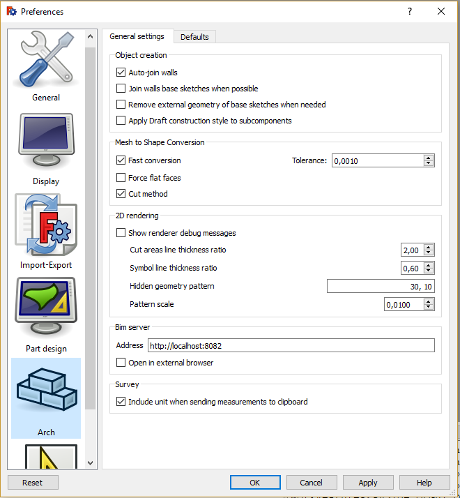
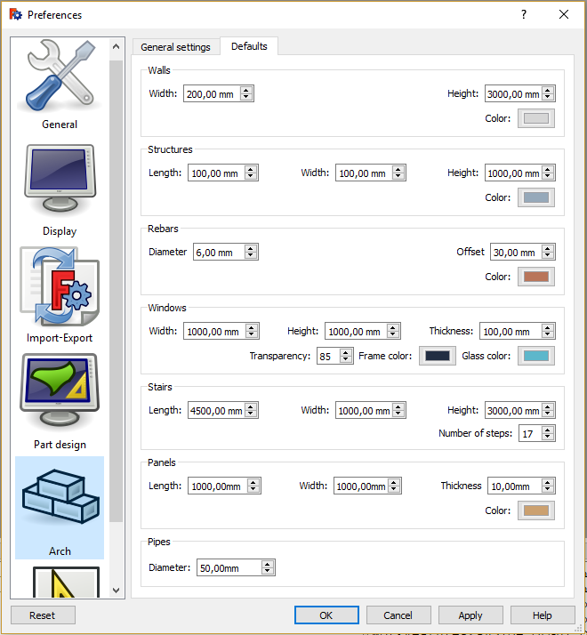

# Arch Preferences
The preferences for the [Arch Workbench](Arch_Workbench.md) are found in the [Preferences Editor](Preferences_Editor.md), in the menu **Edit → Preferences → Arch**.

There are two tabs: General settings, and Defaults.

## General settings 

## Defaults

  

_

---
[documentation index](../README.md) > [Preferences](Category_Preferences.md) > [Arch](Arch_Workbench.md) > Arch Preferences
