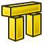

---
- GuiCommand:
   Name:Arch Rebar Straight
   MenuLocation:Arch → Rebar tools → Straight Rebar<br>3D/BIM → Reinforcement tools → Straight Rebar
   Workbenches:[Arch](Arch_Workbench.md), [BIM](BIM_Workbench.md)
   Version:0.17
   SeeAlso:[Reinforcement](Reinforcement_Workbench.md), [Arch Rebar](Arch_Rebar.md), [Arch Rebar BOM](Arch_Rebar_BOM.md)
---

# Arch Rebar Straight

## Description

The [Arch Straight Rebar](Arch_Rebar_Straight.md) tool allows the user to create a set of straight reinforcing bars inside an [Arch Structure](Arch_Structure.md) object.

The [Arch Straight Rebar](Arch_Rebar_Straight.md) tool is also integrated into [BIM Workbench](BIM_Workbench.md).

This command is part of the [Reinforcement Workbench](Reinforcement_Workbench.md), an [external workbench](External_workbenches.md) that can be installed with the  [Addon Manager](Std_AddonMgr.md) via the **Tools → Addon manager → Reinforcement** menu.

   
*Two sets of straight reinforcement bars inside an [Arch Structure](Arch_Structure.md)*

## Usage

1.  Select any face of a previously created ** [Arch Structure](Arch_Structure.md)** object.
2.  Then select ** [Straight Rebar](Arch_Rebar_Straight.md)** from the rebar tools.
3.  A task panel will pop-out on the left side of the screen as shown below.
4.  Select the desired orientation.
5.  Give the inputs like front cover, right side cover, left side cover, bottom cover and diameter of the rebar.
6.  Select the mode of distribution either amount or spacing.
7.  If spacing is selected, a user can also opt for [custom spacing](Custom_Spacing.md).
8.  Pick selected face is used to verify or change the face for rebar distribution.
9.  Click **OK** or **Apply** to generate the rebars.
10. Click **Cancel** to exit the task panel.

 
*Taskview panel for the Arch Rebar Straight tool*

## Properties

-    **Orientation**: It decides the orientation of the rebar (like a bottom, top, right and left).

-    **Front Cover**: The distance between rebar and selected face.

-    **Right Cover**: The distance between the right end of the rebar to right face of the structure.

-    **Left Cover**: The distance between the left end of the rebar to the left face of the structure.

-    **Cover along**: These property facilities the user to specify either top or bottom cover.

-    **Bottom Cover**: The distance between rebar from the bottom face of the structure.

-    **Top Cover**: The distance between rebar from the top face of the structure.

-    **Amount**: The amount of rebars.

-    **Spacing**: The distance between the axes of each bar.

## Scripting


**See also:**

[Arch API](Arch_API.md), [Reinforcement API](Reinforcement_API.md) and [FreeCAD Scripting Basics](FreeCAD_Scripting_Basics.md).

The Straight Rebar tool can be used in [macros](Macros.md) and from the [Python](Python.md) console by using the following function:

 
```python
Rebar = makeStraightRebar(f_cover, coverAlong, rt_cover, lb_cover,
                          diameter, amount_spacing_check, amount_spacing_value, orientation="Horizontal",
                          structure=None, facename=None)
```

-   Creates a `Rebar` object from the given `structure`, which is an [Arch Structure](Arch_Structure.md), and `facename`, which is a face of that structure.
    -   If no `structure` nor `facename` are given, it will take the user selected face as input.

-    `f_cover`, `coverAlong`, `rt_cover`, and `lb_cover` are inner offset distances for the rebar elements with respect to the faces of the structure.

    -   
        `f_cover`
        
        is the frontal cover offset.

    -   
        `coverAlong`
        
        is a tuple `(position, value)` that defines the offset value in one position (top, bottom, left, right) depending on the `orientation`.

    -   
        `rt_cover`
        
        is either the right or the top cover offset, depending on the value of `coverAlong` and `orientation`.

    -   
        `lb_cover`
        
        is either the left or the bottom cover offset, depending on the value of `coverAlong` and `orientation`.

-    `diameter`is the diameter of the reinforcement bars inside the structure.

-    `amount_spacing_check`if it is `True` it will create as many reinforcement bars as given by `amount_spacing_value`; if it is `False` it will create reinforcement bars separated by the numerical value of `amount_spacing_value`.

-    `amount_spacing_value`specifies the number of reinforcement bars, or the value of the separation between them, depending on `amount_spacing_check`.

-    `orientation`specifies the orientation of the rebar; it can be `"Horizontal"` or `"Vertical"`.

Depending on the orientation of the rebar, the function can be called in two general ways by setting `coverAlong` appropriately.

### The rebar is horizontal 

 
```python
Rebar = makeStraightRebar(f_cover, ("Top Side", value), right_cover, left_cover, ...)
Rebar = makeStraightRebar(f_cover, ("Bottom Side", value), right_cover, left_cover, ...)
```

-    `coverAlong`is a tuple with either a `"Top Side"` or a `"Bottom Side"` offset `value`.

-   In this case `rt_cover` refers to the `right_cover` offset, and `lb_cover` refers to the `left_cover` offset.

### The rebar is vertical 

 
```python
Rebar = makeStraightRebar(f_cover, ("Left Side", value), top_cover, bottom_cover, ...)
Rebar = makeStraightRebar(f_cover, ("Right Side", value), top_cover, bottom_cover, ...)
```

-    `coverAlong`is a tuple with either a `"Left Side"` or a `"Right Side"` offset `value`.

-   In this case `rt_cover` refers to the `top_cover` offset, and `lb_cover` refers to the `bottom_cover` offset.

### Example horizontal 

 
```python
import Arch, Draft, StraightRebar

Structure = Arch.makeStructure(length=1000, width=1000, height=400)
Structure.ViewObject.Transparency = 80
FreeCAD.ActiveDocument.recompute()

Rebar = StraightRebar.makeStraightRebar(50, ("Bottom Side", 20), 100, 100,
                                        12, True, 5, "Horizontal", Structure, "Face4")
Rebar.ViewObject.ShapeColor = (0.9, 0.0, 0.0)

Rebar2 = StraightRebar.makeStraightRebar(50, ("Bottom Side", 50), 100, 100,
                                         12, True, 5, "Horizontal", Structure, "Face6")
Rebar2.ViewObject.ShapeColor = (0.0, 0.0, 0.9)
```

### Example vertical 

 
```python
import Arch, Draft, StraightRebar

Structure2 = Arch.makeStructure(length=1000, width=1000, height=400)
Structure2.ViewObject.Transparency = 80
Draft.move(Structure2, FreeCAD.Vector(1500, 0, 0))
FreeCAD.ActiveDocument.recompute()

Rebar3 = StraightRebar.makeStraightRebar(50, ("Left Side", 20), 100, 100,
                                         12, True, 5, "Vertical", Structure2, "Face4")
Rebar3.ViewObject.ShapeColor = (0.9, 0.5, 0.0)

Rebar4 = StraightRebar.makeStraightRebar(50, ("Left Side", 50), 100, 100,
                                         12, True, 5, "Vertical", Structure2, "Face6")
Rebar4.ViewObject.ShapeColor = (0.0, 0.5, 0.5)
```

### Edition of rebar 

You can change the properties of the rebar with the following function  
```python
editStraightRebar(Rebar, f_cover, coverAlong, rt_cover, lb_cover,
                  diameter, amount_spacing_check, amount_spacing_value, orientation,
                  structure=None, facename=None)
```

-    `Rebar`is a previously created `StraightRebar` object.

-   The other parameters are the same as required by the `makeStraightRebar()` function.

-    `structure`and `facename` may be omitted so that the rebar stays in the original structure.

Example:  
```python
import StraightRebar

StraightRebar.editStraightRebar(Rebar, 50, ("Top Side", 20), 100, 100,
                                24, True, 7, "Horizontal")

StraightRebar.editStraightRebar(Rebar2, 50, ("Top Side", 50), 100, 100,
                                24, True, 7, "Horizontal")

StraightRebar.editStraightRebar(Rebar3, 50, ("Right Side", 20), 100, 100,
                                24, True, 7, "Vertical")

StraightRebar.editStraightRebar(Rebar4, 50, ("Right Side", 50), 100, 100,
                                24, True, 7, "Vertical")
```


---
 [documentation index](../README.md) > [Reinforcement](Category_Reinforcement.md) > [Arch](Arch_Workbench.md) > Arch Rebar Straight
