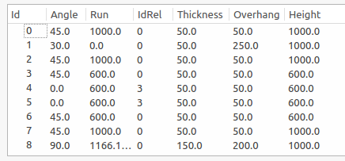

---
 GuiCommand:
   Name: Arch Roof
   MenuLocation: 3D/BIM , Roof
   Workbenches: BIM_Workbench
   Shortcut: **R** **F**
   SeeAlso: 
---

# Arch Roof

## Description

The **Arch Roof** tool allows for the creation of a sloped roof from a selected wire. The created roof object is parametric, keeping its relationship with the base object. The principle is that each edge is seen allotting a profile of roof (slope, width, overhang, thickness).

**Note:** This tool is still in development, and might fail with very complex shapes.

   
*View from above a building model showing the roof with certain transparency*

## Usage (wire base) 

1.  Create a closed wire with following the counter-clockwise direction and select it.

    :   

2.  Press the ** [Roof](Arch_Roof.md)** button, or press **R** then **F** keys

3.  The default roof object could have a strange shape, it\'s because the tool is missing some necessary information.

4.  After creating the default roof, double click on the object in the [tree view](Tree_view.md) to access and edit all the properties. Angle must be between 0 and 90.

    :   

5.  Each line corresponds to a roof pane. So you can set the properties you want for each roof pane.

6.  To help you, you can set `Angle` or `Run` to `0` and define a `Relative Id`, this makes an automatic calculation to find the data relative to the `Relative Id`.

7.  It works like this:
    1.  If `Angle &#61; 0` and `Run &#61; 0` then profile is identical to the relative profile.
    2.  If `Angle &#61; 0` then `Angle` is calculated so that the height is the same one as the relative profile.
    3.  If `Run &#61; 0` then `Run` is calculated so that the height is the same one as the relative profile.

8.  Finally, set an Angle to 90° to make a gable.

    :   

9.  
    **Note**: for better comprehension, please see this [youtube clip](https://www.youtube.com/watch?v=4Urwru71dVk).

## Usage (solid base) 

If your roof has a complex shape (e.g. contains pitched windows or other non-standard features) you can create a custom solid object using various other FreeCAD workbenches ([Part](Part_Workbench.md), [Sketcher](Sketcher_Workbench.md) etc.). And then use this solid as the **Base** object of your roof:

1.  Select the solid base object.
2.  Press the ** [Arch Roof](Arch_Roof.md)** button, or press **R** then **F** keys.

## Subtracting a roof 

Roofs have an automatically generated subtraction volume (<small>(v1.0)</small>  for roofs with a solid base). When a roof is [removed](Arch_Remove.md) from the walls of a building, both the roof itself as well as everything above it is subtracted from the walls.


<small>(v1.0)</small> 

: It is possible to override the automatic subtraction volume by setting the **Subvolume** property of the roof to a custom solid object.

     
*Solid-based roof before (1st image) and after (2nd image) [removing](Arch_Remove.md) it from walls.<br>
The 3rd image shows the generated subtraction volume.*

## Options

-   Roofs share the common properties and behaviors of all [Arch Components](Arch_Component.md).

## Properties

### Data


{{TitleProperty|Roof}}

-    **Angles|FloatList**: The list of angles of the roof segments.

-    **Border Length|Length**: The total length of the borders of the roof.

-    **Face|Integer**: The face number of the base object used to build the roof (not used).

-    **Flip|Bool**: Specifies if the direction of the roof should be flipped.

-    **Heights|FloatList**: The list of calculated heights of the roof segments.

-    **Id Rel|IntegerList**: The list of IDs of the relative profiles of the roof segments.

-    **Overhang|FloatList**: The list of overhangs of the roof segments.

-    **Ridge Length|Length**: The total length of the ridges and hips of the roof.

-    **Runs|FloatList**: The list of horizontal length projections of the roof segments.

-    **Subvolume|Link**: The volume to subtract. If specified it is used instead of the auto-generated subvolume. <small>(v1.0)</small> 

-    **Thickness|FloatList**: The list of thicknesses of the roof segments.

## Scripting


**See also:**

[Arch API](Arch_API.md) and [FreeCAD Scripting Basics](FreeCAD_Scripting_Basics.md).

The Roof tool can be used in [macros](Macros.md) and from the [Python](Python.md) console by using the following function:

 
```python
Roof = makeRoof(baseobj=None, facenr=0, angles=[45.,], run=[], idrel=[0,], thickness=[50.,], overhang=[100.,], name="Roof")
```

-   Creates a `Roof` object from the given `baseobj`, which can be a closed wire or a solid object.
    -   If `baseobj` is a wire, you can provide lists for `angles`, `run`, `idrel`, `thickness`, and `overhang`, for each edge in the wire to define the shape of the roof.
    -   The lists are automatically completed to match the number of edges in the wire.

Example:

 
```python
import FreeCAD as App
import Arch, Draft

doc = App.newDocument()

rect = Draft.makeRectangle(3000, 4000)
doc.recompute()

roof = Arch.makeRoof(rect, angles=[30.,])

p1 = App.Vector(0, 0, 0)
p2 = App.Vector(1000, 1000, 0)
p3 = App.Vector(0, 2000, 0)

wire = Draft.make_wire([p1, p2, p3], closed=True)
doc.recompute()

roof1 = Arch.makeRoof(wire)

doc.recompute()
```


---
⏵ [documentation index](../README.md) > [BIM](Category_BIM.md) > Arch Roof
