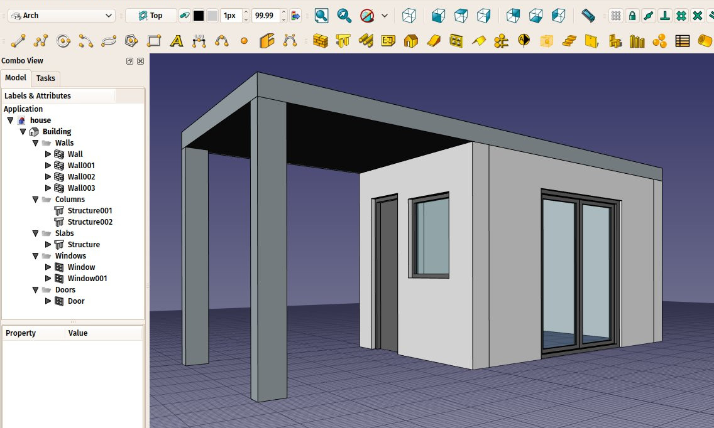
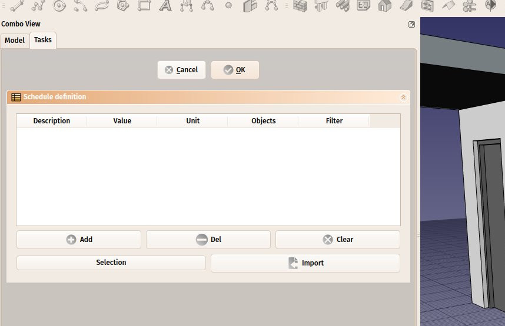
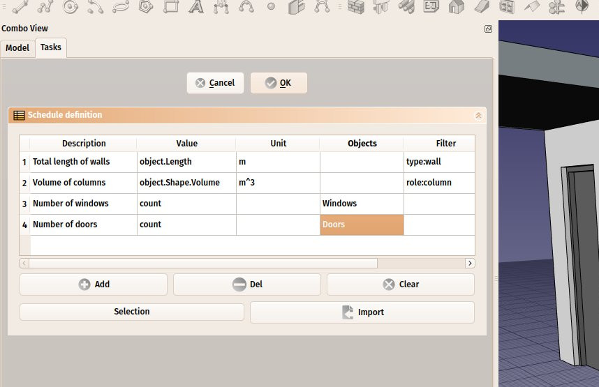
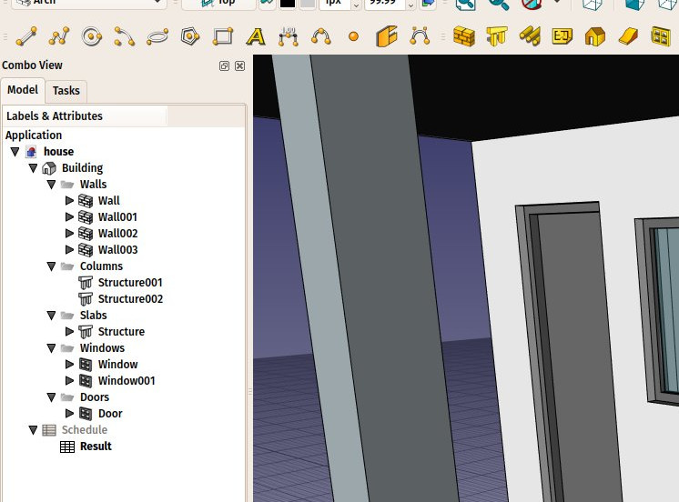
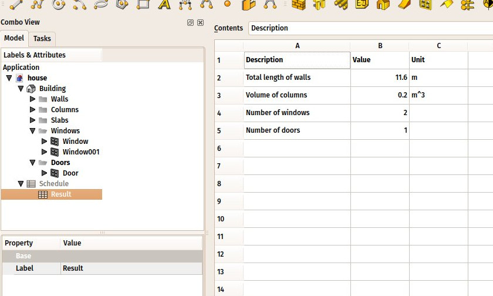

---
- GuiCommand:
   Name:Arch Schedule
   MenuLocation:Arch → Schedule
   Workbenches:[Arch](Arch_Workbench.md)
   SeeAlso:[Arch Equipment](Arch_Equipment.md)
---

# Arch Schedule

## Description

The Schedule tool allows you to create and automatically populate a [spreadsheet](Spreadsheet_Workbench.md) with contents gathered from the model.

**Note**

: This tool has been rewritten in FreeCAD 0.17 and differs from previous versions.

For a more general solution, see the [Reporting Workbench](https://github.com/furti/FreeCAD-Reporting/tree/master) in the list of [external workbenches](External_workbenches.md). This workbench uses SQL syntax to extract information from the document.

## Usage

1.  Open or create a FreeCAD document which contains some objects.
2.  Press the ** [Schedule](Arch_Schedule.md)** button.
3.  Adjust the desired options.
4.  Press **OK**.

## Workflow

First you need to have a model. For example, here is a document with a couple of objects. I did Arch stuff here, but it doesn\'t need to be Arch, it can be anything.

  

Then you press the ** [Arch Schedule](Arch_Schedule.md)** button. You get a task panel like this. It is pretty wide, so you\'ll need to widen the task panel to be comfortable.

  

Then you can fill line by line. Each line is a \"query\" and will render one line in the spreadsheet. Press the **Add** button to add a new line, and double-click each cell from that line to fill in the values. The **Del** button will delete the line which contains a currently selected cell, and **Clear** will delete all the lines. Possible values to put in columns are:

-   **Description**: A description for this query. The Description column will be the first column of the resulting spreadsheet. The description is mandatory to have a query performed. If you leave the description cell empty, the whole line will be skipped and left blank in the spreadsheet. This allows you to add \"separator\" lines.
-   **Value**: This is the real query that you want to perform on all the objects selected by the query. It can be two things: either the word `count` or an object property:
    -   If you enter `count` (or `Count` or `COUNT`, it\'s case-insensitive) the selected objects will simply be counted.
    -   If you enter an object property the value of this property for each of the selected objects will be retrieved and summed up. Objects that do not have the property will be skipped. Use dot notation to retrieve properties of properties: `PropertyOfObject.PropertyOfProperty1.PropertyOfProperty2`. If the property before the first dot starts with a lowercase letter it will be considered a reference to the object itself and be ignored. Entering for example `object.Shape.Volume` is the same as entering `Shape.Volume`.
-   **Unit**: An optional unit to express the results in. It\'s up to you to give a unit that matches the query you are doing, for example, if you are retrieving volumes, you should use a volume unit, such as `m^3`. If you use a wrong unit, for ex. cm, you\'ll get wrong results.
-   **Objects**: You can leave this empty, then all the objects of the document will be considered by this query, or give a semicolon (;)-separated list of object names (not labels). If any of the objects in this list is a group, its children will be selected as well. So the easiest way to use this feature is to group your objects meaningfully in the document, and just give a group name here. You can also use the **Selection** button to add objects currently selected in the document.
-   **Filter**: Here you can add a semicolon`;`-separated list of filters. Each filter is written in the form: `property:value`. You can only use properties that hold a string value. Both the property and the value are case-insensitive. The `value` can be left out but not the `:`. To properly handle schedules created with previous versions of Arch Schedule the `type` property will be translated to the `ifctype` property. It is advisable to not use `type` in new schedules.

:   For example:

    :   
        `label:floor1;ifctype:window`
        
        will retain only objects that have \"floor1\" in their **Label** and \"window\" in their **IFC Type**. A window with the **Label** \"Floor1-AA\" and the **IFC Type** \"Window Standard Case\" will be included.

    :   
        `label:door`
        
        Will retain only objects that have \"door\" in their **Label**.

    :   
        `!label:door`
        
        Will retain only objects that do not have \"door\" in their **Label**.

    :   
        `ifctype:structural`
        
        Will retain only objects that have \"structural\" in their **IFC Type**.

    :   
        `!ifctype:something`
        
        Will retain only objects that do not have \"structural\" in their **IFC Type** or that do not have the **IFC Type** property.

    :   
        `!ifctype:`
        
        Will retain only objects that do not have the **IFC Type** property.

The **Import** button allows you to build this list in another spreadsheet application, and import that as a csv file here.

So we can build a list of queries like this:

  

After that, press **OK** and a new Schedule object is added to the document, which contains a result spreadsheet:

  

By double-clicking the Schedule object, you get back to the task panel and change the values. By double-clicking the spreadsheet itself, you get the results in 3 columns: description, value, unit (if applicable):

  

The spreadsheet can then be exported to csv normally, from the Spreadsheet workbench.

## Dynamic properties 

It is possible to add your own properties to objects. These are called [Dynamic properties](Property_editor#Actions.md). If they have been added with the **Prefix group name** option selected, their names will indeed start with the group name, but this prefix is not displayed in the [Property editor](Property_editor.md). Their names have this form: `NameOfGroup_NameOfProperty`. To reference them in a schedule this full name must be used.

---
 [documentation index](../README.md) > [Arch](Arch_Workbench.md) > Arch Schedule
