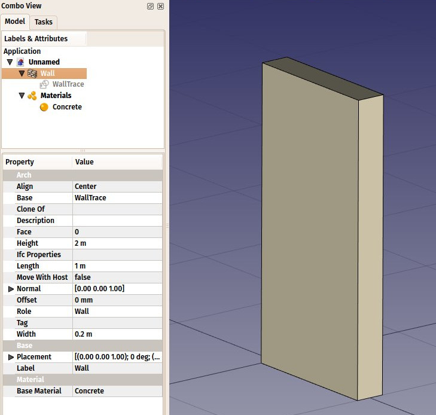
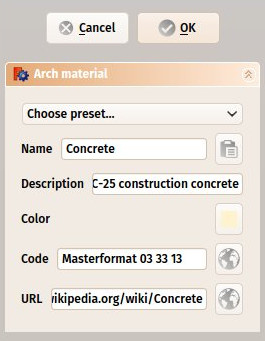

---
- GuiCommand   *
   Name   *Arch SetMaterial
   MenuLocation   *Arch → Material tools → Material
   Workbenches   *[Arch](Arch_Workbench.md), [BIM](BIM_Workbench.md)
   Shortcut   ***M** **T**
   SeeAlso   *[Arch CompSetMaterial](Arch_CompSetMaterial.md), [Arch MultiMaterial](Arch_MultiMaterial.md)
---

# Arch SetMaterial

## Description

This tool allows to add [materials](Material.md) to the active document and attribute a material to an [Arch](Arch_Workbench.md) object. A Material contains all the properties of a certain material and controls the color of the object it is attached to. Materials are stored in a **Materials** folder in the active document.

## Usage

1.  Optionally, select one or more objects to which you wish to attribute a new material.
2.  There are several ways to invoke the command   *
    -   Press the ** [Material](Arch_SetMaterial.md)** button in the toolbar.
    -   Use the **M** then **T** keyboard shortcut.
    -   Use the **Arch → Material Tools → Material** entry from the top menu.
3.  Load a preset material, or create a new one by filling the fields.
4.  Press **OK**.

## Options

-   Upon creating a new material, a task panel allows you to set different options   *

-   **Choose preset**   * Choose one of the preset materials, to be used as is, or to be adapted by modifying the fields below
-   **Name**   * Choose a name for the material
-   **Edit button**   * This opens the current material in FreeCAD\'s [Material editor](Material_editor.md), which allows you to edit many additional properties and add your own custom ones
-   **Description**   * A more detailed description of the material
-   **Color**   * A display color for the material, which will be applied to all objects that use that material
-   **Section Color**   * A display color for the material, which will be applied on TechDraw pages, when an object with this material is cut, and the \"Display materials\" property of the containing section plane is set to True.
-   **Code**   * A name and reference number of a specification system such as [Masterformat](https   *//en.wikipedia.org/wiki/MasterFormat) or [Omniclass](http   *//www.omniclass.org/).
-   **Code browser button**   * Not implemented yet - will allow to open the reference in a web browser
-   **URL**   * An URL where more information about the material can be found
-   **URL button**   *Opens the URL in a web browser

## Relation to IFC 

This roughly corresponds to [IfcMaterial](https   *//standards.buildingsmart.org/IFC/DEV/IFC4_2/FINAL/HTML/link/ifcmaterial.htm).

---
 [documentation index](../README.md) > [Arch](Arch_Workbench.md) > Arch SetMaterial
