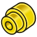

# Artwork PartDesign
These icons are in the indicated source path.

For all icons in the source tree, see [Artwork](Artwork.md).

## src/Mod/PartDesign/

### src/Mod/PartDesign/FeatureHole/

  

### From src/Mod/PartDesign/Gui/Resources/icons/ 

                                                            

### src/Mod/PartDesign/WizardShaft/

 

---
 [documentation index](../README.md) > [Artwork](Category_Artwork.md) > [PartDesign](Category_PartDesign.md) > Artwork PartDesign
