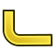

# Artwork Reinforcement
These icons are in the indicated source path.

For all icons in the source tree, see [Artwork](Artwork.md).

## Mod/Reinforcement/

### Mod/Reinforcement/icons/dropdown\_list/

       

[Category   *Artwork](Category_Artwork.md)

---
 [documentation index](../README.md) > [Artwork](Category_Artwork.md) > Artwork Reinforcement
