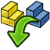

---
 GuiCommand:
   Name: Assembly InsertLink
   MenuLocation: Assembly , Insert Component
   Workbenches: Assembly_Workbench
   Shortcut: **I**
   Version: 1.0
   SeeAlso: 
---

# Assembly InsertLink

## Description

The  [Assembly InsertLink](Assembly_InsertLink.md) tool inserts a component into the active assembly. This creates dynamic links (called components here) to parts, bodies, primitives, and assemblies.

## Usage

1.  There are several ways to invoke the tool:
    -   Press the ** [Insert Component](Assembly_InsertLink.md)** button.
    -   Select the **Assembly →  Insert Component** option from the menu.
    -   Use the keyboard shortcut: **I**.
2.  The **Insert Component** dialog opens in the [Task panel](Task_panel.md) listing elements available to be used as components.
3.  \...

 {{Assembly_Tools_navi}}

---
⏵ [documentation index](../README.md) > [Assembly](Assembly_Workbench.md) > Assembly InsertLink
