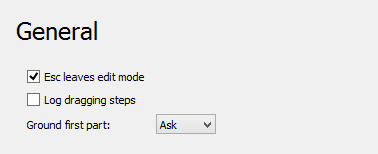

# Assembly Preferences
The preferences for the  [Assembly Workbench](Assembly_Workbench.md) can be found in the [Preferences Editor](Preferences_Editor.md). In the menu select **Edit → Preferences...** and then ** Assembly**. This group is only available if the Assembly Workbench has been loaded in the current FreeCAD session.

There is only one page: General.

  

On this page you can specify the following:

+++
| Name                                 | Description                                                                                                                                                                                                                                                                                                                |
+======================================+============================================================================================================================================================================================================================================================================================================================+
|                       | If checked, pressing the **Esc** key leaves Assembly edit mode.                                                                                                                                                                                                                                          |
| **Esc leaves edit mode** |                                                                                                                                                                                                                                                                                                                            |
|                                   |                                                                                                                                                                                                                                                                                                                            |
+++
|                       | If checked, the dragging steps of the solver are logged. Useful if you want to report a bug. The files are named **runPreDrag.asmt** and **dragging.log** and are located in the default directory of {{Incode|std::ofstream}} (on Windows it\'s the desktop). |
| **Log dragging steps**   |                                                                                                                                                                                                                                                                                                                            |
|                                   |                                                                                                                                                                                                                                                                                                                            |
+++
|                       | When you [insert](Assembly_InsertLink.md) the first part in the assembly, you can choose to ground the part automatically. The options are:                                                                                                                                                                        |
| **Ground first part**    |                                                                                                                                                                                                                                                                                                                            |
|                                   | -   *Ask*                                                                                                                                                                                                                                                                                                                  |
|                                      | -   *Always*                                                                                                                                                                                                                                                                                                               |
|                                      | -   *Never*                                                                                                                                                                                                                                                                                                                |
+++

 {{Assembly_Tools_navi}}

---
⏵ [documentation index](../README.md) > [Preferences](Category_Preferences.md) > [Assembly](Assembly_Workbench.md) > Assembly Preferences
