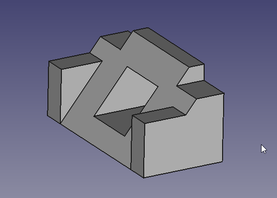
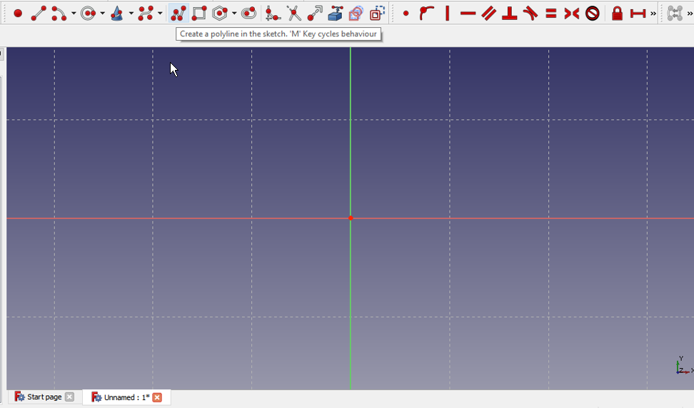
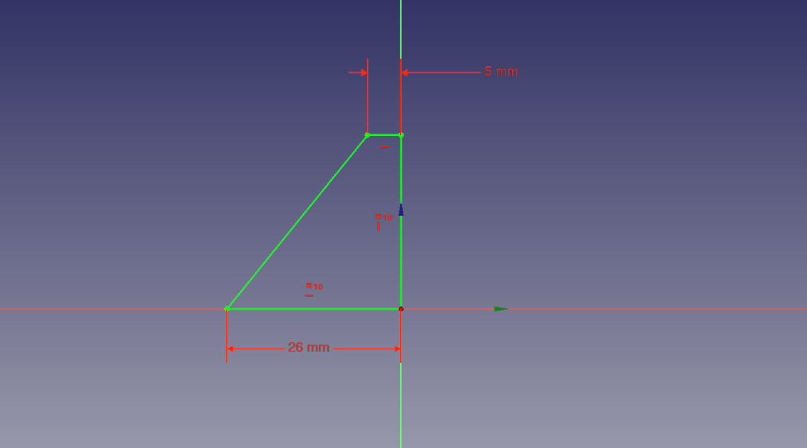
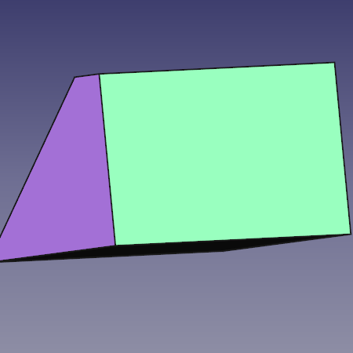
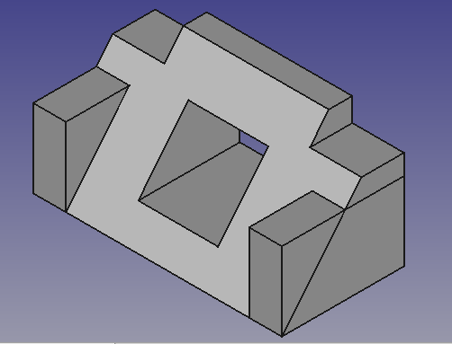
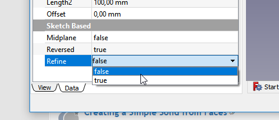

---
- TutorialInfo   *   Topic   *Modeling
   Level   *Beginner
   Author   *Mark Stephen ([Quick61](User_Quick61.md)) and HarryGeier ([HarryGeier](User_HarryGeier.md))
   Time   *Less than an hour
   FCVersion   *0.17 or higher   Files   *[https   *//github.com/FreeCAD/Examples/blob/master/Basic_Part_Design_Tutorial_Example_017_Files/Basic_Part_Design_Tutorial_017.fcstd Basic Part Design for v0.17]
---

# Basic Part Design Tutorial

 

This tutorial introduces the new user to some of the tools and techniques used in the [PartDesign Workbench](PartDesign_Workbench.md). This tutorial is not a complete and comprehensive guide to the Part Design Workbench and many of the tools and capabilities are not covered. This tutorial will take user through the steps needed to model the part shown in the image below using sketches.

  

A video of the whole construction is here   * <https   *//youtu.be/geIrH1cOCzc>

(each section has its own split Video below)

## Before You Begin 

## The Task 

In this tutorial, you will be using the Part Design Workbench to create a 3D solid model of the part shown in the [Drawing](TechDraw_Workbench.md) below. All of the necessary dimensions to complete this task are given. You will start by creating a core shape from a base Sketch and then build on that shape, adding what is known as Features. These features will either add material to, or remove material from the solid by use of additional sketches and accompanying feature operations. This Tutorial will not use every feature and tool available within the Part Design Workbench, but should use enough to give the user of this tutorial a basic foundation upon which to build their knowledge and skills.

## The Part 

  

## Constructing The Part 

### Startup

First begin by making sure you are in the Part Design Workbench. Once there, you will want to create a new document if you have not done so already. It is a good habit to save your work often, so before anything else save the new document, giving it any name you might like.

All work in Part Design begins with a [Body](Glossary#Body.md). Then we will build the solid inside the body by starting with a [sketch](Glossary#Sketch.md).

1.  Click on  [Create new body](PartDesign_Body.md) to create and activate a new Body Container. 
*Note   * this step can be omitted. When creating a sketch, if no existing Body is found, a new one will be automatically created and activated.*
2.  Click on  [Create new sketch](PartDesign_NewSketch.md). This will create the sketch within the just created body.
3.  We need to define where the sketch will be attached. We will attach it to a plane from the Body´s [Origin](Glossary#Origin.md).
4.  In the [Tasks tab](Task_panel.md) from the [Combo view](Combo_view.md), select **YZ_Plane** in the list and press **OK**   *

  

*Note   * it\'s possible that the **OK** button may not be visible if the side panel is not wide enough. You can make it wider by dragging its right border. Place your mouse pointer over the border; when the pointer changes to a two-way arrow, press and hold the left mouse button and drag.*

Once you click OK, FreeCAD automatically switches to the [Sketcher workbench](Sketcher_Workbench.md) and opens the sketch in editing mode   *

  

### Create the sketch 

Next you will want to use the  [Polyline](Sketcher_CreatePolyline.md) tool and make a shape roughly like that in the next image. It does not need to be perfect as the final shape is done with constraints. Once you have the basic shape, we will start applying the constraints. If you had Auto constraints on, some of these constraints will have been applied automatically, if not, do the following. But first make sure that you have exited the Polyline tool by right-clicking or pressing **ESC** twice; the mouse cursor should turn back from a cross-hair to the standard arrow cursor. (Don\'t press **ESC** a third time or you will exit the sketch editing mode; if this happens, click on the Model tab, then double-click the Sketch element in the tree, or right-click and select **Edit sketch** in the contextual menu.)

*NOTE   * Since this tutorial was written there have been improvements to the sketcher solver, if it detects a redundant constraint it will turn the sketch orange in colour, and before further constraints are added, the redundant constraint should be removed.(The redundant constraint is shown in the Task view, click on the blue reference and press delete.)*

1.  Select the two horizontal lines with your mouse by clicking on them, and once selected, click on the  [horizontal constraint](Sketcher_ConstrainHorizontal.md).
2.  Select the vertical line on the right and then click on the  [vertical constraint](Sketcher_ConstrainVertical.md).
3.  Select the start and end points of your polyline and click on the  [coincident constraint](Sketcher_ConstrainCoincident.md) to close the polyline.
4.  Select the bottom horizontal line and the right vertical line and apply and  [equal constraint](Sketcher_ConstrainEqual.md).
5.  Select either the horizontal or vertical line and apply either a corresponding  [horizontal distance constraint](Sketcher_ConstrainDistanceX.md) or  [vertical distance constraint](Sketcher_ConstrainDistanceX.md) and give it a value of 26 mm.
6.  Select the top horizontal line and apply the horizontal distance constraint and give it a value of 5 mm
7.  Select the lower right point (vertex) of the horizontal line Origin and then the center point of the grid and apply the  [coincident constraint](Sketcher_ConstrainCoincident.md) to fix your shape.

At this point you should have a fully constrained sketch as indicated by it changing color and the message shown in the Combo View. It should now look just like the image below.

  

Now in the [Tasks tab](Task_panel.md), click on the **Close** button to leave the sketch edit mode and select  [Pad](PartDesign_Pad.md) from the toolbar or from the Part Design menu. This will give you a Pad dialog in the Task View. Using that dialog, first using the Type pulldown menu, select Two dimensions. Drawing presented at the beginning of this tutorial says the part is 53 mm long. We do it by Padding our sketch both ways from the center plane to make up that distance i.e. make the pad symmetric in relation of sketch-plane. The reason for is seen later when creating features. For now, given we want it to be 53 mm long in total we will input 26.5 for Length, and 26.5 again for the Second length. Alternatively, you can provide a single length of 53 mm and click the Symmetric to plane check box. Once that is done we now have our base solid upon which we will add additional features to construct our part.

A video of the steps used in this portion of the tutorial is here   * <https   *//youtu.be/cUyPnCMeTgg>

### Features with pocket and external geometry 

Using the mouse or the view icons turn the model around so you can see its back. Once the back of the part is visible, select the back face by clicking on it as seen in the next image.

  

After the face is selected, click on the New sketch icon in the toolbar or from the Part Design menu and that will map our next sketch to the back face of the part. Now select  [Rectangle](Sketcher_CreateRectangle.md) tool and place a rectangle on the rear face of the part in a similar fashion as shown below. Now following the steps listed, constrain the sketch.

1.  Select one of the horizontal lines apply a horizontal distance constraint and a value of 5 mm.
2.  Select one of the vertical lines and give it a vertical distance constraint and a value of 11 mm.
3.  Select  [External geometry](Sketcher_External.md) tool
4.  Select the upper right vertex of the face and click it so you are provided a point from the external geometry to link our sketch to.

  

1.  Right click to end the External geometry mode
2.  Select that point you just made available with the External geometry tool and then select the upper right vertex of the rectangle and click on the  [Coinstrain coincident](Sketcher_ConstrainCoincident.md). At this point the sketch should be fully constrained and look like the next image.

  

Once that is done, click the Close button at the top of the Tasks tab in the Combo View window, then select  [Pocket](PartDesign_Pocket.md) tool from the toolbar or Part Design menu. Using this tool is the opposite of the Pad tool. As the Pad tool adds material to the part, the Pocket tool removes material from the part. Both operations are called features. In this Pocket operation we want to select Through all from the type pulldown-menu and then click the OK button.

For the next operation, make sure that "Pocket" is selected in the Model tree view and once done, click on the  [Mirror](PartDesign_Mirrored.md) feature on the toolbar or from the Part Design menu. In the Mirror dialog in the Combo View, select Horizontal sketch axis from the Plane pulldown menu. Then click OK. The Mirror feature works in this way because the base feature of our model was Padded both ways from the horizontal plane in the first operation with the base sketch. If all has gone well, you should now have a part that looks like the image below after you orbit it around to the front.

  

A video of the steps used in this portion of the tutorial is here   * <https   *//youtu.be/wiGXV9G7mrM>

### Features with pad and external geometry 

After taking a look, orbit back around and once again select the back face of the part and select that face to map the next sketch to.

  

Select New sketch and make a new rectangle in the manner similar to what is shown below in the next image. Then proceed to add dimensional constraints to the rectangle.

1.  Select a horizontal line and apply a horizontal distance constraint with a value of 16.7.
2.  Select a vertical line and apply a vertical distance constraint of 7 mm
3.  Using the External geometry tool, select the upper left vertex of the part face.

  

Now selecting the upper left vertex of the rectangle and the external geometry point, click on the coincident constraint to fully constrain the sketch.

  

Close the Sketcher.

Next we will click on the Pad feature and in the Pad dialog in the Combo View we want a length of 26 mm leaving the type as Dimension and then placing a check on the Reversed checkbox. Using the Reversed checkbox will cause the Pad to go into the part instead of away from the part. This operation provides with the following result.

  

Once again use the Mirror feature to get the second pad. First ensure that created Pad is selected in the tree view, then click on Mirror in the toolbar or select it from the Part Design menu. We will repeat the operation we did for Pocket above and select Horizontal sketch axis from the Plane pulldown menu.

  

A video of the steps used in this portion of the tutorial is here   * <https   *//youtu.be/Ido1owp8ubc>

### Feature with pocket and external geometry 

At this point orbiting the part around to the front, we can see that our part is now starting to look like the part in the dimensioned drawing at the beginning of this tutorial. Once you have the view of the front, click on the sloped face with your mouse to select the face we will use for the next sketch.

  

Here we will use the Rectangle tool and place a rectangle in our sketch and once having done so, apply the following constraints.

1.  Select a horizontal line and a vertical line, and after both are selected, click on the Equals constraint.
2.  Select either a horizontal or vertical line and apply a corresponding horizontal or vertical distance constraint with a value of 17 mm
3.  Using the External geometry tool, select the top right vertex as shown in the image below.

  

Now using the dimensions from the drawing, apply the following constraints.

1.  Select the external geometry point and the upper right vertex of the now square sketch and apply a horizontal distance constraint of 7 mm
2.  Select the external geometry point and the upper right vertex of the now square sketch and apply a vertical distance constraint of 11 mm

The result should be as follows.

  

At this point if we were to simply Pocket this sketch, the resulting hole would be perpendicular to the sloped face that it is mapped to, and this is not what we want.

We want the hole to be perpendicular to the back face, but it\'s projected dimensions are not the 17 mm x 17 mm dimensions that are given in the drawing. Now we could do the math and calculate the dimensions needed, or we can use the tools provided in FreeCAD to make that projection for us.

A video of the steps used in this portion of the tutorial is here   * <https   *//youtu.be/x4d5nZPWCLQ>

To create pocket which has the sloped rectangle as it´s outlet, we draw a new rectangle on the rear side, using the projection of the sloped rectangle as an external reference. Orbit the Solid around to see the rear face of the part once again and select the back face to map the final sketch to.

  

Select  [New Sketch](PartDesign_NewSketch.md) from the toolbar or Part Design menu. Now in sketch edit mode, we do not see the sketched rectangle on the slope. To make it selectable , we switch the combo view to model tab and select the last sketch made (Sketch003) on the sloped plane. Then using the spacebar, make it visible. Next, select the mirror feature above (mirrored001) and again using the spacebar, hide it. Then you should see the sloped rectangle inside the 3D View. You may continue to work with the model tab visible, or switch back to tasks tab. Using the  [External geometry](Sketcher_External.md) tool, select the upper and lower horizontal edges of the sloped rectangle. Then, add a new rectangle to the sketch using the  [Rectangle](Sketcher_CreateRectangle.md) tool.

  

1.  Select the upper left vertex of the new rectangle and the upper left point of the external geometry and click on the coincident constraint.
2.  Click on the lower right vertex of the new rectangle and the lower right point of the external geometry and click on the coincident constraint.

And we should end up with this.

  

For the final step in this tutorial, close the sketcher window using close or finish editing from the context menu of sketch004 and then select the  [Pocket](PartDesign_Pocket.md) feature from the toolbar or from the Part Design menu. From the Type pulldown select **Through all** and click the OK button.

  

At this point, you will see some lines which come from intersecting features. In this case the *side block* intersects with the *base profile* letting it appear as a triangular block above the profile (i.e., there is an extra line visible in the above picture on the right face of the model). To remove these lines, you can either switch on \"refine shape\" in your Part Design Settings or, to save some processing speed and still have these lines while constructing, individually switch it on at each feature. The Setting on feature level can be done in the \"data\" tab of the feature. Set the [***refine* property**](Property_editor#Data.md) to TRUE for the pocket feature Pocket001 to invoke refining.

   

A video of these steps of the tutorial is here   * <https   *//youtu.be/UYI0gvxCYeI>

This tutorial and your model are complete.

## Additional Resources 

-   FreeCAD file for comparison (made with 0.17) [Download](https   *//github.com/FreeCAD/Examples/blob/master/Basic_Part_Design_Tutorial_Example_017_Files/Basic_Part_Design_Tutorial_017.fcstd)

{{PartDesign Tools navi

}} {{Sketcher Tools navi}}

---
 [documentation index](../README.md) > [PartDesign](Category_PartDesign.md) > [Sketcher](Category_Sketcher.md) > Basic Part Design Tutorial
