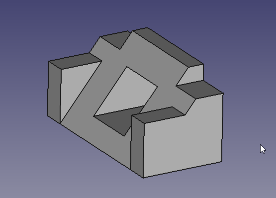
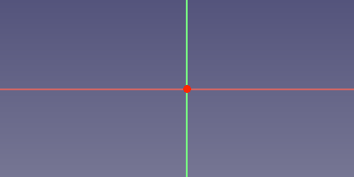
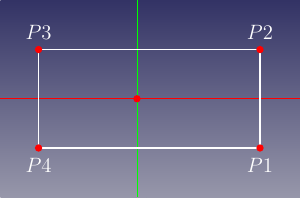
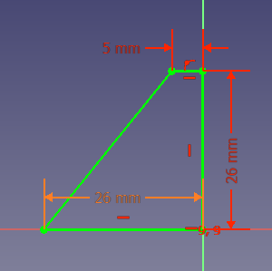
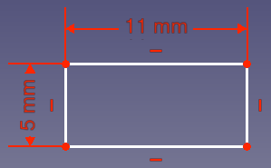
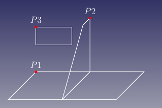

---
- TutorialInfo   *   Topic   *Modeling
   Level   *Beginner
   Author   *Carlo Dormeletti ([onekk](User_onekk.md))
   Time   *Less than an hour
   FCVersion   *0.19 or higher   Files   *[]
---

# Basic Part Design Tutorial 019

This tutorial introduces the new user to some of the tools and techniques used in the [PartDesign Workbench](PartDesign_Workbench.md). This tutorial is not a complete and comprehensive guide to the Part Design Workbench and many of the tools and capabilities are not covered. This tutorial will take user through the steps needed to model the part shown in the image below using sketches.

\'\'Author Note   * This tutorial is work in progress, in this state it is tested only with FreeCAD version 0.20.1 for Linux. Screenshots are made for 0.20.1 too, but it should work without big problems even on 0.19.

As soon I find someone to review it for 0.19 I will made appropriate remarks if necessary for v0.19\'\'

## Before You Begin 

## The Task 

In this tutorial, you will be using the Part Design Workbench to create a 3D solid model of the part shown in the [Drawing](TechDraw_Workbench.md) below. All of the necessary dimensions to complete this task are given. You will start by creating a core shape from a base Sketch and then build on that shape, adding what is known as Features. These features will either add material to, or remove material from the solid by use of additional sketches and accompanying feature operations. This Tutorial will not use every feature and tool available within the Part Design Workbench, but should use enough to give the user of this tutorial a basic foundation upon which to build their knowledge and skills.

## The Part 

## Constructing The Part 

### Startup

First begin by making sure you are in the Part Design Workbench. Once there, you will want to create a new document if you have not done so already. It is a good habit to save your work often, so before anything else save the new document, giving it any name you might like.

All work in Part Design begins with a [Body](Glossary#Body.md). Then we will build the solid inside the body by starting with a [sketch](Glossary#Sketch.md).

Click on  [Create new body](PartDesign_Body.md) to create and activate a new Body Container. 
*Note   * this step can be omitted. When creating a sketch, if no existing Body is found, a new one will be automatically created and activated.*

## Sketch

You will create a base skecth, this is to create the base shape that is a rectangle, but you will use *named constraints*, that could be reused to make the model *parametric*.

This way the constraints, hold a dimension that could be reused across the model, as example if you want the model be 55mm wide and not 53mm as in the technical drawing, it is simply a matter to edit base sketch and modify the length of the appropriate *named constraint*.

### Create Sketch 

1.  Click on  [Create new sketch](PartDesign_NewSketch.md). This will create the sketch within the just created body. It will be named 
**Sketch**
2.  You need to define where the sketch will be attached. We will attach it to a plane from the Body´s [Origin](Glossary#Origin.md).
    
3.  In the [Tasks tab](Task_panel.md) from the [Combo view](Combo_view.md), select **XY_Plane** in the list and press **OK**
    *Note   * it\'s possible that the **OK** button may not be visible if the side panel is not wide enough. You can make it wider by dragging its right border. Place your mouse pointer over the border; when the pointer changes to a two-way arrow, press and hold the left mouse button and drag.*

    Once you click **OK**, FreeCAD automatically switches to the [Sketcher workbench](Sketcher_Workbench.md) and opens the sketch in editing mode   *

    

</ol>

### Create the rectangle 

Click on  [Rectangle](Sketcher_CreateRectangle.md) tool and start creating a rectangle   * 

Some notes   *

1.  Create the rectangle roughle centered on *Y axis* but not with upper side laying on the *X axis*, if not **Solver** will apply a constraint that will create some problem later.
2.  It is not important at this step to make exact dimensions, we will set them using constraints later.
3.  When finished with rectangle creation, press **ESC**, if not FreeCAD will remain in \"rectangle creation\" mode indicated by this cursor appearance 
    and you will start creation of another rectangle.

### Applying constraints 

  Fig   * HS1                                          Fig   * HS2                                            Fig   * HS3
    
        

     * Horizontal ans symmetric constraints

##### Horizontal constraint 

Assign now [horizontal distance constraint](Sketcher_ConstrainDistanceX.md) this way   *

1.  Select the upper line like in the **Fig   * HS1**.
2.  Use the button  [horizontal distance constraint](Sketcher_ConstrainDistanceX.md) this will make two things   *
    1.  A dimension will appear between extreme points of the line selected. This dimension is the actual dimension.
    2.  A dialog like the one below will appear.
        
        In this dialog you could set an exact **Length** and optionally assign a **Name** to this length.
    3.  Assign a **Length = 53mm** and **Name = length** and press **OK**.
        You will be presented with an image that will resemble **Fig   * HS2**

</ol>

##### Symmetrical constraint 

You have to center the rectangle, by design the center of the *X axis* is chosen to do so   *

1.  Select points like in **Fig   * HS3**.
2.  Use  [Symmetric](Sketcher_ConstrainSymmetric.md) tool and apply the symmetry.

You will end with something that resemble **Fig   * V1** below.

##### Vertical constraint 

  Fig   * V1                                   Fig   * V2                                   Fig   * V3
    
        

     * Vertical constraint

Assign now a [vertical distance constraint](Sketcher_ConstrainDistanceY.md), the procedure is similar to the former.

1.  Select the vertical line like in the image **Fig   * V2**
2.  Using the button  [vertical distance constraint](Sketcher_ConstrainDistanceY.md) and assign **Length = 26 mm** and **Name = width**.

Once clicked on OK you will have the result shown in **Fig   * V3**.

## Side Profile 

You will create a new sketch that is holding the side profile.

### Create the sketch_001 

Click on  [Create new sketch](PartDesign_NewSketch.md). This will create the sketch within the just created body.
This time select **YZ_Plane** in the list and press **OK**   *

Use the  [Polyline](Sketcher_CreatePolyline.md) tool and make a shape roughly like that in the next image. Next you will want to It does not need to be perfect as the final shape is done with constraints.

Once you have the basic shape, we will start applying the constraints.

If you had Auto constraints on, some of these constraints will have been applied automatically, if not, do the following. But first make sure that you have exited the Polyline tool by right-clicking or pressing **ESC** twice; the mouse cursor should turn back from a cross-hair to the standard arrow cursor. (Don\'t press **ESC** a third time or you will exit the sketch editing mode; if this happens, click on the Model tab, then double-click the Sketch element in the tree, or right-click and select **Edit sketch** in the contextual menu.)

*NOTE   * if the sketcher solver detects a redundant constraint it will turn the sketch orange in colour, and before further constraints are added, the redundant constraint should be removed. (The redundant constraint is shown in the Task view, click on the blue reference and press delete.)*

### Applying Constraints 

From the image above, you will see that FreeCAD is already applying some constraints, making your life easier.

*Note   * when using \"named constraints\" you have to refer to the \"Name\" property, but names shown here may vary due to the way the example file is done (It was made using Part Design Scripting), refer to the names you have in your design*

  Fig   * SP1                                  Fig   * SP2                                  Fig   * SP3
    
        

     * Side Profile Constraints

1.  Select points as in **Fig   * SP1** above and apply a  [horizontal distance constraint](Sketcher_ConstrainDistanceX.md) and assign 
**Length = 5 mm**
2.  Select points as in **Fig   * SP2** above and apply a  [vertical distance constraint](Sketcher_ConstrainDistanceX.md) and assign 
**Length = 26 mm**
3.  Select points as in **Fig   * SP3** above and apply a  [horizontal distance constraint](Sketcher_ConstrainDistanceX.md) for the value you will use a \"Named constraints\" using [Expressions](Expressions.md) to do so you have to press the little button on the dimensions , and you are presented with a slightly modified dialog   *
    
    1.  if you start typing in the cell, you will be presented with some autocompletions, base on the \"Name\" of the sketch, in the example is **>**.
        Select the right one for your design; Field should have autocompletion so if you select an element you will be presented with **>.**, note the point after the \"element name\".
    2.  Next step is to choose the correct things, you have have named a Constraint \"width\", bit it is not working so flawlessy you had to write the word **Constraints.** with the point, ans sadly there is no autocomplete (yet)
    3.  Third and last step is to add the \"length\" name so the cell will read **>.Constraints.width** if all is good you should see in the cell **Result   *** the correct value as in figure below   *
        
        *Note the absence of \"red words\" and the correct value in the **Result** field*

#### Finalizing the Sketch 

At this point you should have a fully constrained sketch as indicated by it changing color and the message shown in the Combo View. It should now look just like the image below   *

*Note the differences between distance constraints assigned sing expressions and those assigned specifying a length.*

Now in the [Tasks tab](Task_panel.md), click on the **Close** button to leave the sketch edit mode

## Making the Pad 

Select  [Pad](PartDesign_Pad.md) from the toolbar or from the Part Design menu.

This will give you a Pad dialog in the Task View.

Using that dialog, set it accordingly to the following directions   *

1.  Using **Type** pulldown menu, select **Dimension**.
2.  For **Length** we use again an **Expression** but this time you will enter **>.Constraints.length** in the field.
3.  Select **Symmetric to plane** checkbox.

Once that is done we now have our base solid as shown in the image below   *

## Features with pocket 

1.  Click on the New sketch icon in the toolbar or from the Part Design menu.
2.  Now select  [Rectangle](Sketcher_CreateRectangle.md) tool, and create a rectangle, do not create it using near the axis, as we have to meve it in position using [External geometry](Sketcher_External.md) tool.
    Apply these constraints   *
    1.  Select one of the horizontal lines apply a horizontal distance constraint and a value of 5 mm.
    2.  Select one of the vertical lines and give it a vertical distance constraint and a value of 11 mm.

    You should have something similar to the figure below   *

    
3.  Click the Close button at the top of the Tasks tab in the Combo View window.

#### Adding external geometries constraints 

Adding an [External geometry](Sketcher_External.md) need that you have sketches on which we are \"attaching\" our geometry visible.

To do so in the **Treeview** select first and second sketch and make visible using the spacebar, if everything is ok you will have something that resemble the image in **Fig   *1** below   *

  Fig   * 1                                    Fig   * 2
   
     

     * External geometries 1

  Fig   * 3   
   

     * External geometries 2

Double click on the Sketch_2 to activate again *edit mode*.

1.  Select  [External geometry](Sketcher_External.md) tool.

Once that is done, click the Close button at the top of the Tasks tab in the Combo View window,

### Pockets

Select  [Pocket](PartDesign_Pocket.md) tool from the toolbar or Part Design menu. Using this tool is the opposite of the Pad tool. As the Pad tool adds material to the part, the Pocket tool removes material from the part. Both operations are called features. In this Pocket operation we want to select Through all from the type pulldown-menu and then click the OK button.

For the next operation, make sure that "Pocket" is selected in the Model tree view and once done, click on the  [Mirror](PartDesign_Mirrored.md) feature on the toolbar or from the Part Design menu. In the Mirror dialog in the Combo View, select Horizontal sketch axis from the Plane pulldown menu. Then click OK. The Mirror feature works in this way because the base feature of our model was Padded both ways from the horizontal plane in the first operation with the base sketch. If all has gone well, you should now have a part that looks like the image below after you orbit it around to the front.

## Features with pad and external geometry 

After taking a look, orbit back around and once again select the back face of the part and select that face to map the next sketch to.

Select New sketch and make a new rectangle in the manner similar to what is shown below in the next image. Then proceed to add dimensional constraints to the rectangle.

1.  Select a horizontal line and apply a horizontal distance constraint with a value of 16.7.
2.  Select a vertical line and apply a vertical distance constraint of 7 mm
3.  Using the External geometry tool, select the upper left vertex of the part face.

Now selecting the upper left vertex of the rectangle and the external geometry point, click on the coincident constraint to fully constrain the sketch.

Close the Sketcher.

Next we will click on the Pad feature and in the Pad dialog in the Combo View we want a length of 26 mm leaving the type as Dimension and then placing a check on the Reversed checkbox. Using the Reversed checkbox will cause the Pad to go into the part instead of away from the part. This operation provides with the following result.

Once again use the Mirror feature to get the second pad. First ensure that created Pad is selected in the tree view, then click on Mirror in the toolbar or select it from the Part Design menu. We will repeat the operation we did for Pocket above and select Horizontal sketch axis from the Plane pulldown menu.

## Feature with pocket and external geometry 

At this point orbiting the part around to the front, we can see that our part is now starting to look like the part in the dimensioned drawing at the beginning of this tutorial. Once you have the view of the front, click on the sloped face with your mouse to select the face we will use for the next sketch.

Here we will use the Rectangle tool and place a rectangle in our sketch and once having done so, apply the following constraints.

1.  Select a horizontal line and a vertical line, and after both are selected, click on the Equals constraint.
2.  Select either a horizontal or vertical line and apply a corresponding horizontal or vertical distance constraint with a value of 17 mm
3.  Using the External geometry tool, select the top right vertex as shown in the image below.

Now using the dimensions from the drawing, apply the following constraints.

1.  Select the external geometry point and the upper right vertex of the now square sketch and apply a horizontal distance constraint of 7 mm
2.  Select the external geometry point and the upper right vertex of the now square sketch and apply a vertical distance constraint of 11 mm

The result should be as follows.

At this point if we were to simply Pocket this sketch, the resulting hole would be perpendicular to the sloped face that it is mapped to, and this is not what we want.

We want the hole to be perpendicular to the back face, but it\'s projected dimensions are not the 17 mm x 17 mm dimensions that are given in the drawing. Now we could do the math and calculate the dimensions needed, or we can use the tools provided in FreeCAD to make that projection for us.

To create pocket which has the sloped rectangle as it´s outlet, we draw a new rectangle on the rear side, using the projection of the sloped rectangle as an external reference. Orbit the Solid around to see the rear face of the part once again and select the back face to map the final sketch to.

Select  [New Sketch](PartDesign_NewSketch.md) from the toolbar or Part Design menu. Now in sketch edit mode, we do not see the sketched rectangle on the slope. To make it selectable , we switch the combo view to model tab and select the last sketch made (Sketch003) on the sloped plane. Then using the spacebar, make it visible. Next, select the mirror feature above (mirrored001) and again using the spacebar, hide it. Then you should see the sloped rectangle inside the 3D View. You may continue to work with the model tab visible, or switch back to tasks tab. Using the  [External geometry](Sketcher_External.md) tool, select the upper and lower horizontal edges of the sloped rectangle. Then, add a new rectangle to the sketch using the  [Rectangle](Sketcher_CreateRectangle.md) tool.

1.  Select the upper left vertex of the new rectangle and the upper left point of the external geometry and click on the coincident constraint.
2.  Click on the lower right vertex of the new rectangle and the lower right point of the external geometry and click on the coincident constraint.

And we should end up with this.

For the final step in this tutorial, close the sketcher window using close or finish editing from the context menu of sketch004 and then select the  [Pocket](PartDesign_Pocket.md) feature from the toolbar or from the Part Design menu. From the Type pulldown select **Through all** and click the OK button.

At this point, you will see some lines which come from intersecting features. In this case the *side block* intersects with the *base profile* letting it appear as a triangular block above the profile (i.e., there is an extra line visible in the above picture on the right face of the model). To remove these lines, you can either switch on \"refine shape\" in your Part Design Settings or, to save some processing speed and still have these lines while constructing, individually switch it on at each feature. The Setting on feature level can be done in the \"data\" tab of the feature. Set the [***refine* property**](Property_editor#Data.md) to TRUE for the pocket feature Pocket001 to invoke refining.

This tutorial and your model are complete.

## Additional Resources 

{{PartDesign Tools navi

}} {{Sketcher Tools navi}}

---
 [documentation index](../README.md) > [PartDesign](Category_PartDesign.md) > [Sketcher](Category_Sketcher.md) > Basic Part Design Tutorial 019
