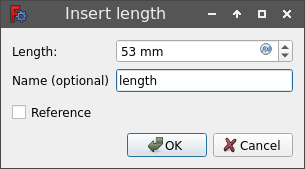

---
- TutorialInfo   *   Topic   *Modeling
   Level   *Beginner
   Author   *Carlo Dormeletti ([onekk](User_onekk.md))
   Time   *Less than an hour
   FCVersion   *0.19 or higher   Files   *[]
---

# Basic Part Design Tutorial 019

This tutorial introduces the new user to some of the tools and techniques used in the [PartDesign Workbench](PartDesign_Workbench.md). This tutorial is not a complete and comprehensive guide to the Part Design Workbench and many of the tools and capabilities are not covered. This tutorial will take user through the steps needed to model the part shown in the image below using sketches.

\'\'Author Note   * This tutorial is work in progress, in this state it is tested only with FreeCAD version 0.20.1 for Linux. Screenshots are made for 0.20.1 too, but it should work without big problems even on 0.19.

As soon I find someone to review it for 0.19 I will made appropriate remarks if necessary for v0.19\'\'

## Before You Begin 

## The Task 

In this tutorial, you will be using the Part Design Workbench to create a 3D solid model of the part shown in the [Drawing](TechDraw_Workbench.md) below. All of the necessary dimensions to complete this task are given. You will start by creating a core shape from a base Sketch and then build on that shape, adding what is known as Features. These features will either add material to, or remove material from the solid by use of additional sketches and accompanying feature operations. This Tutorial will not use every feature and tool available within the Part Design Workbench, but should use enough to give the user of this tutorial a basic foundation upon which to build their knowledge and skills.

## The Part 

## Constructing The Part 

### Startup

First begin by making sure you are in the Part Design Workbench. Once there, you will want to create a new document if you have not done so already. It is a good habit to save your work often, so before anything else save the new document, giving it any name you might like.

All work in Part Design begins with a [Body](Glossary#Body.md). Then we will build the solid inside the body by starting with a [sketch](Glossary#Sketch.md).

Click on  [Create new body](PartDesign_Body.md) to create and activate a new Body Container. 
*Note   * this step can be omitted. When creating a sketch, if no existing Body is found, a new one will be automatically created and activated.*

## Sketch

You will create a base sketch, see maybe [Sketcher WorkBench](Sketcher_Workbench.md) for a more detailed explanation of the terminology used here.

Workflow is following one of the many possible ways to make the design above.

This example will use some techniques described in [ Advice for creating stable models](Feature_editing#Advice_for_creating_stable_models.md).

1.  **master sketch**
2.  **Named constraints** that could be easily reference by other Sketches to make the model *parametric*.
    **Named constraints** are used to hold a dimension in a way to make easy to reuse them across the model.
    This will permit as example to change model width from 53mm as in the technical drawing, to 55mm simply modify **Length** value of the appropriate **named constraint** in the **mater sketch** and having the whole model modify accordingly.
3.  **External Geometries** that could be subject to [Topological Naming Problem](Topological_naming_problem.md), will be used only when stricly necessary and trying to refer **stable** elements.

### Create Sketch 

 

This section is about creating the **master sketch**, that simply hold the rectangle of the base and two **named constraints**   *

1.  **length** that will contain 53mm that is the result of adding the 39mm plus the two 7mm \"sides\"
2.  **width** that will contain 26mm.

Here the steps   *

1.  Click on  [Create new sketch](PartDesign_NewSketch.md). This will create the sketch within the just created body. It will be named **Sketch**.
2.  A dialog like **Fig   * SK1** will open in [Tasks tab](Task_panel.md) on which you have to choose on which plane sketch will be attached.
    1.  Select **XY_Plane** in from the [Combo view](Combo_view.md) list.
    2.  Press **OK**
        *Note   * it\'s possible that the **OK** button may not be visible if the side panel is not wide enough.
        You can make it wider by dragging its right border.
        Place your mouse pointer over the border; when the pointer changes to a two-way arrow, press and hold the left mouse button and drag.*
3.  FreeCAD automatically   *
    1.  switches to [Sketcher workbench](Sketcher_Workbench.md)
    2.  opens the sketch in editing mode and you will see something like **Fig   * SK2**.

### Create the rectangle 

   

Click on  [Rectangle](Sketcher_CreateRectangle.md) tool and start creating a rectangle this way   *

1.  Create the rectangle roughly centered on **Y axis** something that resemble **Fig   * SKC1**. Note   *
    1.  Don\'t place points **X axis** as the **Solver** will automatically apply constraints that will create some problem later.
    2.  It is not important at this step to state exact dimensions, exact dimensions will be assigned using constraints in a later step.
2.  Once done press **ESC** to exit \"rectangle creation mode\". \"Rectangle creation mode\" is indicated by this cursor appearance .

### Applying constraints 

#### Horizontal constraint 

Assign now [horizontal distance constraint](Sketcher_ConstrainDistanceX.md) this way   *

1.  Select line defined by **P2 to P3** in **Fig   * SKC1**.
2.  Use button  [horizontal distance constraint](Sketcher_ConstrainDistanceX.md) this will make two things   *
    1.  A dimension will appear between extreme points of the line selected. This dimension is the actual dimension.
    2.  Additionally a dialog will appear   *
        
3.  Assign a **Length = 53mm**, and to be able to reference the dimension later a name is required as well   * assign **Name = length**.
4.  Click **OK**.
5.  The result should resemble **Fig   * SKC2**

#### Symmetrical constraint 

To center the rectangle, around *Y axis* proceed in this way   *

1.  Select points **P2** and **P3** of the rectangle.
2.  Select the **origin** of the sketch.
    \'\'Note   * selection order of the points is important.\'
3.  Using  [Symmetric](Sketcher_ConstrainSymmetric.md) tool.
4.  You will end with something that resemble **Fig   * SKC3**.

#### Vertical constraint 

You have to assign a [vertical distance constraint](Sketcher_ConstrainDistanceY.md), the procedure is similar to what done for [horizontal distance constraint](Sketcher_ConstrainDistanceX.md)

1.  Select line defined by **P3 to P4** in **Fig   * SKC1**.
2.  Click on  [vertical distance constraint](Sketcher_ConstrainDistanceY.md) and assign   *
    1.  **Length = 26 mm**
    2.  **Name = width**.
3.  Click **OK**.
4.  Result must resemble **Fig   * SKC4**.

Note a couple of things   *

1.  Lines on sketch will change color assuming a \"bright green\" color. (If you use default color theme).
2.  **Solver messages** window is displaying **Fully constrained**.
3.  If you try to click on some line and try to drag them, they won\'t move.

## Side Profile 

You will create a new sketch that is holding the side profile.

### Create the Sketch001 

1.  Click on  [Create new sketch](PartDesign_NewSketch.md). This will create the sketch within the just created body, and FreeCAD will assign the name of **Sketch001**.
    1.  When choosing the plane you will select **YZ_Plane** in the list and press **OK**   *
2.  Use the  [Polyline](Sketcher_CreatePolyline.md) tool and make a shape roughly like that in **Fig   * SP1**;
    1.  Follow the order of point indicated in the image (It is not obtained using FreeCAD, but mimics decently the real appearance with default color theme).
    2.  Exact shape is not important as like in the first sketch you will assign proper constraints later (see note about Constraints below).
        Notes   *
        1.  If you had checked {{CheckBox|TRUE|Auto constraints}} in **Edit controls** window, some of these constraints will have been applied automatically, if not   *
            Make sure that you have exited the Polyline tool by right-clicking or pressing **ESC** twice; the mouse cursor should turn back from a cross-hair to the standard arrow cursor. (Don\'t press **ESC** a third time or you will exit the sketch editing mode; if this happens, click on the Model tab, then double-click the Sketch element in the tree, or right-click and select **Edit sketch** in the contextual menu.)
        2.  If Sketcher\'s Solver detects a redundant constraint it will turn sketch orange in colour, and before further constraints are added, redundant constraints should be removed. (Redundant constraint are shown in Task view, click on the blue reference and press **DEL**.)

### Applying Constraints 

From **Fig   * SP1** you will see that FreeCAD has already applied some constraints   *

1.  Top horizontal line has a  [Horizontal Constraint](Sketcher_ConstrainHorizontal.md) applied.
2.  Right point of the top line has a  [Point On Object Constraint](Sketcher_ConstrainPointOnObject.md) applied.
3.  Left point of bottom horizontal line has another  [Point On Object Constraint](Sketcher_ConstrainPointOnObject.md) applied.

*Note   * when using \"named constraints\" you have to refer to the \"Name\" property, but names shown here may vary due to the way the example file is done (It was made using Part Design Scripting), refer to the names you have in your design*

1.  Select line defined by points **P2** and **P3** and apply a  [horizontal distance constraint](Sketcher_ConstrainDistanceX.md) and assign **Length = 5 mm**.
2.  Select line defined by points **P1** and **P2** and apply a  [vertical distance constraint](Sketcher_ConstrainDistanceX.md) and assign **Length = 26 mm**.
3.  Select line defined by points **P4** and **P1** and apply a  [horizontal distance constraint](Sketcher_ConstrainDistanceX.md) for the value you will use a \"Named constraints\" using [Expressions](Expressions.md) to do so you have to press the little button on the dimensions , and you are presented with a new dialog window named **Formula editor** that contains an input field and a **Result   *** label, similar to the image below   *
    if you start typing in the cell, you will be presented with some autocompletions, base on the \"Name\" of the sketch, in the example is **>**.
    \# Select the right one for your design; Field should have autocompletion so when an element is slected you will be presented with **>.**, note the point after the \"element name\".
    1.  To select **named constraint** \"width\", you have to write the word **Constraints.** with the point, here autocomplete will work.
    2.  To add \"length\" sadly you have not yet autocomplete, so complete the cell to read **>.Constraints.width** if all is good you should see in the cell **Result   *** the correct value as in figure below   *
        *Note the absence of \"red words\" and the correct value in the **Result** field*
    3.  Click **OK** to close **Formula editor** dialog.
    4.  Click **OK** to close **Insert length** dialog.

#### Finalizing the Sketch 

At this point you should have a fully constrained sketch as indicated by it changing color and the message shown in the Combo View. It should now look just like **Fig   * SPFC**   *

*Note the differences in color between distance constraints assigned using expressions and those assigned specifying a length.*

Now in the [Tasks tab](Task_panel.md), click on the **Close** button to leave the sketch edit mode

## Making the Pad 

Select  [Pad](PartDesign_Pad.md) from the toolbar or from the Part Design menu.

This will give you a Pad dialog in the Task View.

Using that dialog, set it\'s values accordingly to the following directions   *

1.  For **Type** select {{ComboBox|LEFT|Dimension}}.
2.  For **Length** you will use again an **Expression** but this time you will enter **>.Constraints.length** in the field.
3.  Select {{CheckBox|TRUE|Symmetric to plane}}.

Once that is done you will have a solid as shown in **Fig   * Pad**

## Features

   

With Pad you have obtained a solid.

Now it is time to add some **Features** to this solid..

These **Features** could be obtained in various way, the way presented here is not the only way to achieve desired result.

Starting point is another time a Sketch.

1.  Hide the just created solid selecting it and using **Spacebar** to hide, or using the
2.  Click on the New sketch icon in the toolbar or from the Part Design menu. This will create a sketch named **Sketch002**.
3.  Select  [Rectangle](Sketcher_CreateRectangle.md) tool, and create a rectangle, do not create it using near the axis, to avoid automatic constraints that will make difficult to move it in the correct position using [External geometry](Sketcher_External.md) tool.
    Apply these constraints   *
    1.  Select one of the horizontal lines apply a horizontal distance constraint and a value of 5 mm.
    2.  Select one of the vertical lines and give it a vertical distance constraint and a value of 11 mm.
        You should obtain something similar to **Fig   * SK2**.
4.  Click **Close** at top of the Tasks tab in the Combo View window.

#### Adding external geometries constraints 

To use an [External geometry](Sketcher_External.md) is necessary to have sketches on which we are \"attaching\" our geometry visible.

1.  In the **Treeview** select **Sketch** and **Sketch001** and make both visible using **Spacebar**.

With **Sketch** and **Sketch001** visible, it is easy to operate   *

1.  Double click on **Sketch002** to activate again *edit mode* and adjust the view so you have clearly visible the points as example like in **Fig   * SK2_1**, this will ease subsequent steps.
    *Note   * position of the rectangle could be different on your draw.*
2.  Select  [External geometry](Sketcher_External.md) tool, the cursor will became .
3.  Select with this cursor point **P1** in **Fig   * SK2_2**, selected point will remain highlighted and in the **Elements** tab of **Task Panel** you will see that this element is shown .
4.  Select with this cursor point **P2** in **Fig   * SK2_2**.
    In the **Elements** tab of **Task Panel** you will see another element like the above.
5.  Press **ESC** to terminate External Geometry selection. Cursor will return **standard arrow pointer**.
6.  Select point **P1** and point **P3** and apply a  [Vertical Constraint](Sketcher_ConstrainVertical.md).
    Rectangle will be aligned with the vertical position of selected point.
7.  Select point **P2** and point **P3** and apply a  [Horizontal Constraint](Sketcher_ConstrainHorizontal.md).
    Rectangle will be aligned with the horizontal position the selected point.

1.  Click **Close** button at top of the Tasks tab in the Combo View window.

### Pockets

You have to subtract some material using the just created sketch that is positioned at one end. To make this operation you have to use  [Pocket](PartDesign_Pocket.md) tool from the toolbar or Part Design menu.

Using this tool is the opposite of the Pad tool. As the Pad tool adds material to the part, the Pocket tool removes material from the part.

#### Pocket

1.  Select **Pad** and Unhide it.
2.  Select **Sketch002**.
3.  Select  [Pocket](PartDesign_Pocket.md) and configure the operation   *
    1.  Select **Type** {{ComboBox|Through all}}.
    2.  Check {{CheckBox|TRUE|Reversed}}
    3.  Click the **OK** button.

You should have something that resemble **Fig   * PK1**

#### Mirror

Instead of creating another sketch and pocket it, as the model is created using the Y axis as a symmetry axis, you could easily duplicate the pocket using  [Mirrored](PartDesign_Mirrored.md).

1.  Select "Pocket".
2.  Click on the  [Mirrored](PartDesign_Mirrored.md) feature on the toolbar or from the Part Design menu.
    A dialog will appear in the Combo View.
    1.  Select Plane {{ComboBox|Vertical sketch axis}} from the pulldown menu.
    2.  Click **OK**
        If all has gone well, you should now have a part that looks like **Fig   * PK2**

#### Pad001

##### Sketch003

 

1.  Make **Sketch** visible as done in precedence.
2.  Click on the New sketch icon in the toolbar or from the Part Design menu. This will create a sketch named **Sketch003**.
3.  Select  [Rectangle](Sketcher_CreateRectangle.md) tool, and create a rectangle.
    Apply these constraints   *
    1.  Select one of the horizontal lines apply a horizontal distance constraint and a value of 7 mm.
    2.  Select one of the vertical lines and give it a vertical distance constraint using an **Espression** and assign a **>.Constraints.width**.
    3.  Add an  [External geometry](Sketcher_External.md) using the point 
**P1** as shown in **Fig   * SK2_2**
4.  Click **Close** at top of the Tasks tab in the Combo View window.

##### Pad001 

1.  Select **Sketch003**.
2.  Click  [Pad](PartDesign_Pad.md) and assign these values   *
    1.  **Type =** {{ComboBox|LEFT|Length}}.
    2.  **Length = 16,70 mm**
3.  Click **Close** at top of the Tasks tab in the Combo View window.
    You should have a result as shown in **Fig   * Pad001**

##### Mirrored001

1.  Select "Pad001".
2.  Click on  [Mirrored](PartDesign_Mirrored.md) and assign   *
    1.  Select Plane {{ComboBox|Vertical sketch axis}} from the pulldown menu. (It should be already selected, but check)
3.  Click **OK**
    If all has gone well, you should now have a part that looks like **Fig   * Mirrored001**

#### Sketch004

 

Now it is time of the most challenging thing, in the design above, you will easily see that central pocket dimensions are referred to the slanted face.

This will surely lead to [Topological_naming_problem](Topological_naming_problem.md) as you could refer to the face that is created using **Sketch001**, a different solution is to use **Sketch001** to model another sketch as follows.

1.  Make **Sketch** visible as done in precedence.
2.  Click on the New sketch icon in the toolbar or from the Part Design menu. This will create a sketch named **Sketch004**.
    1.  Select **YZ Plane**
3.  Using  [Polyline](Sketcher_CreatePolyline.md) tool, trace a polyline like those indicate with points **P1, P2, P3, P4** in **Fig   * CP01**.
    Note   *
    1.  Trace polyline slightly over **X axis**.
    2.  Remember to close polyline clicking first point as last point, this will correctly make the coincident constraints.
    3.  Note applied constraints, if they are not applied using {{CheckBox|TRUE|Auto constraints}} apply manually   *
        1.   [Constraint horizontal](Sketcher_ConstrainHorizontal.md) on lines defined by **P1 to P4**, and **P2 to P3**.
        2.   [Point on object](Sketcher_ConstrainPointOnObject.md) on **P1** and **P2** on the **Y axis**.
4.  Using  [External geometry](Sketcher_External.md) tool select line defined by **EGP1** and **EGP2** on **Sketch001** indicated in **Fig   * CP02** with purple color.
5.  Apply  [Point on object](Sketcher_ConstrainPointOnObject.md) to **P3** and **P4**, selecting the point and the external geometry, this will make line **P3 to P4** coincident with line defined by **EGP1** and **EGP2** in **Sketch001**.
6.  Apply  [Distance](Sketcher_ConstrainDistance.md) to line 
**P3 to P4** and assign **Length = 17.00mm**
7.  Apply  [Distance](Sketcher_ConstrainDistance.md) to 
**P4** and **EGP2** and assign **Length = 7.00mm**
    This will result in a fully constrained sketch like in **Fig   * CP02**.
8.  Close **Sketch004**

#### Pocket001

Now it is time to make the central pocket, remember that the central pocket has to respect some distance to the side pad marked as 11mm distance, but with some easy calculations it will became evident that the pocket is simply centered on the face, this will ease the pocket positioning.

1.  Select **Sketch004**.
2.  Select  [Pocket](PartDesign_Pocket.md) and configure the operation   *
    1.  Select **Type** {{ComboBox|TwoLengths}}.
    2.  Assign **8,50mm** to **Length** and **Length2** values
    3.  Click the **OK** button.
3.  Select the newly created **Pocket001** and modify **Refine** property to **True**

This will result in   *

This tutorial and your model are complete.

## Additional Resources 

File to make comparison with your results   *

{{PartDesign Tools navi

}} {{Sketcher Tools navi}}

---
 [documentation index](../README.md) > [PartDesign](Category_PartDesign.md) > [Sketcher](Category_Sketcher.md) > Basic Part Design Tutorial 019
