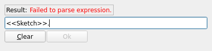

---
- TutorialInfo   *   Topic   *Modeling
   Level   *Beginner
   Author   *Carlo Dormeletti ([onekk](User_onekk.md)) Ed Williams ([edwilliams16](User_edwilliams16.md))
   Time   *Less than an hour
   FCVersion   *0.19 or higher   Files   *[]
---

# Basic Part Design Tutorial 019

This tutorial introduces the new user to some of the tools and techniques used in the [PartDesign Workbench](PartDesign_Workbench.md). This tutorial is not a complete and comprehensive guide to the Part Design Workbench and many of the tools and capabilities are not covered. This tutorial will take user through the steps needed to model the part shown in the image below using sketches.

\'\'Author Note   * This tutorial is work in progress, in this state it is tested only with FreeCAD version 0.20.1 for Linux. Screenshots are made for 0.20.1 too, but it should work without big problems even on 0.19.

As soon I find someone to review it for 0.19 I will made appropriate remarks if necessary for v0.19\'\'

## Before You Begin 

**The Task**

In this tutorial, you will be using the Part Design Workbench to create a 3D solid model of the part shown in the [Drawing](TechDraw_Workbench.md) below, on which all of the necessary dimensions to complete this task are given. See [Workbench Concepts](https   *//wiki.freecadweb.org/Part_and_PartDesign#PartDesign_Workbench_Concepts%7Chttps   *//wiki.freecadweb.org/Part_and_PartDesignPartDesign) for some conceptual background.

You will start by creating a core solid shape from a base Sketch and then build on that shape, adding what are known as Features.

These features will either add material to, or remove material from the solid by use of additional sketches and accompanying feature operations.

This Tutorial will not use every feature and tool available within the Part Design Workbench, but should use enough to give the user of this tutorial a basic foundation upon which to build their knowledge and skills.

This tutorial will provide detailed descriptions when it describes an operation for the first time; subsequent operations will have a more concise description. When in doubt, find the operation that contains the more detailed description. For instance, when creating a sketch for the first time the process of choosing the sketch Plane will be explained in detail, for subsequent sketches it will not.

Feel free to signal errors and problems in this forum thread   *

[New Part Design Tutorial for FC 019 and 020](https   *//forum.freecadweb.org/viewtopic.php?f=36&t=73235)

**The Part**

 

## Constructing The Part 

**Startup**

First begin by making sure you are in  [PartDesign Workbench](PartDesign_Workbench.md), selected from the drop-down menu. Once there, you will want to create a new document if you have not done so already. It is a good habit to save your work often, so first save the new document, giving it any name you choose.

All work in Part Design begins with a [Body](Glossary#Body.md). Then we will build the solid inside the body by starting with a [sketch](Glossary#Sketch.md).

Click on  [Create new body](PartDesign_Body.md) to create and activate a new Body Container. 
*Note   * this step can be omitted. When creating a sketch using Part Design\|Sketch\|Create Sketch, if no existing Body is found, a new one is automatically created and activated. This is not the case if you create a sketch using the Sketcher workbench, as sketches are useful in workbenches other than Part Design.*

## Master Sketch 

You will create a **master sketch**, see [Sketcher WorkBench](Sketcher_Workbench.md) for a more detailed explanation of the terminology used here.

The workflow follows one of the many possible ways to make the above design.

This example will use some techniques described in [ Advice for creating stable models](Feature_editing#Advice_for_creating_stable_models.md).

1.  **master sketch**
2.  **Named constraints** are used to hold dimensions that can be readily referenced later in the model construction.
    For instance, to change the model width from 53 mm, as in the technical drawing, to 55 mm we need only to modify the **Length** value of the appropriate **named constraint** in the **master sketch** and the whole model will modify accordingly. This is *parametric* design in action.
3.  **External Geometries** are potentially subject to the [Topological Naming Problem](Topological_naming_problem.md). We will be using them only when strictly necessary and will attempt to refer to the most **stable** elements available. Referring to edges or vertices of prior sketches is normally more stable than referencing edges or vertices of generated geometry.

**Rationale**

1.  The **Master sketch** contains the model\'s rectangular base shape and two **named constraints** that will be created to supply correct dimensions to other parts of the model   *
2.  **length** that will contain 53mm. (The result of adding the 39mm dimension to the two 7mm \"sides\")
3.  **width** that will contain 26mm.

**Notes**

1.  If {{CheckBox|TRUE|Auto constraints}} in the Sketcher\'s **Edit controls** window is checked, some constraints will be applied automatically. Otherwise, you will need to apply them yourself.
2.  You exit a drawing tool by pressing the **ESC** key or by right-clicking an empty area of the 3D view. The mouse cursor should change to the standard arrow cursor. If you press **ESC** an additional time you will exit the sketch editing mode. To return to the editor, click on the Model tab, then either double-click the Sketch element in the tree, or right-click it and select **Edit sketch** in the resulting context menu.)
3.  If Sketcher\'s Solver detects a redundant constraint it will turn the sketch orange in color. Before further constraints are added, redundant constraints should be removed. (Redundant constraints are shown in the Task view - click on the blue reference and press **DEL**.)
4.  It\'s possible that some elements of the side panel, for instance the **OK** button may not be visible if the side panel is not wide enough.
    You can make it wider by dragging its right border.
    Place your mouse pointer over the border; when the pointer changes to a two-way arrow, press and hold the left mouse button and drag.

 

**Sketch**

1.  Click on  [Create new sketch](PartDesign_NewSketch.md) or the menu item *Sketch\|Create Sketch*. This will create the sketch within the just created body. It will be named **Sketch**.
2.  A dialog like **Fig   * SK1** will open in [Tasks tab](Task_panel.md) on which you have to choose on which plane sketch will be attached.
    1.  Select **XY_Plane** from the [Combo view](Combo_view.md) list.
    2.  Press **OK**
3.  FreeCAD automatically   *
    1.  switches to [Sketcher workbench](Sketcher_Workbench.md)
    2.  opens the sketch in editing mode and you will see something like **Fig   * SK2**.

**Step1   * Rectangle creation**

   

Click on  [Rectangle](Sketcher_CreateRectangle.md) tool and start creating a rectangle this way   *

1.  Create the rectangle roughly centered on **Y axis** resembling **Fig   * SKC1**. Note   *
    1.  Don\'t place points on **X axis** as the **Solver** will automatically apply constraints that will create a problem later.
    2.  The dimensions of the rectangle are unimportant at this point. They will be assigned using constraints in a later step.
2.  Once done, press **ESC** (or right-click) to exit \"rectangle creation mode\". \"Rectangle creation mode\" is indicated by this cursor appearance .

**Step2   * Horizontal constraint**

Assign now a [horizontal distance constraint](Sketcher_ConstrainDistanceX.md) this way   *

1.  Select the line defined by **P2 to P3** in **Fig   * SKC1**.
2.  Use the button  [horizontal distance constraint](Sketcher_ConstrainDistanceX.md) which will make two things happen   *
    1.  A dimension will appear between extreme points of the line selected. This dimension is the current distance.
    2.  Additionally, a dialog will appear   *
        
3.  Set **Length = 53mm**, and to be able to easily reference this dimension later a name is required. You are free to use the name of your choice. It need only be unique within the sketch. Assign **Name = length**.
4.  Click **OK**.
5.  The result should resemble **Fig   * SKC2**

**Step3   * Symmetrical constraint**

To center the the top edge of the rectangle around the origin proceed as follows   *

1.  Select points **P2** and **P3** of the rectangle.
2.  Select the **origin** of the sketch.
    \'\'Note   * the selection order of the points is important.
3.  Use  [Symmetric](Sketcher_ConstrainSymmetric.md) tool.
4.  You will end up with something that resembles **Fig   * SKC3**.
5.  Making a good choice of origin of the model can simplify its construction, in this case by taking advantage of the part\'s reflection symmetry in a later steps.

**Step5   * Vertical constraint**

You now assign a [vertical distance constraint](Sketcher_ConstrainDistanceY.md), using a procedure analogous to the prior [horizontal distance constraint](Sketcher_ConstrainDistanceX.md)

1.  Select the line defined by **P3 to P4** in **Fig   * SKC1**.
2.  Click on  [vertical distance constraint](Sketcher_ConstrainDistanceY.md) and assign   *
    1.  **Length = 26 mm**
    2.  **Name = width**.
3.  Click **OK**.
4.  Result should resemble **Fig   * SKC4**.

Note the following   *

1.  The lines on the sketch will become \"bright green\". (Assuming you have not modified the default color theme).
2.  The **Solver messages** window displays **Fully constrained**.
3.  If you select any line or vertex of the sketch and try to drag it, it won\'t move.

**Step6   * Close Sketch**

Click on **Close** button in the [Tasks tab](Task_panel.md) to leave sketch edit mode.

## Main Profile 

You will create a new sketch that is holding the main profile.

**Sketch001**  Click on  [Create new sketch](PartDesign_NewSketch.md). Create it in **YZ_Plane**. FreeCAD will assign the name of **Sketch001**.

**Step1   * Polyline**

Use the  [Polyline](Sketcher_CreatePolyline.md) tool to make a shape like that in 
**Fig   * SP1**

1.  The labels P1, P2 etc. will not appear in the Sketcher. They were added as references.
2.  The three vertical and horizontal constraints you see in the image are added automatically by the auto-constraints provided you drew the lines that way. If you didn\'t you need to add them.
3.  When you close the figure, make sure the first point is selected when you click to create the final line. The selected point will change color and you will see the symbol for a  [Coincident](Sketcher_ConstrainCoincident.md) constraint appear by the vertex. Coincidence constraints have to be explicit - just having two vertices visually coincident is not sufficient.
4.  As done in first sketch you will assign additional constraints later to adjust the dimensions and exact shape (see note about Constraints below).

**Step2   * Constraints**

1.  Select the point **P2** and the **Y-axis** and apply a  [Point on object](Sketcher_ConstrainPointOnObject.md) constraint.
2.  Select the **origin** and the point **P1** and apply a  [Horizontal](Sketcher_ConstrainHorizontal.md) constraint. Why not a  [Coincident](Sketcher_ConstrainCoincident.md) constraint, you might ask. Try it (and undo). The sketch will turn orange and a solver message *redundant constraints* will appear. Because the line P1-P2 has already been constrained to be vertical, the only remaining degree of freedom is P1\'s y-coordinate. The coincidence constraint sets both the x- and y-coordinates to zero, but the x-coordinate is already determined. The horizontal constraint, on the other hand, only sets the y-coordinate to zero, which is sufficient.
3.  Select the line defined by points **P2** and **P3** and apply a  [horizontal distance constraint](Sketcher_ConstrainDistanceX.md) and assign **Length = 5 mm**.
4.  Select the line defined by points **P1** and **P2** and apply a  [vertical distance constraint](Sketcher_ConstrainDistanceX.md) and assign **Length = 26 mm**.
5.  Select the line defined by points **P4** and **P1** and apply a  [horizontal distance constraint](Sketcher_ConstrainDistanceX.md). For this value you will use a \"Named constraint\" using [Expressions](Expressions.md). To do so you have to press the little button on the dimensions , and you will be presented with a new dialog window named **Formula editor** that contains an input field and a **Result   *** label, similar to the image below   *
    When you start typing in the cell, you will be presented with some autocompletions, the example shows **>**.
    \# Select the right one for your design; in this case we want **>.**. Note the period after the \"element name\".
    1.  To select **named constraint** \"width\", you have to enter **Constraints.** with the period. Here autocomplete works.
    2.  To add \"length\", as yet autocompletion is not available, so complete the cell to read **>.Constraints.width**. If all is good you should see in the cell **Result   *** the correct value as in figure below   *
        *Note both the absence of any \"red error message\" and the correct value of the dimension displayed in the **Result** field*
    3.  Click **OK** to close **Formula editor** dialog.
    4.  Click **OK** to close **Insert length** dialog.
        At this point you should have a fully constrained sketch similar to **Fig   * SPFC**.
        *Note the different colors between distance constraints assigned using expressions and those assigned specifying a length.*

**Step3   * Close Sketch001**

Click on **Close** button in the [Tasks tab](Task_panel.md) to leave sketch edit mode.

**Pad**

Select  [Pad](PartDesign_Pad.md) from the toolbar or from the Part Design menu.

This will give you a Pad dialog in the Task View.

Using that dialog, set its values accordingly to the following directions   *

1.  For **Type** select {{ComboBox|LEFT|Dimension}}.
2.  For **Length** you will use again an **Expression** but this time you will enter **>.Constraints.length** in the field. This should evaluate to 53 mm.
3.  Select {{CheckBox|TRUE|Symmetric to plane}}.

Once that is done you will have a solid as shown in **Fig   * Pad** 

## Features

With Pad you have obtained a solid.

Now it is time to add some **Features** to this solid. Feature operations add or subtract material from our body. The result of any feature operation must remain a single contiguous body. You can\'t create additional bodies or cut them into pieces with them.

These **Features** could be applied in various ways, the way presented here is not the only way to achieve desired result.

The starting point is again a Sketch.

**Sketch002**

   

1.  Hide the just created solid; Select it (Pad) and hit **Spacebar** to hide.
2.  Click on  [Create new sketch](PartDesign_NewSketch.md) in **XZ_Plane**. Sketch will be named **Sketch002**.

**Step1   * Rectangle**

-   Select  [Rectangle](Sketcher_CreateRectangle.md) tool, and create a rectangle. Do not create it too near an axis, to avoid any automatic constraints that would make it difficult to move into the correct position using the [External geometry](Sketcher_External.md) tool.

**Step2   * Constraints**

Apply these constraints   *

1.  Select one of the horizontal lines apply a horizontal distance constraint and a value of 11 mm.
2.  Select one of the vertical lines and give it a vertical distance constraint and a value of 5 mm.

You should obtain something similar to **Fig   * SK2**.

**Step3   * Close Sketch002**

-   Click **Close** at top of the Tasks tab in the Combo View window. *Note   * Sketch002 will not be not fully constrained at this stage.*

**Step   *4 Make visible external geometries**

To use an [External geometry](Sketcher_External.md) is necessary to have sketches to which we are \"attaching\" our geometry visible when you are modifying **Sketch002**.

-   Make sure that **Sketch** and **Sketch001** are both visible. Use **Spacebar** to toggle visibility if needed.

**Step5   * Applying External geometries constraints**

1.  Double click on **Sketch002** to activate *edit mode*. Rotate the view so you can clearly see the points as shown in the example in Fig   * SK2_1. This will ease subsequent steps.
    *Note   * rectangle\'s initial position could be different on your sketch.*
2.  Select  [External geometry](Sketcher_External.md) tool, the cursor will became .
3.  Select with this cursor point **P1** in **Fig   * SK2_2**, selected point will remain highlighted and in the **Elements** tab of **Task Panel** you will see that this element is shown .
4.  Select with this cursor point **P2** in **Fig   * SK2_2**.
    In the **Elements** tab of **Task Panel** you will see another element like the above.
5.  Right-click or press **ESC** to terminate External Geometry selection. The cursor will return to the **standard arrow pointer**.
6.  Select point **P1** and point **P3** and apply a  [Vertical Constraint](Sketcher_ConstrainVertical.md).
    Rectangle will be aligned with the vertical position of selected point.
7.  Select point **P2** and point **P3** and apply a  [Horizontal Constraint](Sketcher_ConstrainHorizontal.md).
    Rectangle will be aligned with the horizontal position the selected point.

**Sketch002** should now show green as \"fully constrained\".

**Step6   * Close Sketch002**

-   Click **Close** button at top of the Tasks tab in the Combo View window.

### Pockets

You have to subtract some material using the just created sketch that is positioned at one end. To make this operation you have to use  [Pocket](PartDesign_Pocket.md) tool from the toolbar or Part Design menu.

Using this tool is the opposite of the Pad tool. As the Pad tool adds material to the part, the Pocket tool removes material from the part.

**Pocket**

1.  Select **Pad** and Unhide it.
2.  Select **Sketch002**.
3.  Select  [Pocket](PartDesign_Pocket.md) and configure the operation   *
    1.  Select **Type** {{ComboBox|Through all}}.
    2.  Check {{CheckBox|TRUE|Reversed}}
    3.  Click the **OK** button.

You should have something that resemble **Fig   * PK1**

**Mirror**

Instead of creating another sketch and pocketing it, we can take advantage of the model\'s mirror symmetry about the **YZ_plane**, and use [Mirrored](PartDesign_Mirrored.md).

1.  Select "Pocket".
2.  Click on the  [Mirrored](PartDesign_Mirrored.md) feature on the toolbar or from the Part Design\|Apply a pattern menu.
    A dialog will appear in the Combo View.
    1.  Select Plane {{ComboBox|Vertical sketch axis}} from the pulldown menu. *Note   * \"Vertical sketch axis\" makes the plane of the sketch the mirror plane. Or, we could have selected \"Base_YZ_Plane\", obtaining the same result.*
    2.  Click **OK**.
        If all has gone well, you should now have a part that looks like **Fig   * PK2**

### Sides

**Sketch003**

  

1.  Make sure **Sketch** is visible, and **Mirrored** is hidden.
2.  Click on  [Create new sketch](PartDesign_NewSketch.md) and create the new sketch in **XY_Plane**; Sketch will be named **Sketch003**.
3.  Select  [Rectangle](Sketcher_CreateRectangle.md) tool, and create a rectangle, similar to those in **Fig   * Sk3_1**. This should not trigger any auto constraint, because we offset our rectangle from the x-axis..
    Apply these constraints   *
    1.  Select one of the horizontal lines apply a horizontal distance constraint and a value of 7 mm.
    2.  Select one of the vertical lines and give it a vertical distance constraint using an **Expression** and assigning the distance **>.Constraints.width**.
    3.  Add an  [External geometry](Sketcher_External.md) using the point **P1** as shown in **Fig   * SK2_2**. (Vertices are somewhat finicky to select. Selecting any line containing P1 will create external references to both ends.)
    4.  Select both the **top-left** point of created rectangle, (marked **TL** in in **Fig   * Sk3_1**) and the newly added External Geometry reference to P1.
    5.  Apply a  [Coincident](Sketcher_ConstrainCoincident.md) Constraint.
4.  Click **Close** at top of the Tasks tab in the Combo View window.

**Pad001**

1.  Select **Sketch003**.
2.  Click  [Pad](PartDesign_Pad.md) and assign these values   *
    1.  **Type =** {{ComboBox|LEFT|Length}}. (on Version 0.19 Should be {{ComboBox|LEFT|Dimension}}.)
    2.  **Length = 16.70 mm**
3.  Click **Close** at top of the Tasks tab in the Combo View window.
    You should have a result as shown in **Fig   * Pad001**

**Mirrored001**

1.  Select "Pad001".
2.  Click on  [Mirrored](PartDesign_Mirrored.md) and check that   *
    1.  Plane {{ComboBox|Vertical sketch axis}} from the pulldown menu, is selected. (It should be already selected, but a double check is not a bad habit.)
3.  Click **OK**.
    If all has gone well, you should now have a part that looks like **Fig   * Mirrored001**

**Note   ***

Our two mirror operations have a common symmetry plane, so we could have made our model a little simpler by combining them. We would

1.  Omit the **Mirror** operation above
2.  Select both Pad001 and Pocket in step 1 of the above **Mirrored001** operation.

This emphasizes the important concept that we are mirroring the selected features (the operations we performed on the body, in the order selected), not the body itself.

### Center Hole 

 

Now it is time for the most challenging part of our modeling, a challenge that arises because the central pocket dimensions are referred to the slanted face.

If you use as a reference points on the slanted face created by padding **Sketch001**, you expose yourself to the [Topological_naming_problem](Topological_naming_problem.md). A better solution is to reference **Sketch001** itself when creating our next sketch as follows.

**Sketch004**

1.  Make **Sketch** visible, and **Mirrored001** hidden.
2.  Click on  [Create new sketch](PartDesign_NewSketch.md), and create the new sketch in the **YZ Plane**. This will create a sketch named **Sketch004**.
3.  Using  [Polyline](Sketcher_CreatePolyline.md) tool, trace a polyline like those indicated by the points **P1, P2, P3, P4** in **Fig   * CP01**.
    Note   *
    1.  Remember to close the polyline by clicking the last point over the selected first point. This will create the required coincidence constraint.
    2.  Check the applied constraints. If they were not applied using {{CheckBox|TRUE|Auto constraints}} apply them manually   *
        1.   [Constraint horizontal](Sketcher_ConstrainHorizontal.md) on lines defined by **P1 to P4**, and **P2 to P3**.
        2.   [Point on object](Sketcher_ConstrainPointOnObject.md) on **P1** and **P2** on the **Y axis**.
4.  Using  [External geometry](Sketcher_External.md) tool select line defined by **EGP1** and **EGP2** on **Sketch001** indicated in **Fig   * CP02** with purple color.
5.  Apply  [Point on object](Sketcher_ConstrainPointOnObject.md) to **P3** and **P4**, selecting the point and the external geometry, this will make line **P3 to P4** coincident with line defined by **EGP1** and **EGP2** in **Sketch001**.
6.  Apply  [Distance](Sketcher_ConstrainDistance.md) to line 
**P3 to P4** and assign **Length = 17.00mm**
7.  Apply  [Distance](Sketcher_ConstrainDistance.md) to 
**P4** and **EGP2** and assign **Length = 7.00mm**
    This will result in a fully constrained sketch like in **Fig   * CP02**.
8.  Close **Sketch004**

**Pocket001**

Now you have to model central pocket, Drawing specify its distance from side pad as 11mm. An easy calculation shows that with this dimension the pocket is centered, having modeled the solid symmetric around the **Y axis** is more easy to place the pocket.

1.  Select **Sketch004**.
2.  Select  [Pocket](PartDesign_Pocket.md) and configure the operation   *
    1.  Select **Type** {{ComboBox|Two Dimensions}}.
    2.  Assign **8.50mm** to **Length** and **Length2** values
    3.  Click the **OK** button.
3.  Select the newly created **Pocket001** and modify **Refine** property to **True**.

**Notes   ***

1.  **Refine** will try to delete \"seams\" left by previous operations. It is advisable to only **\'\'Refine**\'\' the final solid obtained, as some operations can fail if **Refine** is activated.
    (However, there are also cases where **Refine** can make an operation succeed. So in case of problems check this property and test. Unfortunately there is not yet a general rule to follow.)
2.  Alternatively we could have used **Type** {{ComboBox|Dimension}}, checked **Symmetric to Plane** and entered **17 mm** for the **Length** value\'\'

This will result in   *

Your model is complete.

Single click on **Sketch** in the Tree View. Look for Sketch\|Constraints in the Data tab and check on the effects of changing the length and/or width properties. The model should change parametrically.

## Additional Resources 

File to make comparison with your results   *

{{PartDesign Tools navi

}} {{Sketcher Tools navi}}

---
 [documentation index](../README.md) > [PartDesign](Category_PartDesign.md) > [Sketcher](Category_Sketcher.md) > Basic Part Design Tutorial 019
