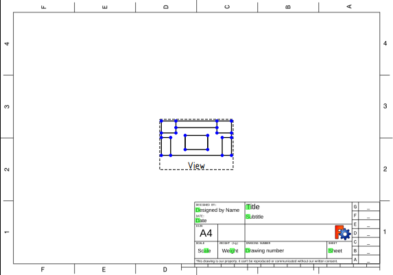
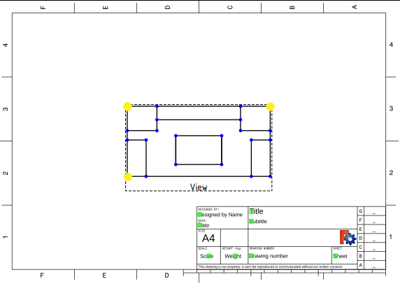
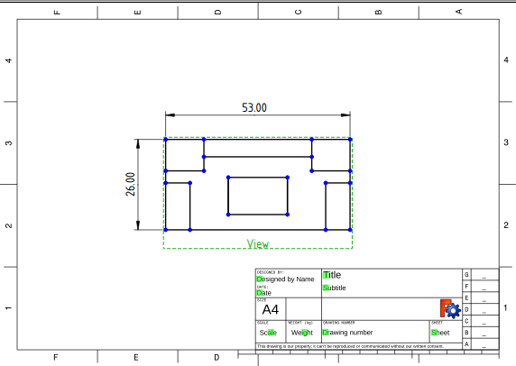
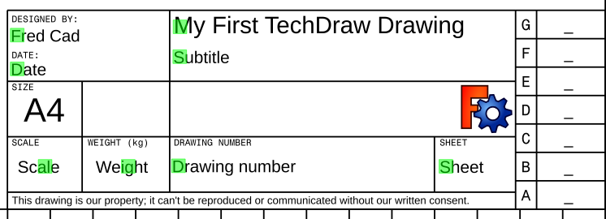
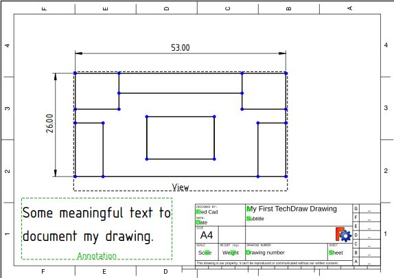
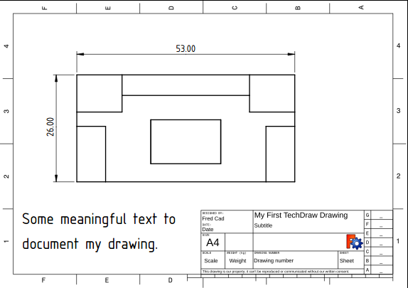
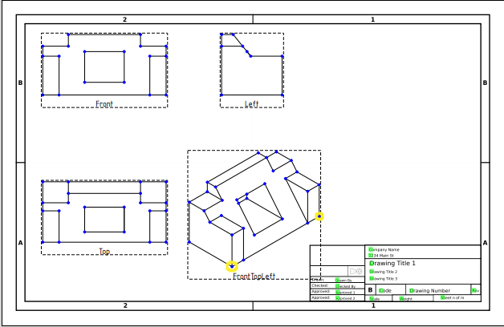
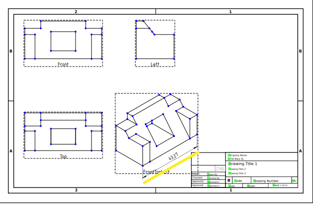
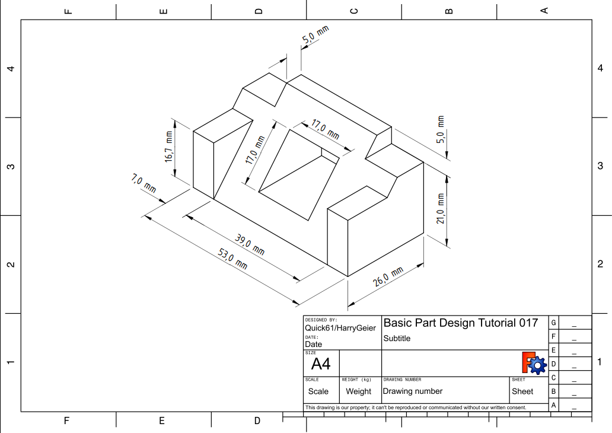

# Basic TechDraw Tutorial
---
- TutorialInfo:   Topic:Modeling
   Level:Beginner
   Author:[WandererFan](User_WandererFan.md)
   Time:Less than an hour
   FCVersion:0.17 or higher
   Files:[https://github.com/FreeCAD/Examples/blob/master/Basic_Part_Design_Tutorial_Example_017_Files/Basic_Part_Design_Tutorial_017.fcstd  Basic Part Design for v0.17 Sample] [https://github.com/FreeCAD/Examples/blob/master/Basic_TechDraw_Tutorial_Example_Files/Basic_TechDraw_Tutorial.fcstd Basic TechDraw Tutorial Sample]
}}

## Introduction

This tutorial introduces the new user to some of the tools and techniques used in the ****. This tutorial is not a complete and comprehensive guide to the TechDraw Workbench and many of the tools and capabilities are not covered. This tutorial will take user through the steps needed to produce technical drawings of the part from the [Basic Part Design Tutorial](Basic_Part_Design_Tutorial.md).

## Before You Begin 

Download the [sample file](https://github.com/FreeCAD/Examples/blob/master/Basic_Part_Design_Tutorial_Example_017_Files/Basic_Part_Design_Tutorial_017.fcstd) from the Part Design tutorial.

## The Task 

In this tutorial, you will be using the TechDraw Workbench to create a 2D drawings of the 3D part below. We will create multiple Views of the part and add key dimensions. This Tutorial will not use every feature and tool available within the TechDraw Workbench, but should use enough to give the user of this tutorial a basic foundation upon which to build their knowledge and skills.

## The Part 

  

## Creating a Drawing 

### Startup

-   You may wish to adjust your [preference](TechDraw_Preferences.md) settings before beginning. See Note 1.
-   First open the file containing our 3D part. Then make sure you are in the TechDraw Workbench.
-   You will be selecting items in the Drawing window and/or the Combo panel. Selection in TechDraw works the same as in the 3D window. Items turn yellow when the cursor is in position to select them and turn green when selected. To select multiple items use the **Ctrl** key while clicking.

### Views and Dimensions 

All work in TechDraw begins with a Page. Pages are based on Templates and contain Views.

1.  Click on  [TechDraw PageDefault](TechDraw_PageDefault.md) to create a new Page.
2.  Click on Body in the [3D view](3D_view.md) or in the [Combo view](Combo_view.md).
3.  Click on  [TechDraw View](TechDraw_View.md). This will add the View to the page we just created.

Now we have a View on the Page looking down at the top of the Body. It is a little small, though.

1.  Select Page in the [Combo view](Combo_view.md) and scroll to the Scale property on the Data tab.
2.  Change the Scale from 1 to 2 and press **Enter**. The View will get bigger.
3.  Drag the View away from the documentation block in the bottom right of the page.

Better, but a little boring. Let\'s add some Dimensions.

1.  Select the top-left Vertex (small dot) with the **LMB** (Left Mouse Button), then also select (**Ctrl**+**LMB**) the bottom-left vertex.
2.  Click on  [TechDraw VerticalDimension](TechDraw_VerticalDimension.md). Drag the dimension text away from the Body.
3.  Try that again with the top-left and top-right Vertices and  [TechDraw HorizontalDimension](TechDraw_HorizontalDimension.md).

### Editable Text 

We should add some documentation to our drawing.

1.  Click on the small green square beside Title in the documentation block. You\'ll get a pop-up window where you can change Title to something more meaningful.
2.  Just for practice, put your name in the Designed by Name field the same way.

Getting better. Let\'s add some text to the page.

1.  Click on  [TechDraw Annotation](TechDraw_Annotation.md). A text block will appear in the middle of the page.
2.  Drag the text block away from the main View.
3.  Click on Annotation in the Combo view and scroll to the Text property on the Data tab.
4.  Click in the data area, then click on the ellipsis at the right of the field. You\'ll get a pop-up window where you can change the text to something more meaningful.

Before we leave this Page, let\'s see what it will look like when we print it.

1.  Click on  [TechDraw ToggleFrame](TechDraw_ToggleFrame.md). The Vertices and View frames will disappear. You can get them back by clicking Toggle again.

### Multiple Views of a Single Part 

Let\'s create a multiview drawing using a different Template as a starting point. We\'ll be using the First Angle convention, but you can change to Third Angle if that is your local convention.

1.  Click on  [TechDraw PageTemplate](TechDraw_PageTemplate.md). A file chooser dialog will appear. Select a template file. We\'re going to use \"ANSIB.SVG\". A new tab will appear.
2.  Select \"Body\" and \"Page001\" (if you have more than one page in your document, you need to tell TechDraw which one to use).
3.  Click on  [TechDraw ProjectionGroup](TechDraw_ProjectionGroup.md). The familiar small view in the middle of the page will appear and a dialog will appear in the Task panel.
4.  Click on several boxes in the Secondary Views section of the dialog.
5.  Drag the View labelled \"Front\". All the other Views move with it.
6.  Change the Scale drop down box from Page to Custom and change the Custom Scale to 2:1. Press the **OK** button.

1.  In the View labelled \"TopLeftFront\", select the two Vertices at the extreme ends of the front edge of the work piece.
2.  Click on  [TechDraw LengthDimension](TechDraw_LengthDimension.md). Drag the dimension text away from the Body.

### Linking Dimensions to 3D Model 

Do you notice a problem with the dimension we just created?

From the first part of this tutorial, we know that the work piece is 53 mm wide, but our new dimensions reads 43.27. This is because \"TopLeftFront\" is an [isometric projection](https://en.wikipedia.org/wiki/Isometric_projection), and our first drawing was an [orthogonal (multiview) projection](https://en.wikipedia.org/wiki/Orthographic_projection). To get the right value, we need to link our dimension directly to the 3D model.

1.  Note the name of our faulty dimension in the Combo panel. We\'ll need it in a minute.
2.  Change to the 3D tab and select the Vertices at the ends of the front edge of the work piece. Also select Page001.
3.  Click on  [TechDraw LinkDimension](TechDraw_LinkDimension.md). A dialog will open in the Task panel.
4.  In the dialog, move our dimension from the Available column to the Selected column. Press **OK**.
5.  Return to Page001. Our dimension should now read the correct value of 53. (if you still see 43.27, you may need to press the **Recompute** button or drag the dimension value a bit until it changes.)

## Going Further 

In this tutorial you have learned enough about TechDraw to produce a drawing like this one (by [NormandC](User_Normandc.md)). See Note 2.

There is much more functionality in TechDraw for you to explore - Section Views, Detail Views, Svg Symbols, Images, face hatching.

## Notes

1.  There is an excellent set of suggested preferences in this [Forum post](https://www.forum.freecadweb.org/viewtopic.php?f=3&t=30083#p248189).
2.  This drawing was produced in v0.18. It shows dimensions in the proper format for an isometric view. In v0.17 the extension lines will be perpendicular to the edge rather than aligned with the axes.

## Additional Resources 

-   FreeCAD file of this exercise for comparison (made with 0.17) [Download](https://github.com/FreeCAD/Examples/blob/master/Basic_TechDraw_Tutorial_Example_Files/Basic_TechDraw_Tutorial.fcstd)

  {{TechDraw Tools navi}} {{Userdocnavi
---

---
 [documentation index](../README.md) > [Tutorials](Category_Tutorials.md) > [TechDraw](Category_TechDraw.md) > Basic TechDraw Tutorial
