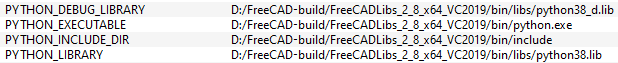

# Compile on Windows
This page explains step by step **how to compile FreeCAD 0.19 or newer on Windows** using Microsoft\'s MSVC compiler. For information on using MSYS2/MinGW see [Compile on MinGW](Compile_on_MinGW.md). For other platforms see [Compiling](Compiling.md).

## Prerequisites

Compiling FreeCAD on Windows requires several tools and libraries.

### Required

-   A compiler. FreeCAD is tested with Visual Studio (MSVC)---other compilers may work, but instructions for use are not included here. Fore more details, see the section [Compiler](#Compiler.md) below.

-   [Git](http://git-scm.com/) (There are also GUI frontends available for Git, see the next section.)

-   [CMake](https://cmake.org/download/) version 3.11.x or newer.  *Hint:* Choosing the option *Add CMake to the system PATH for all users* when installing CMake will make CMake accessible from the Windows command prompt, which can be useful.

-   The [LibPack](https://github.com/FreeCAD/FreeCAD-LibPack). This is a single package containing all of the libraries necessary to compile FreeCAD on Windows. Download the version of the LibPack that corresponds to the version of FreeCAD you want to compile. To compile FreeCAD 0.20 download the [LibPack version 2.6](https://github.com/FreeCAD/FreeCAD-LibPack/releases/tag/2.6), for FreeCAD 0.19 download the [LibPack version 1.0](https://github.com/FreeCAD/FreeCAD-LibPack/releases/tag/1.0). Extract the LibPack to a convenient location. (If your computer does not recognize the .7z extension, you must install the program [7-zip](https://www.7-zip.org).)  **Note**: It is highly recommended to compile FreeCAD with the compiler version the LibPack is designed for. For example, you might run into problems compiling FreeCAD 0.20 using MSVC 2017 because the LibPack is designed to be built with MSVC 2019 or newer.To update your LibPack later, see the section [Updating the LibPack](#Updating_the_LibPack.md).

### Optional programs 

-   A GUI frontend for Git. There are several frontends available, see [this list](https://en.wikipedia.org/wiki/Comparison_of_Git_GUIs). The main benefit of a frontend is that you don\'t have to learn the Git commands to get the source code of FreeCAD or to send patches to the GitHub repository of FreeCAD.

In the following we describe source code handling using the [TortoiseGit](https://tortoisegit.org/) frontend. This frontend integrates directly into Windows file explorer and has a large user community to get help in case you have problems.

-   [NSIS](http://sourceforge.net/projects/nsis/) is used to generate the FreeCAD Windows installer.

### Source code 

Now you can get the source code of FreeCAD:

#### Using a frontend 

When using the [Git frontend](https://en.wikipedia.org/wiki/Comparison_of_Git_GUIs) TortoiseGit:

1.  Create a new folder where the source code will be downloaded.
2.  Right-click on this folder in the Windows file explorer and select **Git Clone** in the context menu.
3.  A dialog will appear. In it, enter the URL for the FreeCAD Git repository

 *<https://github.com/FreeCAD/FreeCAD.git>* 

and click **OK**.

The latest source code will be downloaded from the FreeCAD Git repository and the folder will be tracked by Git.

#### Using the command line 

To create a local tracking branch and download the source code, open a terminal (command prompt) and switch there to the directory you want the source, then type:

 
```python
git clone https://github.com/FreeCAD/FreeCAD.git
```

### Compiler

The default (recommended) compiler is MS Visual Studio (MSVC). Though it may be possible to use other compilers, for example gcc via Cygwin or MinGW, it is not tested or covered here.

You can get a free version of MSVC (for individual usage) by downloading the [*Community* edition of MS Visual Studio](https://visualstudio.microsoft.com/vs/community/).

For those who want to avoid installing the huge MSVC for the mere purpose of having a compiler, see [CompileOnWindows - Reducing Disk Footprint](CompileOnWindows_-_Reducing_Disk_Footprint.md).

**Note:** Although the *Community* edition of MSVC is free, to use the IDE for more than a 30-day trial period you must create a Microsoft account. If you will only compile using the command line, you don\'t need the IDE and thus no Microsoft account.

As a free and OpenSource alternative IDE you can use [KDevelop](https://www.kdevelop.org/download). You can use KDevelop to modify and write C++ code but must use the command line to compile.

### Optional system path configuration 

Optionally you can include the paths to some folders to the system PATH variable. This is helpful if you want to access programs in these folders from the command line/powershell or if you want special programs to be found by the compiler or CMake. Besides this, adding folders to the PATH might be necessary if you did not use the corresponding options when installing the program.

-   You can include the folder of your LibPack in your system PATH variable. This is useful if you plan to build multiple configurations/versions of FreeCAD.
-   If you did not use the option to add CMake to the PATH while installing it, add its installation folder

*C:\\Program Files\\CMake\\bin* to the PATH.

-   If you did not use the option to add TortoiseGit to the PATH while installing it, add its installation folder

*C:\\Program Files\\TortoiseGit\\bin* to the PATH.

To add folder paths to the PATH variable:

1.  In the Windows Start menu Right click on *Computer* and choose *Properties*.
2.  In the appearing dialog click on *Advanced system settings*.
3.  Another dialog will open. Click there in the tab *Advanced* on **Environment Variables**.
4.  Again another dialog will open. Select then the variable *Path* and click on **Edit**.
5.  And again another dialog will open. Click there on **New** and add to path to the folder of Git or the LibPack.
6.  Finally press **OK** and close all dialogs by pressing **OK** as well.

## Configuration

Once you have all of the necessary tools, libraries, and FreeCAD source code, you are ready to begin the configuration and compilation process. This process will proceed in five steps:

1.  Run CMake once to examine your system and begin the configuration progress (this will report that it failed).
2.  Adjust necessary CMake settings to set the locations of the LibPack and enable Qt5.
3.  Re-run CMake to finalize the configuration (this time it should succeed).
4.  Use CMake to generate the Visual Studio build system.
5.  Use Visual Studio to build FreeCAD.

### CMake

First, configure the build environment using CMake:

1.  Open the CMake GUI
2.  Specify the source folder of FreeCAD.
3.  Specify a build folder (do not use the source folder \-- CMake will create this folder if it does not exist).
4.  Click **Configure**.
5.  In the dialog that appears specify the generator you want to use: in most cases you will use the defaults in this dialog. For the standard MS Visual Studio use *Visual Studio xx 2yyy* where xx is the compiler version and 2yyy the year of its release. It is recommended to use the default option *Use default native compilers*.

**Note:** It is important to specify the correct bit variant. If you have the 64-bit variant of the LibPack you must also use the x64 compiler.

This will begin the configuration and *will fail* because of missing settings. This is normal, you have not yet specified the location of the LibPack. However, there are other failures that might occur that require some further action on your part.

If it fails with the message that Visual Studio could not be found, the CMake support in MSVC is not yet installed. To do this:

1.  Open the MSVC IDE
2.  Use the menu Tools → Get Tools and Features
3.  In the *Workloads* tab enable *Desktop development with C++*
4.  On the right side you should now see that the component *Visual C++ tools for CMake* will be installed.
5.  Install it.

If it fails with a message about the wrong Python version or missing Python, then:

1.  Use the \"Search:\" box in CMake to search for the string \"Python\"
2.  If you see there a path like *C:/Program Files/Python38/python.exe*, CMake recognized the Python that is already installed on your PC, but that version is not compatible with the LibPack. Since the LibPack includes a compatible version of Python, modify the following Python settings in CMake to its paths (assuming the LibPack is in the folder *D:\\FreeCAD-build\\FreeCADLibs_12.5.2_x64_VC17*):



If there is no error about Visual Studio or Python, everything is fine, but CMake does not yet know all necessary settings. Therefore now:

1.  Search in CMake for the variable **FREECAD_LIBPACK_DIR** and specify the location of the LibPack folder you downloaded earlier.
2.  Only if building FreeCAD 0.19, search for the variable **BUILD_QT5** and enable this option.
3.  Click **Configure** again.

There should now be no errors. If you continue to encounter errors that you cannot diagnose, visit the [Install/Compile forum](https://forum.freecadweb.org/viewforum.php?f=4) on the FreeCAD forum website. If CMake proceeded correctly, click on **Generate**. After this is done you can close CMake and start the compilation of FreeCAD using Visual Studio. However, for the first compilation keep it open in case you want or need to change some options for the build process.

**Note:** When compiling FreeCAD 0.19, the CMake variable **BUILD_ENABLE_CXX_STD** will be set to **C++14** while for FreeCAD 0.20 it will be set to **C++17**. This is because FreeCAD 0.20 requires at least the C++ language standard version 17. So when you compiled the last time FreeCAD 0.19 it is necessary to re-run CMake for FreeCAD 0.20 to change the C++ language standard.

### Options for the build process 

The CMake build system gives you control over some aspects of the build process. In particular, you can switch on and off some features or modules using CMake variables.

Here is a description of some of these variables:

  Variable name                       Description                                                                                                                                                                                                                                                                                                                                                                                                                                                                                                                                                                                                                                                     Default
    
  BUILD_XXX                           Build FreeCAD with the component XXX. If you don\'t want/need to compile e.g. the workbench *OpenSCAD*, disable the variable *BUILD_OPENSCAD*. FreeCAD will then not have this workbench. **Note:** Some components are required for other components. If you for example uncheck *BUILD_ROBOT* CMake will inform you that then the component *Path* cannot be compiled correctly. Therefore check the CMake output after you changed a BUILD_XXX option!                                                                                                                                                                                                       depends
  BUILD_ENABLE_CXX_STD                The version of the C++ language standard. **C++14** is the highest possible for FreeCAD 0.19 while at least **C++17** is required for FreeCAD 0.20. See also the note in the section [Building with Visual Studio 15 (2017) and 16 (2019)](#Release_Build.md)                                                                                                                                                                                                                                                                                                                                                                                           depends
  BUILD_DESIGNER_PLUGIN               To build the Qt Designer plugin, see [this section below](Compile_on_Windows#Qt_Designer_plugin.md)                                                                                                                                                                                                                                                                                                                                                                                                                                                                                                                                                     OFF
  BUILD_FLAT_MESH                     Necessary to have a build that includes the [CreateFlatMesh feature](MeshPart_CreateFlatMesh.md)                                                                                                                                                                                                                                                                                                                                                                                                                                                                                                                                                        OFF
  CMAKE_INSTALL_PREFIX                The output folder when building the target *INSTALL*, see also the section [Running and installing FreeCAD](#Running_and_installing_FreeCAD.md)                                                                                                                                                                                                                                                                                                                                                                                                                                                                                                         Windows default program installation folder
  FREECAD_COPY_DEPEND_DIRS_TO_BUILD   Copies depending libraries needed to execute the FreeCAD.exe to the build folder. See also the section [Running and installing FreeCAD](#Running_and_installing_FreeCAD.md). **Note:** the options FREECAD_COPY_XXX only appear if the libraries were not already copied. If you only need to upgrade/change to another LibPack version, see the section [Updating the LibPack](#Updating_the_LibPack.md). If you want to bring back the options for some reason, you need to delete all folders in your build folder, except for the LibPack folder. In CMake delete the cache and start as if you compile for the first time.   OFF
  FREECAD_COPY_LIBPACK_BIN_TO_BUILD   Copies the LibPack binaries needed to execute the FreeCAD.exe to the build folder. See also the section [Running and installing FreeCAD](#Running_and_installing_FreeCAD.md).                                                                                                                                                                                                                                                                                                                                                                                                                                                                           OFF
  FREECAD_COPY_PLUGINS_BIN_TO_BUILD   Copies Qt\'s plugin files needed to execute the FreeCAD.exe to the build folder. See also the section [Running and installing FreeCAD](#Running_and_installing_FreeCAD.md).                                                                                                                                                                                                                                                                                                                                                                                                                                                                             OFF
  FREECAD_LIBPACK_USE                 Switch the usage of the FreeCAD LibPack on or off                                                                                                                                                                                                                                                                                                                                                                                                                                                                                                                                                                                                               ON
  FREECAD_LIBPACK_DIR                 Directory where the LibPack is                                                                                                                                                                                                                                                                                                                                                                                                                                                                                                                                                                                                                                  FreeCAD\'s source code folder
  FREECAD_RELEASE_PDB                 Create debug libraries (\*.pdb) also for release builds. It doesn\'t affect the speed (like a real debug build would do) and can be very useful to locate crashes in FreeCAD code. In case FreeCAD crashes a *crash.dmp* file will be created that can be loaded with MSVC and if you have the corresponding PDB files plus the source code of that version you can debug through the code. Without the PDB files it\'s not possible to debug the code and all what the debugger shows is the name of the DLL where the crash has occurred.                                                                                                                     ON
  FREECAD_USE_MP_COMPILE_FLAG         Adds the /MP (multiprocessor) option to the Visual Studio projects, enabling speedups on multi-core CPUs. This can greatly accelerate builds on modern processors.**Note:** If you turn off **FREECAD_USE_PCH**, the compilation can quickly overload your heap space, even if you have 16 GB RAM.                                                                                                                                                                                                                                                                                                                                                ON
  FREECAD_USE_PCH                     [Precompiles the headers](https://en.wikipedia.org/wiki/Precompiled_header) in order to save compilation time.                                                                                                                                                                                                                                                                                                                                                                                                                                                                                                                                                  ON
  FREECAD_USE_PYBIND11                Includes the [PyBind11](https://github.com/pybind/pybind11) library. Necessary to have a build that includes the [CreateFlatMesh feature](MeshPart_CreateFlatMesh.md).**Note:** after turning it on you might get a configuration error. Just configure again and the problem should go away.                                                                                                                                                                                                                                                                                                                                             OFF

## Building FreeCAD 

Depending on your compiler, the process for building FreeCAD will be slightly different. In the following sections known workflows are described. If you are building with Qt Creator, jump to [Building with Qt Creator (outdated)](#Building_with_Qt_Creator_.28outdated.29.md), otherwise proceed directly:


<div class="mw-collapsible mw-collapsed toccolours">


### Building with Visual Studio 15 (2017) or newer 


<div class="mw-collapsible-content">


#### Release Build 

1.  Start the Visual Studio IDE. This can either be done by pressing the button *Open Project* in the CMake GUI or by double-clicking on the file *FreeCAD.sln* that you find in your build folder.
2.  In the toolbar of the MSVC IDE assure that you use for the first compilation *Release*.
3.  There is a window called *Solution Explorer*. It lists all possible compilation targets. To start a full compilation, right-click on the target **ALL_BUILD** and then choose **Build**.

This will now take quite a long time.

To compile a ready-to use FreeCAD, compile the target *INSTALL*, see the section [Running and installing FreeCAD](#Running_and_installing_FreeCAD.md).

If you don\'t get any errors you are done. **Congratulations!** You can exit MSVC or keep it open.

**Note:** FreeCAD 0.20 requires at least the C++ language standard version 17 but the 3rd-party component *flann* from the LibPack is not yet ready for this. Therefore you will get compilation errors for the target *ReverseEngineering*. To fix this, right-click on this target in the MSVC solution explorer and select in the context menu the last entry *Properties*. In the appearing dialog change the **C++ Language Standard** to **ISO C++14**. Finally build the target **ALL_BUILD** again.

#### Debug Build 

For a debug build it is necessary that the Python is used that is included in the LibPack. To assure this:

1.  Search in the CMake GUI for \"Python\"
2.  If you see there a path like *C:/Program Files/Python38/python.exe*, CMake recognized the Python that is installed on your PC and not the one of the LibPack. In this case adapt these different Python settings in CMake to this (assuming the LibPack is in the folder *D:\\FreeCAD-build\\FreeCADLibs_12.5.2_x64_VC17*):


As prerequisite for the debug build, you need to do this:

1.  Copy the content of the LibPack folder *bind* to the *bin* folder of the FreeCAD build folder (overwrite the existing files).
2.  Copy the content of the LibPack folder *libd* to the *lib* folder of the FreeCAD build folder.

Now you can compile:

1.  Start the Visual Studio IDE. This can either be done by pressing the button *Open Project* in the CMake GUI or by double-clicking on the file *FreeCAD.sln* that you find in your build folder.
2.  In the toolbar of the MSVC IDE assure that you use for the first compilation *Debug*.
3.  There is a window called *Solution Explorer*. It lists all possible compilation targets. To start a full compilation, right-click on the target **ALL_BUILD** and then choose **Build** in the context menu.

This will now take quite a long time. If there were no compilation errors, you can start the debug build:

1.  Right-click on the target **FreeCADMain** and then choose **Set as Startup Project** in the context menu.
2.  Finally click in the toolbar on the button with the green triangle named **Local Windows Debugger**.

This will start the debug build of FreeCAD and you can use the MSVC IDE to debug it.

#### Video Resource 

An English language tutorial that begins with configuration in CMake Gui and continues to the \


</div>


</div>


<div class="mw-collapsible mw-collapsed toccolours">


### Building with Qt Creator (outdated) 


<div class="mw-collapsible-content">


#### Installation and configuration of Qt Creator 

-   Download and install [Qt Creator](https://www.qt.io/offline-installers)
-   Tools → Options → Text Editor → Behavior tab:
    -   File Encodings → Default Encodings:
    -   Set to: **ISO-8859-1 /\...csISOLatin1** (Certain characters create errors/warnings with Qt Creator if left set to UTF-8. This seems to fix it.)
-   Tools → Options → Build & Run:
    -   CMake tab
        -   Fill Executable box with path to cmake.exe
    -   Kits tab
        -   Name: MSVC 2008
        -   Compiler: Microsoft Visual C++ Compiler 9.0 (x86)
        -   Debugger: Auto detected\...
        -   Qt version: None
    -   General tab
        -   Uncheck: Always build project before deploying it
        -   Uncheck: Always deploy project before running it

#### Import project and building 

-   File → Open File or Project
-   Open **CMakeLists.txt** which is in the top level of the source
-   This will start CMake
-   Choose build directory and click next
-   Set generator to **NMake Generator (MSVC 2008)**
-   Click Run CMake. Follow the instructions depicted above to configure CMake to your liking.

Now FreeCAD can be built

-   Build → Build All
-   This will take a long time\...

Once complete, it can be run: There are 2 green triangles at the bottom left. One is debug. The other is run. Pick whichever you want. 


</div>


</div>


<div class="mw-collapsible mw-collapsed toccolours">


### Command line build 


<div class="mw-collapsible-content">


The steps how to compile from the command line depends on the compiler. For MSVC 2017 the steps are:

1.  In Windows start menu go to **Visual Studio 2017 → Visual Studio Tools** and choose **Developer Command Prompt for VS 2017**
2.  Change to your build folder.
3.  Execute the command

 

or

 

These steps can also be automaized. Here is for example a solution for MSVC 2017:

1.  Download the script [compile-FC.txt](https://forum.freecadweb.org/download/file.php?id=92135).
2.  Rename it to *compile-FC.bat*
3.  In Windows file explorer Shift+Right-click on your build folder and use from the context menu *Command prompt here*.
4.  Execute the command

 

Instead of calling **compile-FC** with the option *install* you can also use *debug* or *release*:

*debug*   - compile FreeCAD in debug configuration

*release* - compile FreeCAD in release configuration

*install*    - compile FreeCAD in release configuration and create an install setup


</div>


</div>


## Running and installing FreeCAD 

There are 2 methods to run the compiled FreeCAD:

*Method 1*: You execute the FreeCAD.exe that you find in your build folder in the subfolder *bin*

*Method 2*: You build the target *INSTALL*

Method 2 is the simpler one because it automatically assures that all libraries needed to run the FreeCAD.exe are in the correct folder. The FreeCAD.exe and the libraries will be output in the folder you specified in the CMake variable *CMAKE_INSTALL_PREFIX*.

For Method 1 you need to put the libraries into the *bin* folder of your build folder (where the FreeCAD.exe is). This can easily be done:

1.  Open the CMake GUI.
2.  Search there for the variable option *FREECAD_COPY_DEPEND_DIRS_TO_BUILD* and check it. If there is no such option, the libraries were already copied, see the [description of the options](#Options_for_the_build_process.md).
3.  Search there for the variable option *FREECAD_COPY_LIBPACK_BIN_TO_BUILD* and check it.
4.  Search there for the variable option *FREECAD_COPY_PLUGINS_BIN_TO_BUILD* and check it.
5.  Click on **Configure**. At the end of the configuration CMake will automatically copy the necessary libraries from the LibPack folder.

### Troubleshooting

When running FreeCAD you may encounter missing DLLs when using certain workbenches or features of workbenches. The error message in FreeCAD\'s console will not tell you what DLL is missing. To find this out you must use an external tool:

-   Download the latest release of the program **Dependencies**: <https://github.com/lucasg/Dependencies/releases> (choose the file *Dependencies_x64_Release.zip*)
-   In the FreeCAD [Python console](Python_console.md) execute these commands:

import os
os.system(r"~\DependenciesGui.exe")

**Note**: Instead of the \~ you must specify the full path to the *DependenciesGui.exe* on your system.

-   Now drag in the \*.pyd file of the workbench with which you get missing DLLs reported.

## Updating the build 

FreeCAD is very actively developed. Therefore its source code changes almost daily. New features are added and bugs are fixed. To benefit from these source code changes, you must rebuild your FreeCAD. This is done in two steps:

1.  Updating the source code
2.  Recompilation

### Updating the source code 

#### Using a frontend 

When using the [Git frontend](https://en.wikipedia.org/wiki/Comparison_of_Git_GUIs) TortoiseGit:

1.  Right-click on your FreeCAD source code folder in the Windows file explorer and select in the context menu **Pull**.
2.  A dialog will appear. Select there what development branch you want to get. **master** is the main branch. Therefore use this unless you want to compile a special new feature from a branch that has not yet been merged to *master*. (For more about Git branches, see [Git development process](Source_code_management#Git_development_process.md).)

Finally click **OK**.

#### Using the command line 

Open a terminal (command prompt) and switch there to your source directory. Then type:

 
```python
git pull https://github.com/FreeCAD/FreeCAD.git master
```

where *master* the the name of the main development branch. If you want to get code from another branch, use its name instead of *master*.

### Recompilation

1.  Open the MSVC IDE by double-clicking either on the file *FreeCAD.sln* or on the file *ALL_BUILD.vcxproj* in your build folder.
2.  Continue with step 2 from the section [Building with Visual Studio 15 2017](#Building_with_Visual_Studio_15_.282017.29_or_newer.md).

## Updating the LibPack 

If a new major version of a third-party dependency like Open Cascade is released, or if a third-party dependency has important bug fixes, a new LibPack is released. You can find the latest version [here](https://github.com/FreeCAD/FreeCAD-LibPack/releases/).

To update your LibPack the following recipe is best practice:

1.  Delete the *bin* folder in your build folder.
2.  Switch to your local LibPack folder and delete everything there.
3.  Extract the content of the new LibPack ZIP file into the existing, but now empty, local LibPack folder.
4.  Open CMake and there press the button **Configure** and then the button **Generate**. This recreates the *bin* folder you just deleted and also copies the new LibPack files into it.
5.  In CMake click the button **Open Project** and the MSVC IDE will open.
6.  In the MSVC IDE build the target *INSTALL*.

## Tools

In order to join the FreeCAD development you should compile and install the following tools:

### Qt Designer plugin 

FreeCAD uses [Qt](https://en.wikipedia.org/wiki/Qt_(software)) as toolkit for its user interface. All dialogs are setup in UI-files that can be edited using the program [Qt Designer](https://doc.qt.io/qt-5/qtdesigner-manual.html) that is part of any Qt installation and also included in the LibPack. FreeCAD has its own set of Qt widgets to provide special features like adding a unit to input fields and to set preferences properties.

#### Compilation

The plugin cannot be loaded by the Qt Designer if it was compiled using another Qt version than the one your Qt Designer/Qt Creator is based on. Therefore the plugin must be compiled together with FreeCAD:

-   In the CMake options (see [this section above](Compile_on_Windows#Options_for_the_build_process.md)) enable the option BUILD_DESIGNER_PLUGIN and reconfigure.
-   open MSVC and build the target **FreeCAD_widgets**

As result you will get the plugin file *\'FreeCAD_widgets.dll* in the folder*\~\\src\\Tools\\plugins\\widget\\Release*

#### Installation

To install the plugin, copy it to either:

-   If you use the LibPack: to the folder*\~\\FreeCADLibs_12.5.4_x64_VC17\\bin\\designer*Since there will only be a *bin* folder and you must first create the *designer* subfolder.
-   If you have a full Qt installation: you can choose between the folder*C:\\Qt\\5.15.2\\msvc2019_64\\plugins\\designer*or*C:\\Qt\\5.15.2\\msvc2019_64\\bin\\designer* (you must first create the *designer* subfolder.)(adapt the paths to your installation!).

Finally (re)start Qt Designer and check its menu **Help → Plugins**. If the plugin **FreeCAD_widgets.dll** is listed as being loaded, you can now design and change FreeCAD\'s .ui files. If not, you must [compile](#Compilation.md) the DLL by yourself.

If you prefer using [Qt Creator](https://en.wikipedia.org/wiki/Qt_Creator) instead of Qt Designer, the plugin file must be placed in this folder:*C:\\Qt\\Qt5.15.2\\Tools\\QtCreator\\bin\\plugins\\designer*Then (re)start Qt Creator, switch to the mode **Design** and then check the menu **Tools → Form Editor → About Qt Designer Plugins**. If the plugin **FreeCAD_widgets.dll** is listed as being loaded, you can now design and change FreeCAD\'s .ui files. If not, you must [compile](#Compilation.md) the DLL by yourself.

### Thumbnail Provider 

FreeCAD has the feature to provide preview thumbnails for \*.FCStd files. That means that in the Windows file explorer \*.FCStd files are shown with a screenshot of the model it contains. To provide this feature, FreeCAD needs to have the file **FCStdThumbnail.dll** installed to Windows.

#### Installation 

The DLL is installed this way:

1.  Download [this ZIP file](https://forum.freecadweb.org/download/file.php?id=13404) and extract it.
2.  Open a Windows command prompt with administrator privileges (these privileges are a requirement).
3.  Change to the folder where the DLL is.
4.  Execute this command 
```pythonregsvr32 FCStdThumbnail.dll```

So check if it works, assure that in FreeCAD the preferences option **[Save thumbnail into project file when saving document](Preferences_Editor#Document.md)** is enabled and save a model. Then view in Windows Explorer the folder of the saved model using a symbol view. You should now see a screenshot of the model in the folder view.

#### Compilation 

To compile the FCStdThumbnail.dll

1.  Change to the FreeCAD source folder*\~\\src\\Tools\\thumbs\\ThumbnailProvider*
2.  Open the CMake GUI
3.  Specify there as source folder the one you are currently in.
4.  Use the same folder as build folder.
5.  Click **Configure**
6.  In the appearing dialog, specify the generator according to the one you want to use. For the standard MS Visual Studio use *Visual Studio xx 2yyy* where xx is the compiler version and 2yyy the year of its release. It is recommended to use the default option *Use default native compilers*.**Note:** It is important to specify the correct bit variant. If you have the 64bit variant of LibPack you must also use the x64 compiler.
7.  Click on **Generate**.
8.  You should now have the file **ALL_BUILD.vcxproj** in the folder *\~\\src\\Tools\\thumbs\\ThumbnailProvider*. Double-click on it and the MSVC IDE will open.
9.  In the toolbar of the MSVC IDE assure that you use the compilation target *Release*.
10. There is a window called *Solution Explorer*. Right-click there on **ALL_BUILD** and then choose **Build**.
11. As result you should now have a **FCStdThumbnail.dll** in the folder *\~\\src\\Tools\\thumbs\\ThumbnailProvider\\release* that you can install as described above.

## Compiling Open Cascade 

The LibPack comes with a version of [Open Cascade](https://en.wikipedia.org/wiki/Open_Cascade) that is suitable for general use. However, under some circumstances you may wish to compile against an alternate version of Open Cascade, such as one of their official releases, or a patched fork.

When compiling Open Cascade for FreeCAD note that there is no guarantee that FreeCAD will work with all versions of Open Cascade. Note also that when you are using the Netgen library, you must use the a NetGen version that it approved to compile with the Open Cascade version you like to compile.

To compile:

-   First obtain the Open Cascade source code, either directly from [Open Cascade\'s git repository](https://github.com/Open-Cascade-SAS/OCCT) or by cloning someone else\'s fork, such as [the \"blobfish\" fork](https://gitlab.com/blobfish/occt) maintained by FreeCAD forum member [tanderson69](https://forum.freecadweb.org/memberlist.php?mode=viewprofile&u=208).

-   Then open the CMake GUI to configure the build system in a similar manner to building FreeCAD. These CMake options have to be set (or explicitly not set):

  Variable name                      Description                                                                                                                                                                                                                                                                                                    Default
    
  3RDPARTY_DIR                       The path to 3rdparty components. It is recommended to use the folder as input where your used LibPack is. Explicitly leave this field empty.                                                                                                                                                                   empty
  3RDPARTY_DOXYGEN_EXECUTABLE        The path to the executable of the 3rdparty component [Doxygen](https://en.wikipedia.org/wiki/Doxygen). It is recommended to install Doxygen. CMake will then find it automatically.                                                                                                                            empty
  3RDPARTY_FREETYPE_DIR              The path to the necessary 3rdparty component [Freetype](https://en.wikipedia.org/wiki/FreeType). It is recommended to use the folder as input where your used LibPack is.                                                                                                                                      empty
  3RDPARTY_RAPIDJSON_DIR             Only available if **USE_RAPIDJSON** is used. The path to the 3rdparty component [RapidJSON](https://rapidjson.org/). It is recommended NOT to use an existing LibPack folder as input. You can use the RapidJSOn folder from a LibPack, but copy it to a new folder and use this new folder as input.          empty
  3RDPARTY_TCL_DIR                   The path to the necessary 3rdparty component [TCL](https://en.wikipedia.org/wiki/Tcl). It is recommended NOT to use an existing LibPack folder as input. Take for example one of [these releases](https://github.com/teclab-at/tcltk/releases), extract it and take this as input folder for CMake.            empty
  3RDPARTY_TK_DIR                    The path to the necessary 3rdparty component [TK](https://en.wikipedia.org/wiki/Tk_(software)). It is recommended NOT to use an existing LibPack folder as input. Take for example one of [these releases](https://github.com/teclab-at/tcltk/releases), extract it and take this as input folder for CMake.   empty
  3RDPARTY_VTK_DIR                   Only available if **USE_VTK** is used. The path to the necessary 3rdparty component [VTK](https://en.wikipedia.org/wiki/VTK). It is recommended to use the folder as input where your used LibPack is. If you use another folder please assure that you don\'t use VTK 9.x or newer.                           empty
  BUILD_RELEASE_DISABLE_EXCEPTIONS   Disables exception handling for release builds. For FreeCAD you must set it to **OFF**.                                                                                                                                                                                                                        ON
  INSTALL_DIR                        The output folder when building the target *INSTALL*. If the build was successful, take the files from this folder to update your LibPack.                                                                                                                                                                     Windows default program installation folder
  INSTALL_DIR_BIN                    The output subfolder for the DLL when building the target *INSTALL*. You must change it to **bin**                                                                                                                                                                                                             win64/vc14/bin
  INSTALL_DIR_LIB                    The output subfolder for the .lib files when building the target *INSTALL*. You must change it to **lib**                                                                                                                                                                                                      win64/vc14/lib
  USE_RAPIDJSON                      To compile Open Cascade with support for RapidJSON. Enabling this is mandatory in order to get support for the file format [glTF](https://en.wikipedia.org/wiki/Gltf).                                                                                                                                         OFF
  USE_VTK                            To compile Open Cascade with support for VTK. Enabling this is optimal. You can use this to build Open Cascade\'s VTK bridge.                                                                                                                                                                                  OFF

-   Open the project in Visual Studio and first build the ALL_BUILD and then INSTALL targets in the **Release** mode.
-   Repeat building the two targets in the **Debug** mode.

To build FreeCAD using the self-compiled Open Cascade, you must do the following:

-   Copy all folders from the INSTALL_DIR to your LibPack folder (overwrite the existing files)
-   Switch to the LibPack folder and go there to the subfolder *cmake*
-   Open there the file *OpenCASCADEDrawTargets.cmake* with a text editor
-   Search there for absolute paths to your LibPack folder and remove them. So e.g. the absolute path*D:/FreeCADLibs_12.5.4_x64_VC17/lib/freetype.lib*becomes just *freetype.lib*
-   Do the same for the file *OpenCASCADEVisualizationTargets.cmake*

## Compiling Netgen 

The LibPack comes with a version of [Netgen](https://ngsolve.org) that will was tested to be build with the Open Cascade version of the LibPack. The problem is that every new release of Netgen changes the API. Also every new release of Open Cascade does the same. Therefore one cannot just easily change the Netgen version.

However, you might build Netgen nevertheless. This is an easy task:

-   First obtain the Netgen source code, either directly from [Netgen \'s git repository](https://github.com/NGSolve/netgen).
-   Then open the CMake GUI to configure the build system in a similar manner to building FreeCAD. These CMake options have to be set:

  Variable name          Description                                                                                                                                                                                                                                                                                                                                                                                                                                                                                                                                       Default
    
  CMAKE_INSTALL_PREFIX   The output folder when building the target *INSTALL*. If the build was successful, take the files from this folder to update your LibPack.                                                                                                                                                                                                                                                                                                                                                                                                        C:/netgen
  OpenCasCade_DIR        The path to the CMake files of Open Cascade. If you built Open Cascade as described in the section [Compiling Open Cascade](#Compiling_Open_Cascade.md) you can use the subfolder *cmake* of there folder you used as INSTALL_DIR. If not, use the subfolder *cmake* of your LibPack. Note hereby that the LibPack must then already contain a proper Open Cascade build. Independent what folder you use, you must now also create there a subfolder *lib* and copy in the files *freetype.lib* and *freetyped.lib* from your LibPack.   empty
  USE_GUI                set it to **OFF**                                                                                                                                                                                                                                                                                                                                                                                                                                                                                                                                 ON
  USE_NATIVE_ARCH        set it to **OFF**; this is only necessary important to support older CPU that don\'t have the [AVX2](https://en.wikipedia.org/wiki/Advanced_Vector_Extensions) instruction set                                                                                                                                                                                                                                                                                                                                                                    ON
  USE_OCC                set it to **ON**                                                                                                                                                                                                                                                                                                                                                                                                                                                                                                                                  OFF
  USE_PYTHON             set it to **OFF**                                                                                                                                                                                                                                                                                                                                                                                                                                                                                                                                 ON
  USE_SUPERBUILD         set it to **OFF**                                                                                                                                                                                                                                                                                                                                                                                                                                                                                                                                 ON
  ZLIB_INCLUDE_DIR       The path to the necessary 3rdparty component [zlib](https://en.wikipedia.org/wiki/Zlib). It is recommended to use the folder as input where your used LibPack is.                                                                                                                                                                                                                                                                                                                                                                                 empty
  ZLIB_LIBRARY_DEBUG     The path to the ZLib file *zlibd.lib*. It is located in the subfolder *lib* of your LibPack folder.                                                                                                                                                                                                                                                                                                                                                                                                                                               empty
  ZLIB_LIBRARY_RELEASE   The path to the ZLib file *zlib.lib*. It is located in the subfolder *lib* of your LibPack folder.                                                                                                                                                                                                                                                                                                                                                                                                                                                empty

-   Additionally you need to add a new CMake entry:

name: *CMAKE_DEBUG_POSTFIX*, type: *string*, content: **\_d** This assures that he file names of the debug libraries get another name than the release libraries and can later not be accidentally exchanged.

-   Press the *Configure* button in CMake to generate the \*.cmake files.
-   Only necessary if older CPU should be supported that don\'t have the AVX2 instruction set:
    -   Search your Netgen build folder for the file *netgen-targets.cmake* and open it with a text editor. Remove the setting *;/arch:AVX2* in the Option INTERFACE_COMPILE_OPTIONS.
    -   Press the *Configure* button in CMake again.
-   Press the *Generate* button in CMake.
-   Open the project in Visual Studio and first build the ALL_BUILD and then INSTALL targets in the **Release** mode.
-   Repeat building the two targets in the **Debug** mode.

To build FreeCAD using the self-compiled Netgen, you must do the following:

-   Copy all folders from the CMAKE_INSTALL_PREFIX to your LibPack folder (overwrite the existing files)

## References

See also

-   [Compiling - Speeding up](Compiling_(Speeding_up).md)


---
 [documentation index](../README.md) > [Developer_Documentation](Category_Developer_Documentation.md) > [Developer](Category_Developer.md) > Compile on Windows
