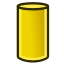

# Cone API

Describes a cone in 3D space
				To create a cone there are several ways:
				Part.Cone()
				    Creates a default cone with radius 1

				Part.Cone(Cone)
				    Creates a copy of the given cone

				Part.Cone(Cone, Distance)
				    Creates a cone parallel to given cone at a certain distance

				Part.Cone(Point1,Point2,Radius1,Radius2)
				    Creates a cone defined by two points and two radii
				    The axis of the cone is the line passing through
				    Point1 and Poin2.
				    Radius1 is the radius of the section passing through
				    Point1 and Radius2 the radius of the section passing
				    through Point2.

				Part.Cone(Point1,Point2,Point3,Point4)
				    Creates a cone passing through three points Point1,
				    Point2 and Point3.
				    Its axis is defined by Point1 and Point2 and the radius of
				    its base is the distance between Point3 and its axis.
				    The distance between Point and the axis is the radius of
				    the section passing through Point4.
			

####  Apex

Compute the apex of the cone.

####  Axis

The axis direction of the cone

####  Center

Center of the cone.

####  Content

Content of the object in XML representation.

####  Continuity

Returns the global continuity of the surface.

####  MemSize

Memory size of the object in bytes.

####  Module

Module in which this class is defined

####  Radius

The radius of the cone.

####  Rotation

Returns a rotation object to describe the orientation for surface that supports it

####  SemiAngle

The semi-angle of the cone.

####  Tag

Gives the tag of the geometry as string.

####  TypeId

Is the type of the FreeCAD object with module domain

####  UPeriod

Returns the period of this patch in the u parametric direction.

####  VPeriod

Returns the period of this patch in the v parametric direction.

####  bounds

Returns the parametric bounds (U1, U2, V1, V2) of this trimmed surface.

####  clone

Create a clone of this geometry with the same Tag

####  copy

Create a copy of this geometry

####  curvature

curvature(u,v,type) -> float
The value of type must be one of this: Max, Min, Mean or Gauss
Computes the curvature of parameter (u,v) on this geometry

####  curvatureDirections

curvatureDirections(u,v) -> (Vector,Vector)
Computes the directions of maximum and minimum curvature
of parameter (u,v) on this geometry.
The first vector corresponds to the maximum curvature,
the second vector corresponds to the minimum curvature.

####  deleteExtensionOfName

Deletes all extensions of the indicated name.

####  deleteExtensionOfType

Deletes all extensions of the indicated type.

####  dumpContent

dumpContent(Compression=3) -> bytearray

Dumps the content of the object, both the XML representation and the additional
data files required, into a byte representation.

Compression : int
    Set the data compression level in the range [0,9]. Set to 0 for no compression.

####  getAllDerivedFrom

Returns all descendants

####  getD0

Returns the point of given parameter

####  getDN

Returns the n-th derivative

####  getExtensionOfName

Gets the first geometry extension of the name indicated by the string.

####  getExtensionOfType

Gets the first geometry extension of the type indicated by the string.

####  getExtensions

Returns a list with information about the geometry extensions.

####  hasExtensionOfName

Returns a boolean indicating whether a geometry extension with the name indicated as a string exists.

####  hasExtensionOfType

Returns a boolean indicating whether a geometry extension of the type indicated as a string exists.

####  intersect

Returns all intersection points/curves between the surface and the curve/surface.

####  intersectSS

Returns all intersection curves of this surface and the given surface.
The required arguments are:
* Second surface
* precision code (optional, default=0)

####  isDerivedFrom

Returns true if given type is a father

####  isPlanar

isPlanar([float]) -> Bool
Checks if the surface is planar within a certain tolerance.

####  isUClosed

Checks if this surface is closed in the u parametric direction.

####  isUPeriodic

Returns true if this patch is periodic in the given parametric direction.

####  isUmbillic

isUmbillic(u,v) -> bool
Check if the geometry on parameter is an umbillic point,
i.e. maximum and minimum curvature are equal.

####  isVClosed

Checks if this surface is closed in the v parametric direction.

####  isVPeriodic

Returns true if this patch is periodic in the given parametric direction.

####  mirror

Performs the symmetrical transformation of this geometric object

####  normal

normal(u,v) -> Vector
Computes the normal of parameter (u,v) on this geometry

####  parameter

Returns the parameter on the curve
of the nearest orthogonal projection of the point.

####  projectPoint

Computes the projection of a point on the surface

projectPoint(Point=Vector,[Method="NearestPoint"])
projectPoint(Vector,"NearestPoint") -> Vector
projectPoint(Vector,"LowerDistance") -> float
projectPoint(Vector,"LowerDistanceParameters") -> tuple of floats (u,v)
projectPoint(Vector,"Distance") -> list of floats
projectPoint(Vector,"Parameters") -> list of tuples of floats
projectPoint(Vector,"Point") -> list of points

####  restoreContent

restoreContent(obj) -> None

Restore the content of the object from a byte representation as stored by `dumpContent`.
It could be restored from any Python object implementing the buffer protocol.

obj : buffer
    Object with buffer protocol support.

####  rotate

Rotates this geometric object at angle Ang (in radians) about axis

####  scale

Applies a scaling transformation on this geometric object with a center and scaling factor

####  setExtension

Sets a geometry extension of the indicated type.

####  tangent

tangent(u,v) -> (Vector,Vector)
Computes the tangent of parameter (u,v) on this geometry

####  toBSpline

Returns a B-Spline representation of this surface.
					The optional arguments are:
					* tolerance (default=1e-7)
					* continuity in u (as string e.g. C0, G0, G1, C1, G2, C3, CN) (default='C1')
					* continuity in v (as string e.g. C0, G0, G1, C1, G2, C3, CN) (default='C1')
					* maximum degree in u (default=25)
					* maximum degree in v (default=25)
					* maximum number of segments (default=1000)
					* precision code (default=0)
					Will raise an exception if surface is infinite in U or V (like planes, cones or cylinders)

####  toShape

Return the shape for the geometry.

####  toShell

Make a shell of the surface.

####  transform

Applies a transformation to this geometric object

####  translate

Translates this geometric object

####  uIso

Builds the U isoparametric curve

####  vIso

Builds the V isoparametric curve

####  value

value(u,v) -> Point
Computes the point of parameter (u,v) on this surface

---
 [documentation index](../README.md) > [API](Category_API.md) > Cone API
