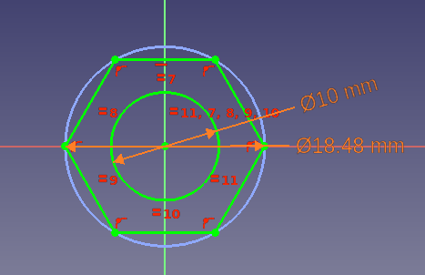

---
 TutorialInfo:
   Topic: Using Configuration Tables
   Level: Beginner
   Time: 30 minutes
   Author: Gbroques
   FCVersion: 0.20
   Files: https://forum.freecad.org/download/file.php?id=270593 ConfigurationTableExample.FCStd
---

# Configuration Tables

 

## Introduction

With the release of [FreeCAD V0.20](Release_notes_0.20#Spreadsheet_Workbench.md) two powerful new features have been introduced: *Variant [Links](Std_LinkMake.md)* and *[Configuration Tables](https://forum.freecadweb.org/viewtopic.php?f=17&t=42183)*. Configuration tables are a special type of variant link. They allow to vary sets of predefined parameters for a given object.

Prior to this, you could parameterize objects with techniques such as spreadsheets, but multiple varied instances of that object couldn\'t exist at the same time unless you resorted to techniques like copying files or objects which creates maintenance issues. Configuration tables make the maintenance of such variants, and the ability to toggle between them easy.

This tutorial assumes that you have some familiarity with the [PartDesign Workbench](PartDesign_Workbench.md) and the [Sketcher Workbench](Sketcher_Workbench.md). You should also be familiar with the [Tree view](Tree_view.md) and the [Property editor](Property_editor.md).

There is also a [video version of this tutorial](https://www.youtube.com/watch?v=m9C_ahIVKOI).

## Example

To gain a better idea of configuration tables consider the following example.

Imagine a simple hexagonal nut with a \"major\" diameter of 10mm (M10).

We can reuse the same design, create a link, and then vary certain parameters to create an M12 hexagonal nut.

For our example, we will describe the differences between these two variants with 3 parameters:

1.  diameter of the center hole
2.  width across the corners
3.  and thickness.

The particular parameter values for our variants are described in this table:

  Variant   Diameter   WidthAcrossCorners   Thickness
     
  M10       10         18.48                8.4
  M12       12         20.78                10.8

## Instructions

1.  Create a new [spreadsheet](Spreadsheet_CreateSheet.md) with a heading row. Leave the second row empty. That row will hold the current configuration and will automatically be filled later. Add parameters for M10 and M12 in rows 3 and 4:
    
2.  Use the [PartDesign Workbench](PartDesign_Workbench.md) to create a [Body](PartDesign_Body.md) and [Sketch](PartDesign_NewSketch.md) for the hex nut. Dimensional constraint will be added in a later step.
    
3.  [Pad](PartDesign_Pad.md) the Sketch. Accept the default Length value.
4.  Right-click cell A2 in the spreadsheet and select **Configuration table...** from the context menu.
5.  The **Setup Configuration Table** dialog opens.
6.  Enter the following:
    

    This fills out the second row in the table, adds a new **Configuration** property to the Body and binds the configuration table to it.
7.  Press the **OK** button.
8.  If cell A2 shows {{Value|#PENDING}}, you can right-click the spreadsheet in the [Tree view](Tree_view.md) and choose **Recompute object** to show the correct value.
9.  Set an alias for the 3 cells in row 2 underneath Diameter, WidthAcrossCorners, and Thickness. Each alias should match the cell\'s column heading.
    
10. Constrain the Sketch with two constraints and bind the [expressions](Expressions.md) {{Value|Spreadsheet.Diameter}} and {{Value|Spreadsheet.WidthAcrossCorners}} to them:
    
11. Bind {{Value|Spreadsheet.Thickness}} to the **Length** of the pad.
12. Create a [PartDesign SubShapeBinder](PartDesign_SubShapeBinder.md).
13. In the [Tree view](Tree_view.md) drag the Binder out of the Body and drop it on the Document node.
14. Drop the Body on the Binder to set its **Support** property to the Body. Dropping is required as this property is Read Only by default.
15. Set the **Bind Copy on Change** to {{Value|Enabled}} on the Binder.
16. Select {{Value|M12}} for the **Configuration** property of the Binder.
17. Set **Use Binder Style** to `False` on the Binder.
18. Change the **Placement** of the Binder so that it\'s away from the Body.
19. Once finished, you should have something like the following:
    

### Use Std Link instead of PartDesign SubShapeBinder 

For the variant link you can also use a [Std Link](Std_LinkMake.md) instead of a [PartDesign SubShapeBinder](PartDesign_SubShapeBinder.md):

1.  The preparatory steps 1-10 mentioned above are the same.
2.  Create a Link to the Body.
3.  Set the **Link Copy On Change** to {{Value|Enabled}} on the Link.
4.  Follow steps 16, 18 and 19 mentioned above.

## Key considerations 

-   As mentioned, a variant link can be made using a [Std Link](Std_LinkMake.md) or a [PartDesign SubShapeBinder](PartDesign_SubShapeBinder.md). Realthunder explains the difference [here](https://forum.freecadweb.org/viewtopic.php?f=17&t=42183):{{quote|text=Instead of duplicating the linked object with all its hierarchy, the [SubShapeBinder](PartDesign_SubShapeBinder.md) will make a flattened copy of the mutated object. Another difference to Link is that the [SubShapeBinder](PartDesign_SubShapeBinder.md) will sync any changes of the original object back to the copy even if the configurations are different, while for Link, once copied, the two objects become independent.}}
    
-   Although built upon links, variant links are not \"cheap\" like normal links, as they create copies of the original object. Guidance is provided by Realthunder [here](https://forum.freecadweb.org/viewtopic.php?p=532130#p532130) and [here](https://forum.freecadweb.org/viewtopic.php?p=358582#p358582):{{quote|text=[When] using Link for alternative configurations, you'll need to realize that it makes a copy of the original object... it would be better to create a single 'variant' link for each [variant] to avoid unnecessary duplicates. Or better, use SubShapeBinder... And again, create one [SubShapeBinder](PartDesign_SubShapeBinder.md) for each configuration.}}

---
⏵ [documentation index](../README.md) > [PartDesign](Category_PartDesign.md) > [Spreadsheet](Category_Spreadsheet.md) > Configuration Tables
