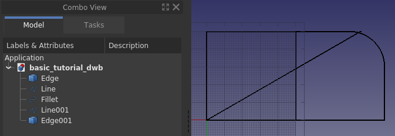
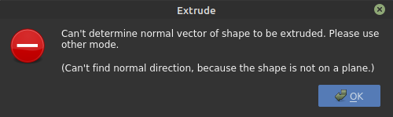

---
- TutorialInfo   *   Topic   *Modeling
   Level   *Beginner
   Author   *heda
   Time   *1.5 hours
   FCVersion   *0.19 or above
   Files   *n/a
---

# Creating a simple part with Draft and Part WB

## Introduction

  This tutorial aims to be used as a first introduction to [Draft Workbench](Draft_Workbench.md)  in FreeCAD. The tutorial uses a *2d shape* to create a *3d solid*, the latter is accomplished through [Part Workbench](Part_Workbench.md). The reader is recommended to first work through the sister tutorial *[Creating a simple part with Part WB](Creating_a_simple_part_with_Part_WB.md)*, which is creating the same model with a different technique, while at the same time covering more of the basics of FreeCAD's user interface. This tutorial expects the user to be briefly familiar with both the user interface and some workflows available in FreeCAD. The tutorial is composed such that the aim is not necessarily to show the most efficient way to use the program, but rather to make the reader aware of different functionalities available in FreeCAD, how to use them, and where to find them. 

## The tutorial covers 

 

-   The model to make
-   Creating the 2d profile
-   Why does not extruding work
-   Extruding the profile
-   Creating the through hole
-   Making a sketch out of the 2d profile
-   Wrapping up

## The model to make 

 

## Creating the 2d profile 

  Create a new document and save it directly under a new name. Switch to **[Draft Workbench](Draft_Workbench.md)**, your screen should look like below. If the grid does not show, toggle it on/off with  [Toggle Grid](Draft_ToggleGrid.md). 

 If you have not altered the default settings, the [navigation cube](Navigation_Cube.md) is in the upper right corner of the 3d-view, and the view is the *TOP* view, the global orientation *XY-plane*. 

 To start off the profile, draw a random  [Rectangle](Draft_Rectangle.md) on the screen in the XY-plane by clicking 2 points in the 3d-view forming any diagonal of a rectangle. A *task panel* will open once the command is invoked, this time we are not going to use it at all, but you could of course enter the coordinates directly for the rectangle. Your 3d-view should now have a rectangle drawn, similar to below picture. 

 When working in **Draft WB** one always draws on a 2d plane, that 2d plane is called *[Working plane](Draft_SelectPlane.md)*, and is in default setting always automatically aligning itself to the same orientation as the current 3d-view camera position. So, until the 2d profile is completed, it is best to simply keep the TOP view (camera position) and not mock around with rotating the view. If you happened to have changed it, just change back to the TOP view before starting any new command in **Draft WB**. 

 The side view of our final model has the outer contour of 100 x 50 mm, and it would be nice if the lower left corner was placed in global zero position. This can be accomplished through the *property-view* of the created **Rectangle**. First change *Position* of the rectangle to **(0, 0, 0)**, then modify *height* to **50** mm and *length* to **100** mm as per images below. 

 The **Rectangle** is finished and it should look like this after applying  [Fit all](Std_ViewFitAll.md) to the view. 

 Next we will break up the rectangle into its four edges, this is done by first selecting the **Rectangle** and then invoking the command  [Draft Downgrade](Draft_Downgrade.md), the filled face will disappear and the object in the *tree-view* is now a **Wire** instead of a **Rectangle**, shown in the left picture below. Invoking **Draft Downgrade** once more will break up the *wire* into its *edges*, shown in the middle picture below. 

 The observant will notice that the object icon in the tree-view already for the wire changed to a *blue box*. This blue box is the icon used for generic geometric objects (Part Module geometric objects to be specific, but that is for advanced readers). Select the left vertical edge and invoke the command  [Draft Upgrade](Draft_Upgrade.md), the former *edge* will now have a different icon and has changed *label* to **Line**. It is now a **Draft WB** object where one can edit for example *start-point* and *end-point* through the *properties-view*, this is not possible with the *edge* objects. 

### Creating the fillet 

  Start by selecting the upper right corner edges, use menu 

 With the top right corner edges selected, invoke command  [Fillet](Draft_Fillet.md) in **Draft WB**. Check *Delete original objects* and change *radius* to 20 mm and hit 

 The **Fillet** is created and your model should now look like below. 

### Creating the chamfer 

  To make the *chamfer* we need to have a line with the correct inclination and also be able to position it correctly. Let us begin with the position, which is on coordinate *(50, 50, 0)*. In the current profile we do not have a point there, so lets create one by making a *temporary help line*. First select the left vertical **Line**, then create the help line by  [Duplicate selection](Std_DuplicateSelection.md) in 

 Next, move the *angled line* into position. For this we make use  [Draft Move](Draft_Move.md) along with the *snap* functionality in **Draft WB**, more specifically *end-point* snap. First make sure that your snap toolbar looks similar to below. 

 Then select the *angled line*, **Edge001**, press **Move** and a *task panel* opens up. 

 Make sure that *Copy* is unchecked. Hoover the mouse over the *upper quarter* of the *angled line*, once the *white dot* and *end-point* symbol shows at the right spot, click  **LMB**. Drag the mouse to the upper quarter of the help line, once the white dot and end point symbol appears, click LMB. The sequence is illustrated below. 

 The line is now in the correct position, but it is too long. To adjust the lengths of the lines  [Draft Trimex](Draft_Trimex.md) will be used. Click on the *left part* of the *angled line*, i.e. the part of **Edge001** that is to be removed. Once the line is selected, press **Trim** and then click on the *left-most vertical line*, **Line**. The image below shows the **Trim** command invoked, and the pre-selected vertical line. 

 Repeat the trimming of the left-most vertical line to form the lower corner of the chamfer. Here you probably need to do the trimming in 2 steps. The trim function can make an *undesired flip*, keeping the longest part of the object to be trimmed. In those cases, trim a shorter distance first by simply clicking in the 3d-view for example halfway of your intended trim. The trim function accepts any click in the 3d view. If you get it wrong, just use  [Undo](Std_Undo.md) and  [Refresh](Std_Refresh.md) (the latter often called *recompute*) and try again. 

 To trim the *upper horizontal* edge, the **Fillet** needs to be *downgraded* so that the upper edge is it's own object in the tree-view. If you attempt to trim it without first having done the downgrade, the trimming function attempts to trim the arc in the fillet. You will need to trim the line in steps to avoid the resulting trim to flip. 

 The profile is ready and shown below with the edges organized in a  [Group](Std_Group.md) named **Profile** (or *labeled* to be precise in FreeCAD lingo), along with the help line deleted. Groups can be used to organize the features in your *FreeCAD documents*, it's usage is analogue to a folder structure on a computers file system. 

## Why does not extruding work 

  Let's jump right into it, select all the edges in the *group* **Profile**, in  [Part Workbench](Part_Workbench.md), invoke command  [Extrude](Part_Extrude.md). A *task panel* opens, accept all the defaults and click 

 That did not work out, but it sounds easy enough to fix the error, we just need to specify a direction. Click 

 Accept the default z-axis and once more click 

 We managed to make a fence like structure, judging from the tree-view every edge is treated separately. It is not the wanted filled solid that we want. Hit [Undo](Std_Undo.md), and let's try something else. 

 Scrolling all the way to the bottom of the **Extrude** *task panel* there is an option *Create solid*, check that option and click 

 Everything disappeared, clearly that did not work either. Let's go through why none of these ways are working. In the first case we got an error that the direction could not be determined. A flat face has a normal, i.e. direction, a line does not. Since from our second attempt we know that it worked when providing a direction, the error simply comes from trying to extrude a line without knowing into which direction to extrude that line. The observant will say that an arc has a direction, this is true. If you select only the edge that is the arc, FreeCAD will extrude that arc, also with default settings. 

 In the second case it worked, but we also got an extrusion for each edge we had in our selection. The resulting features, however are not what we want, i.e. a solid. 

 In the third case we checked *Create solid*, and ended up with everything disappearing. The icon in the tree-view has a different icon as well, there is a *white exclamation* mark on red background, that particular *overlay icon* means that the feature has an error that has to be tended to. One can read up on [overlay icons](Tree_view#Overlay_icons.md) on the wiki. 

 Hoovering over the tree-view overlay icon a tool tip is displayed, it says *Wire not closed*. 

 In our case the error is not fixable. It is *geometrically impossible* to create a solid out of an extruded single line. An extruded line simple becomes a sheet, or *shell* in FreeCAD lingo. In other words, this is not a FreeCAD limitation, it is a fundamental outcome of geometrical theory. The reason why the 3d-view goes completely blank is that the created features, or objects in the tree-view, has errors in the produced *shape*, and thus contains nothing to render. FreeCAD does however create the new document objects (in this case extrusions) and thus hides any geometry/object used for making the new document objects. The is why the screen goes blank when trying to make a solid out of a line, or lines. 

 The tool-tip says it all, in order to extrude into a solid one needs a *closed wire, or a face*. A face is, per definition, simply a closed wire that is filled. One way to create a closed wire out of our profile edges is to select them all and apply  [Draft Upgrade](Draft_Upgrade.md). If applied once it becomes a wire, while at the same time it consumes the individual edges from the tree-view. If applied twice it becomes a face, either of those allows for a successful solid extrusion. 

## Extruding the profile 

  Another way to create the closed wire is  [Shape builder](Part_Builder.md), which allows for making a wire without consuming the individual edges. **Part Shape builder** is a powerful tool to create any geometric entity in FreeCAD that can be used further to create complex solids from lower level entities, the simplest example is creating a line between two vertexes. Click **Part Shape builder** to bring up the *task panel*. 

 We can use either *Wire from edges* or *Face from edges*. Multiple selections has to be made with 

 Select the **Face** and invoke **Part Extrude**, set the extrusion *length* to **30** mm and click 

## Creating the through hole 

  To make the through hole we need a *cylinder* correctly *positioned* to make a boolean *cut* with. 

 Create a cylinder, and position it correctly. In this case the *radius* is 5 mm, *height* is made to be 60 mm. For the placement, first it is *rotated* -90 degrees around x-axis, then positioned in *(65, -5, 15)*. The negative 5 in y-direction originates from that the height is 10 mm longer than needed. 

 It does not hurt to make the height of the cylinder longer than seemingly needed. For a simple model like this it will not matter if the cylinder is the exact height of the profile. It is however good practice to avoid co-planar faces, potentially that avoids numerical errors in the geometric kernel that can lurk around behind the scenes resulting in strange effects, or failures in subsequent operations when making co-planar faces on more complex models. 

 With a final boolean cut and changing appearance of the model, the model is completed. 

## Making a sketch out of the 2d profile 

  Using **Draft WB** is one way of creating a 2d profile. In **Draft WB** a wire can be made in 3d-space. FreeCAD provides another tool to make 2d profiles --  [Sketcher Workbench](Sketcher_Workbench.md). Using a *sketch* to make a 2d profile is a more versatile way to create a 2d profile. Any 2d profile made in **Draft WB** can be converted to an *unconstrained* sketch. 

 Start by hiding the **Cut** feature and make the edges in the profile visible. Select the edges in profile from the earlier made group **Profile**. From **Draft WB** press toolbar button  [Draft to Sketch](Draft_Draft2Sketch.md) and you should see the same as in the image below. 

 Next, hide the original edges and double-click the **Sketch** object in the tree-view, bringing you to the following state, i.e. the *sketcher task panel* opened. 

 This is how it looks when one *edits a sketch*. Since this is not a tutorial for using the sketcher just go ahead and close it. If you want an introduction to sketching, which is a core workflow in any 3d parametric cad, please follow the sister tutorial *[Creating a simple part with PartDesign](Creating_a_simple_part_with_PartDesign.md)*. 

 With **Sketch** closed and selected, from **Part WB** use Extrude in the same way as for the earlier extruded profile **Face**. The basic block of the simple model is ready once again. 

## Quality of models 

  Sooner or later when working with 3d parametric cad you will come across a broken model, either one you have made yourself, or a model that you have imported. A broken model can work for its purpose, but more often than not, there are subsequent operations that simply will not work with a broken model. To repair a broken model one has to know what to repair, this is where the built-in quality check tools in FreeCAD come in. 

 First let us check the quality of the recently created **Extrude001**. With **Part WB** active, first select **Extrude001** and then use command  [Check geometry](Part_CheckGeometry.md). 

 Our model is OK, no errors are reported. There is also a listing of the models content, or in FreeCAD lingo, the content of the *shape*, i.e. how it is put together from ground up. Here one can see that apparently to make a *solid* one also needs a *shell*, and the shell is made out of *faces*, and so on. In other words, you can create any solid by simply starting out by making points, or *vertices*, from those one makes *edges*, and from those one creates *wires*, and out of the wires one makes *faces* which are then stitched into a *shell*, from which one finally arrives at a *solid*. 

 One other check one can do is related to the **Sketch**. Close the *task panel* for the geometry check. Select the **Sketch**, expand **Extrude001** in the tree-view if needed in order to see the sketch-object. Switch to  [Sketcher Workbench](Sketcher_Workbench.md), use command  [Validate sketch](Sketcher_ValidateSketch.md), a *task panel* opens. In the *task panel*, click the 

 Click 

 Finally it should be pointed out that although it can work creating subsequent objects with *open vertices* in sketches, it is *best practice* to *not have any*, as well as having a *fully constrained sketch* (as opposed to a under constrained ditto). The reason why it works here is that the *sketch* is created from a profile that has all edge *endpoints matching* without any gaps. If you in the sketcher draw by hand and also try to match endpoints by hand, it is virtually guaranteed that the endpoint will *not be matched* from the *sketch solver* point of view, i.e. the gap (although not really visible on the screen) is large enough that the sketch solver cannot consider them to be matching endpoints. 

## Wrapping up 

  Having gone through the tutorial you have become somewhat familiar with the basic functionality of FreeCAD, along with the core workbenches **Part** and **Draft**. You are also aware of the existence of **Sketcher WB**, which for many experienced users is the sole tool used to create 2d profiles later utilized in solid feature operations. The use of *sketches* is a core concept in **PartDesign WB**. It is suggested that you learn *sketches* and **PartDesign WB** next if your focus is on creating solids. The sister-tutorial *[Creating a simple part with PartDesign](Creating_a_simple_part_with_PartDesign.md)* makes the same model as this tutorial. If your focus is modeling buildings your next learning should be the **Draft** and **Arch** workbenches. 

 At last, FreeCAD is made by volunteers in their spare time. If you want to further advance FreeCAD's capabilities, consider [contributing](Help_FreeCAD.md) to FreeCAD, for example by improving documentation.

---
 [documentation index](../README.md) > Creating a simple part with Draft and Part WB
