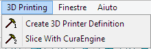

# Cura Engine Workbench
## Introduction

This is a Python macro workbench used to integrate CuraEngine into FreeCAD

**It is a work in progress. Feedback welcome.**

## References

-   Author: cblt2l
-   Home page: <https://github.com/cblt2l/FreeCAD-CuraEngine-Plugin>
-   Source code on github: <https://github.com/cblt2l/FreeCAD-CuraEngine-Plugin>

## Tools

Drop down menu

-   

## Installation

### Automatic installation 

This workbench can be installed from the [Addon Manager](Std_AddonMgr.md).

### From GitHub 

The easiest way to install is to clone into \~/.FreeCAD/Mod

cd ~/.FreeCAD/Mod
git clone [https://github.com/cblt2l/FreeCAD-CuraEngine-Plugin.git](https://github.com/cblt2l/FreeCAD-CuraEngine-Plugin.git)

Then restart FreeCAD. An entry for \'3D Printing\' should be available in the Workbench dropdown menu.

**Prerequisites**

To use do the following:

-   install the [official Cura package](http://software.ultimaker.com/?show=all) (CuraEngine is installed to /usr/share/cura/CuraEngine) or compile CuraEngine from source.

**Linux Installation Instructions** (From GitHub)

**Windows Installation Instructions** (From GitHub)

**Mac Installation Instructions** (From GitHub)

## Links to CuraEngine WB 

-   Workbench Wiki:
-   FreeCAD Wiki:
-   FreeCAD Forum: <http://forum.freecadweb.org/viewtopic.php?f=22&t=5466>
-   Tutorials:
-   Videos:
-   Files:
-   Report bugs: Please report bugs at <https://github.com/cblt2l/FreeCAD-CuraEngine-Plugin/issues>

## Other useful links 

-   Official CuraEngine: [Ultimaker Cura](https://ultimaker.com/software/ultimaker-cura) respectively [github CuraEngine repository](https://github.com/Ultimaker/CuraEngine)
-   [Manual:Preparing models for 3D printing: Using the Cura addon](Manual:Preparing_models_for_3D_printing#Using_the_Cura_addon.md)
-   [FreeCAD-CuraEngine-Plugin](https://github.com/cblt2l/FreeCAD-CuraEngine-Plugin/tree/28f66c9d39a354da4839acb7c5d6884cbde948ab)
-   [External workbenches](External_workbenches.md)
-   [Macros recipes](Macros_recipes.md)

[Category:Sandbox](Category:Sandbox.md)
