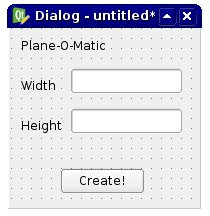
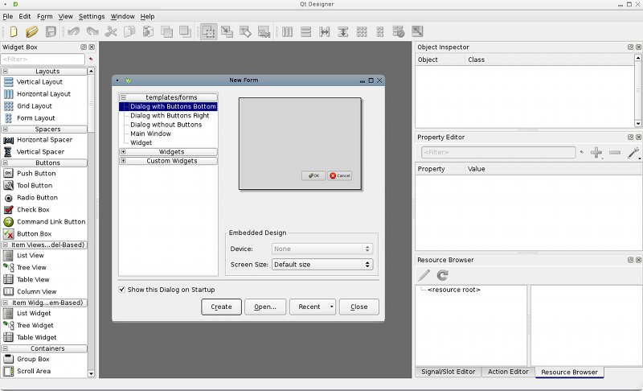
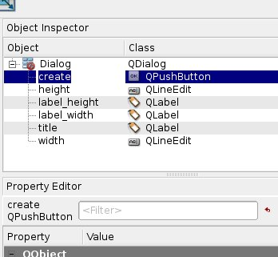

 

 

## Introduction

In this page we will show how to build a simple graphical interface with [Qt Designer](http://qt-project.org/doc/qt-4.8/designer-manual.html), Qt\'s official tool for designing interfaces; the dialog will be converted to [Python](Python.md) code, then it will be used inside FreeCAD. We\'ll assume that the user knows how to edit and run [Python](Python.md) generally.

In this example, the entire interface is defined in [Python](Python.md). Although this is possible for small interfaces, for larger interfaces the recommendation is to load the created {{FileName|.ui}} files directly into the program. See [Interface creation with UI files](Interface_creation_with_UI_files.md) for more information.

 *Two general methods to create interfaces, by including the interface in the Python file, or by using `.ui* files.`

## Designing the dialog 

In CAD applications, designing a good UI (User Interface) is very important. About everything the user will do will be through some piece of interface: reading dialog boxes, pressing buttons, choosing between icons, etc. So it is very important to think carefully to what you want to do, how you want the user to behave, and how will be the workflow of your action.

There are a couple of concepts to know when designing interface:

-   [Modal/non-modal dialogs](http://en.wikipedia.org/wiki/Modal_window): A modal dialog appears in front of your screen, stopping the action of the main window, forcing the user to respond to the dialog, while a non-modal dialog doesn\'t stop you from working on the main window. In some case the first is better, in other cases not.
-   Identifying what is required and what is optional: Make sure the user knows what he must do. Label everything with proper description, use tooltips, etc.
-   Separating commands from parameters: This is usually done with buttons and text input fields. The user knows that clicking a button will produce an action while changing a value inside a text field will change a parameter somewhere. Nowadays, though, users usually know well what is a button, what is an input field, etc. The interface toolkit we are using, Qt, is a state-of-the-art toolkit, and we won\'t have to worry much about making things clear, since they will already be very clear by themselves.

So, now that we have well defined what we will do, it\'s time to open the qt designer. Let\'s design a very simple dialog, like this:



We will then use this dialog in FreeCAD to produce a nice rectangular plane. You might find it not very useful to produce nice rectangular planes, but it will be easy to change it later to do more complex things. When you open it, Qt Designer looks like this:



## Creating the dialog 

Qt Designer is very simple to use. On the left bar you have elements that can be dragged on your widget. On the right side you have properties panels displaying all kinds of editable properties of selected elements. So, begin with creating a new widget.

1.  Select \"Dialog without buttons\", since we don\'t want the default **OK**/**Cancel** buttons.
2.  We need *\'Labels*. Labels are simple text strings that appear on your widget to inform the end user. If you select a label, notice that on the right side there will appear several properties that you can modify such as: font style, height, etc\... So lets drag 3 separate labels on to our widget:
    -   One label for the title
    -   Another label for writing \"**Height**\"
    -   Another label for writing \"**Width**\"
3.  We now need LineEdits (2 of them actually). Drag two of them on to the widget. **LineEdits** are text fields that the end user can fill in. So we need one LineEdit for the *Height* and one for the *Width*. Here too, we can edit properties. For example, why not set a default value say for example: 1.00 for each. This way, when the user will see the dialog, both values will be filled already. If the end user is satisfied, they can directly press the button, saving precious time.
4.  Next lets add a **PushButton**. This is the button the end user will need to press after they\'ve filled both fields.

**Note:** that we chose very simple controls here. Qt has many more options, for example one could use **Spinboxes** instead of **LineEdits**, etc\... Have a look at what is available, explore\...you will surely have other ideas.

That\'s about all we need to do in Qt Designer. One last thing, though, let\'s rename all our elements with simpler names, so it will be easier to identify them in our scripts:

  

## Converting our dialog to python 

  Now, let\'s save our widget somewhere. It will be saved as an .ui file, that we will easily convert to python script with pyuic. On windows, the pyuic program is bundled with pyqt (to be verified), on linux you probably will need to install it separately from your package manager (on debian-based systems, it is part of the pyqt4-dev-tools package). To do the conversion, you\'ll need to open a terminal window (or a command prompt window on windows), navigate to where you saved your .ui file, and issue:  
```python
pyuic mywidget.ui > mywidget.py
``` In Windows pyuic.py is located in \"C:\\Python27\\Lib\\site-packages\\PyQt4\\uic\\pyuic.py\" For conversion create a batch file called \"compQt4.bat:  
```python
@"C:\Python27\python" "C:\Python27\Lib\site-packages\PyQt4\uic\pyuic.py" -x %1.ui > %1.py
``` In the DOS console type without extension  
```python
compQt4 myUiFile
```

 In macOS, you can retrieve the appropriate version (the same that is used internally in FreeCAD 0.19) of QT and Pyside with these commands (pip required)  
```python
python3 -m pip install pyqt5
python3 -m pip install pySide2
``` This will install uic in the folder \"/Library/Frameworks/Python.framework/Versions/3.7/lib/python3.7/site-packages/PySide2/uic\", and Designer in \"/Library/Frameworks/Python.framework/Versions/3.7/lib/python3.7/site-packages/PySide2/Designer.app\". For convenience you can create a link of uic in /usr/local/bin to be able to call it simply with uic -g python \... instead of typing the whole path of the program, and a link to Designer to retrieve it in the mac\'s Applications folder with  
```python
sudo ln -s /Library/Frameworks/Python.framework/Versions/3.7/lib/python3.7/site-packages/PySide2/uic /usr/local/bin
ln -s /Library/Frameworks/Python.framework/Versions/3.7/lib/python3.7/site-packages/PySide2/Designer.app /Applications
```

 Into Linux : to do 

 Since FreeCAD progressively moved away from PyQt after version 0.13, in favour of [PySide](http://qt-project.org/wiki/PySide) (Choose your PySide install [building PySide](http://pyside.readthedocs.org/en/latest/building/)), to make the file based on PySide now you have to use:

 
```python
pyside-uic mywidget.ui -o mywidget.py
``` In Windows uic.py are located in \"C:\\Python27\\Lib\\site-packages\\PySide\\scripts\\uic.py\" For create batch file \"compSide.bat\":  
```python
@"C:\Python27\python" "C:\Python27\Lib\site-packages\PySide\scripts\uic.py" %1.ui > %1.py
``` In the DOS console type without extension  
```python
compSide myUiFile
``` Into Linux : to do

On some systems the program is called pyuic4 instead of pyuic. This will simply convert the .ui file into a python script. If we open the mywidget.py file, its contents is very easy to understand:  
```python
from PySide import QtCore, QtGui

class Ui_Dialog(object):
    def setupUi(self, Dialog):
        Dialog.setObjectName("Dialog")
        Dialog.resize(187, 178)
        self.title = QtGui.QLabel(Dialog)
        self.title.setGeometry(QtCore.QRect(10, 10, 271, 16))
        self.title.setObjectName("title")
        self.label_width = QtGui.QLabel(Dialog)
        ...

        self.retranslateUi(Dialog)
        QtCore.QMetaObject.connectSlotsByName(Dialog)

   def retranslateUi(self, Dialog):
        Dialog.setWindowTitle(QtGui.QApplication.translate("Dialog", "Dialog", None, QtGui.QApplication.UnicodeUTF8))
        self.title.setText(QtGui.QApplication.translate("Dialog", "Plane-O-Matic", None, QtGui.QApplication.UnicodeUTF8))
        ...
``` As you see it has a very simple structure: a class named Ui\_Dialog is created, that stores the interface elements of our widget. That class has two methods, one for setting up the widget, and one for translating its contents, which is part of the general Qt mechanism for translating interface elements. The setup method simply creates, one by one, the widgets as we defined them in Qt Designer, and sets their options as we decided earlier. Then, the whole interface gets translated, and finally, the slots get connected (we\'ll talk about that later).

We can now create a new widget and use this class to create its interface. We can already see our widget in action, by putting our mywidget.py file in a place where FreeCAD will find it (in the FreeCAD bin directory, or in any of the Mod subdirectories), and, in the FreeCAD python interpreter, issue:  
```python
from PySide import QtGui
import mywidget
d = QtGui.QWidget()
d.ui = mywidget.Ui_Dialog()
d.ui.setupUi(d)
d.show()
``` And our dialog will appear! Note that our Python interpreter is still working, we have a non-modal dialog. So, to close it, we can (apart from clicking its close icon, of course) issue:  
```python
d.hide()
```

## Making our dialog do something 

Now that we can show and hide our dialog, we just need to add one last part: To make it do something! If you play a bit with Qt designer, you\'ll quickly discover a whole section called \"signals and slots\". Basically, it works like this: elements on your widgets (in Qt terminology, those elements are themselves widgets) can send signals. Those signals differ according to the widget type. For example, a button can send a signal when it is pressed and when it is released. Those signals can be connected to slots, which can be special functionality of other widgets (for example a dialog has a \"close\" slot to which you can connect the signal from a close button), or can be custom functions. The [PyQt Reference Documentation](http://www.riverbankcomputing.co.uk/static/Docs/PyQt4/html/classes.html) lists all the qt widgets, what they can do, what signals they can send, etc\...

What we will do here, is to create a new function that will create a plane based on height and width, and to connect that function to the pressed signal emitted by our \"Create!\" button. So, let\'s begin with importing our FreeCAD modules, by putting the following line at the top of the script, where we already import QtCore and QtGui:  
```python
import FreeCAD, Part
``` Then, let\'s add a new function to our Ui\_Dialog class:  
```python
def createPlane(self):
    try:
        # first we check if valid numbers have been entered
        w = float(self.width.text())
        h = float(self.height.text())
    except ValueError:
        print("Error! Width and Height values must be valid numbers!")
    else:
        # create a face from 4 points
        p1 = FreeCAD.Vector(0,0,0)
        p2 = FreeCAD.Vector(w,0,0)
        p3 = FreeCAD.Vector(w,h,0)
        p4 = FreeCAD.Vector(0,h,0)
        pointslist = [p1,p2,p3,p4,p1]
        mywire = Part.makePolygon(pointslist)
        myface = Part.Face(mywire)
        Part.show(myface)
        self.hide()
``` Then, we need to inform Qt to connect the button to the function, by placing the following line just before QtCore.QMetaObject.connectSlotsByName(Dialog):  
```python
QtCore.QObject.connect(self.create,QtCore.SIGNAL("pressed()"),self.createPlane)
``` This, as you see, connects the pressed() signal of our create object (the \"Create!\" button), to a slot named createPlane, which we just defined. That\'s it! Now, as a final touch, we can add a little function to create the dialog, it will be easier to call. Outside the Ui\_Dialog class, let\'s add this code:  
```python
class plane():
   def __init__(self):
       self.d = QtGui.QWidget()
       self.ui = Ui_Dialog()
       self.ui.setupUi(self.d)
       self.d.show()
``` (Python reminder: the \_\_init\_\_ method of a class is automatically executed whenever a new object is created!) Then, from FreeCAD, we only need to do:  
```python
import mywidget
myDialog = mywidget.plane()
``` That\'s all Folks\... Now you can try all kinds of things, like for example inserting your widget in the FreeCAD interface (see the [Code snippets](Code_snippets.md) page), or making much more advanced custom tools, by using other elements on your widget.

## The complete script 

This is the complete script, for reference:  
```python
# Form implementation generated from reading ui file 'mywidget.ui'
#
# Created: Mon Jun  1 19:09:10 2009
#      by: PyQt4 UI code generator 4.4.4
# Modified for PySide 16:02:2015 
# WARNING! All changes made in this file will be lost!

from PySide import QtCore, QtGui
import FreeCAD, Part 

class Ui_Dialog(object):
   def setupUi(self, Dialog):
       Dialog.setObjectName("Dialog")
       Dialog.resize(187, 178)
       self.title = QtGui.QLabel(Dialog)
       self.title.setGeometry(QtCore.QRect(10, 10, 271, 16))
       self.title.setObjectName("title")
       self.label_width = QtGui.QLabel(Dialog)
       self.label_width.setGeometry(QtCore.QRect(10, 50, 57, 16))
       self.label_width.setObjectName("label_width")
       self.label_height = QtGui.QLabel(Dialog)
       self.label_height.setGeometry(QtCore.QRect(10, 90, 57, 16))
       self.label_height.setObjectName("label_height")
       self.width = QtGui.QLineEdit(Dialog)
       self.width.setGeometry(QtCore.QRect(60, 40, 111, 26))
       self.width.setObjectName("width")
       self.height = QtGui.QLineEdit(Dialog)
       self.height.setGeometry(QtCore.QRect(60, 80, 111, 26))
       self.height.setObjectName("height")
       self.create = QtGui.QPushButton(Dialog)
       self.create.setGeometry(QtCore.QRect(50, 140, 83, 26))
       self.create.setObjectName("create")

       self.retranslateUi(Dialog)
       QtCore.QObject.connect(self.create,QtCore.SIGNAL("pressed()"),self.createPlane)
       QtCore.QMetaObject.connectSlotsByName(Dialog)

   def retranslateUi(self, Dialog):
       Dialog.setWindowTitle("Dialog")
       self.title.setText("Plane-O-Matic")
       self.label_width.setText("Width")
       self.label_height.setText("Height")
       self.create.setText("Create!")
       print("tyty")
   def createPlane(self):
       try:
           # first we check if valid numbers have been entered
           w = float(self.width.text())
           h = float(self.height.text())
       except ValueError:
           print("Error! Width and Height values must be valid numbers!")
       else:
           # create a face from 4 points
           p1 = FreeCAD.Vector(0,0,0)
           p2 = FreeCAD.Vector(w,0,0)
           p3 = FreeCAD.Vector(w,h,0)
           p4 = FreeCAD.Vector(0,h,0)
           pointslist = [p1,p2,p3,p4,p1]
           mywire = Part.makePolygon(pointslist)
           myface = Part.Face(mywire)
           Part.show(myface)

class plane():
  def __init__(self):
      self.d = QtGui.QWidget()
      self.ui = Ui_Dialog()
      self.ui.setupUi(self.d)
      self.d.show()

```

## More examples 

-   [Dialog creation with various widgets](Dialog_creation_with_various_widgets.md) with `QPushButton`, `QLineEdit`, `QCheckBox`, `QRadioButton`, and others.
-   [Dialog creation reading and writing files](Dialog_creation_reading_and_writing_files.md) with `QFileDialog`.
-   [Dialog creation setting colors](Dialog_creation_setting_colors.md) with `QColorDialog`.
-   [Dialog creation image and animated GIF](Dialog_creation_image_and_animated_GIF.md) with `QLabel` and `QMovie`.
-   [PySide usage snippets](PySide_usage_snippets.md).
-   [Qt Example](Qt_Example.md)

## Relevant links 

-   [Manual:Creating interface tools](Manual:Creating_interface_tools.md)
-   [Interface creation with UI files](Interface_creation_with_UI_files.md)

 {{Powerdocnavi}} 

[Category:Developer Documentation{{\#translation:}}](Category:Developer_Documentation.md) [Category:Python Code{{\#translation:}}](Category:Python_Code.md)
