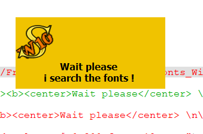
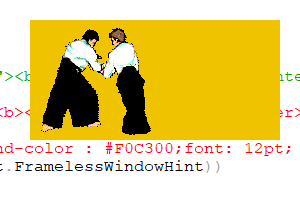

# Dialog creation image and animated GIF
 

## Introduction

This is an example of [dialog creation](Dialog_creation.md) with [PySide](PySide.md).

In this example, the entire interface is defined in [Python](Python.md). Although this is possible for small interfaces, for larger interfaces the recommendation is to create {{FileName|.ui}} files through Qt Designer, and load these in the program. See [Interface creation with UI files](Interface_creation_with_UI_files.md).

## Dialog with image (QLabel) and animated GIF (QMovie) 

 
```python
import PySide
from PySide import QtGui ,QtCore
from PySide.QtGui import QPixmap, QMovie, QLabel
from PySide.QtCore import *
class MyLabelPatience():
    label = QtGui.QLabel()
    label.setText("<b><center>Wait please</center> \n\n<center>i search the fonts !\n\n</center></b>")
    # center screen
    ecran = FreeCADGui.getMainWindow().frameGeometry()
    xF = 250; yF = 120
    xW = (ecran.width()/2) - (xF/2)
    yW = (ecran.height()/2)- (yF/2)
    label.setGeometry(xW, yW, xF, yF)
    ####
    label.setStyleSheet("QLabel {background-color : #F0C300;font: 12pt; }");
    label.setWindowFlags(Qt.WindowFlags(Qt.FramelessWindowHint))        # pas de bords (not border)
    ### un-comment for use ###############
    movie = QtGui.QMovie(path_Name_Image)    # anime le fichier Gif anime (decommenter)
    label.setMovie(movie)
    movie.start()
    ##################

patience = MyLabelPatience().label
patience.show()                    #show the image
#patience.close()                   #close the Qlabel
#MyLabelPatience().movie.start()    #start the animation (after patience.show())
#MyLabelPatience().movie.stop()     #stop animation

```

   *Example QLabel with image and text.*

   *Example QLabel with animated GIF.*

 {{Powerdocnavi}} 

[Category:Developer Documentation](Category:Developer_Documentation.md) [Category:Python Code](Category:Python_Code.md)
