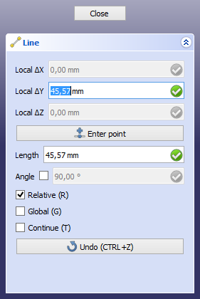

# Draft Constrain
## Description

Apart from entering coordinates or using [snapping](Draft_Snap.md), there is a feature called constraining to help you draw accurately in the  [Draft Workbench](Draft_Workbench.md) and the  [Arch Workbench](Arch_Workbench.md). For each subsequent point you can constrain the movement of the cursor to the X, Y, or Z direction of the [working plane](Draft_SelectPlane.md) coordinate system. This can for example be used to create a perfectly vertical line.

Constraining is available with most [Draft](Draft_Workbench.md) and [Arch](Arch_Workbench.md) commands.

   
*While the cursor is constrained the task panel locks the values that are not being modified*

## Usage horizontal and vertical constraints 

1.  Choose a [Draft](Draft_Workbench.md) or [Arch](Arch_Workbench.md) command to create your geometry.
2.  Pick a first point. A previous point is required.
3.  Do one of the following:
    -   For a horizontal constraint: move the cursor to the left or right of the previous point.
    -   For a vertical constraint: move the cursor above or below the previous point.
4.  Hold down **Shift**.
5.  The cursor is now constrained.
6.  Pick the next point.
7.  If the command is still active: optionally release **Shift** to disable the constraint.
8.  Always release **Shift** when the command is finished.

## Usage X, Y and Z constraints 

1.  Choose a [Draft](Draft_Workbench.md) or [Arch](Arch_Workbench.md) command to create your geometry.
2.  Pick a first point. A previous point is required.
3.  Press **X**, **Y** or **Z** to specify the direction.
4.  The cursor is now constrained.
5.  Pick the next point.
6.  If the command is still active optionally do one of the following:
    -   Press the same key to disable the constraint.
    -   Press one of the two other keys to constrain in a different direction.
7.  X, Y and Z constraints are automatically disabled when the command is finished.

## Notes

-   Constraining can be combined with [snapping](Draft_Snap.md).
-   The [Draft Offset](Draft_Offset.md) command and [Draft Trimex](Draft_Trimex.md) command use a different type of constraining, namely to restrict the operation to a certain segment.

## Preferences

See also: [Preferences Editor](Preferences_Editor.md) and [Draft Preferences](Draft_Preferences.md).

-   The default **Constrain mod** key, **Shift**, can be changed: **Edit → Preferences... → Draft → Grid and snapping → Snapping → Constrain mod**.
-   The **X**, **Y** and **Z** shortcuts can be changed: **Edit → Preferences... → Draft → User interface settings → In-Command Shortcuts**.

---
 [documentation index](../README.md) > [Draft](Draft_Workbench.md) > Draft Constrain
