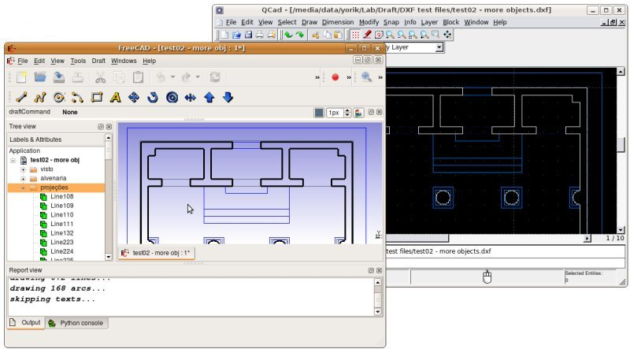

# Draft DXF
## Description

Draft DXF is a software module used by the  _ and  [Std Export](Std_Export.md) commands to handle the DXF file format.

   
*Qcad drawing exported to DXF, which is subsequently opened in FreeCAD*

## Importing

Two importers are available, which one is used can be specified under **Edit → Preferences... → Import-Export → DXF**. One is built-in, C++-based and fast, the other is legacy, coded in Python, slower, and requires the installation of an add-on, but can handle some entities better and can create more refined FreeCAD objects. Both support all DXF versions starting from R12.

3D solids inside a DXF file are stored under a binary ACIS/SAT blob, which at the moment cannot be read by FreeCAD.

### C++ importer 

This importer can import the following DXF objects:

-   lines
-   polylines (and lwpolylines)
-   arcs
-   circles
-   ellipses
-   splines
-   points
-   texts and mtexts
-   dimensions
-   leaders
-   blocks (only geometry, texts, dimensions and attributes inside blocks are skipped)
-   layers
-   paper space objects

### Legacy importer 

This importer can import the following DXF objects:

-   lines
-   polylines (and lwpolylines)
-   arcs
-   circles
-   ellipses
-   splines
-   3D faces
-   texts and mtexts
-   leaders
-   layers

## Exporting

There are also two exporters. The legacy exporter exports to the R12 DXF format, the C++ exporter to the R14 DXF format. Both formats can be handled by many applications.

### C++ exporter 

Some of the features and limitations of this exporter are:

-   All FreeCAD 2D geometry is exported, except [Draft CubicBezCurves](Draft_CubicBezCurve.md), [Draft BezCurves](Draft_BezCurve.md) and [Draft Points](Draft_Point.md).
-   Straight edges from faces of 3D objects are exported, but curved edges only if they are on a plane parallel to the XY plane of the global coordinate system. Note that a DXF created from 3D objects will contain duplicate lines.
-   Texts and dimensions are not exported.
-   Colors are ignored.
-   Layers are mapped from object names.

### Legacy exporter 

Some of the features and limitations of this exporter are:

-   All FreeCAD 2D geometry is exported, except [Draft Points](Draft_Point.md). But ellipses, B-splines and Bézier curves are not exported properly.
-   3D objects are exported as flattened 2D views.
-   Compound objects are exported as blocks.
-   Texts and dimensions are exported.
-   The colors in the DXF are based on the line color of objects. Black is mapped to \"ByBlock\", other colors are mapped using AutoCAD Color Index (ACI) colors.
-   Layers are mapped from layer and group names. When groups are nested, the deepest group gives the layer name.

## Installing

For licensing reasons, the required _.

## Preferences

See [Import Export Preferences](Import_Export_Preferences.md).

## DWG

The DXF importer is used to import and export both DXF and DWG files. The DWG format being a proprietary, closed and undocumented format, however, turns it hard for open-source projects like FreeCAD to support it. For this reason, FreeCAD doesn\'t handle the DWG format directly, but converts it first to and from DXF. It\'s important to note that the DXF format allows a 1:1 conversion of the DWG format. All applications that can write/read DWG files can also do the same with DXF files, with no data loss. It is always possible to work with DXF files the same way as with DWG files, without creating problems for the people who will need to read your files. However, for convenience, FreeCAD also allows to import and export directly to the DWG format using one of the following conversion applications, to be configured under menu *Edit -\> Preferences -\> Import/Export -\> DWG*:

-   Automatic: FreeCAD will try to find a converter application automatically following the list below:
-   [LibreDWG](https://www.gnu.org/software/libredwg/): LibreDWG is an open-source DWG reading and writing library. It is included in the official FreeCAD packages that you can download from the FreeCAD website. It is the preferred choice as it is an open-source project. However, it lacks support for several DWG enitites, and might not give a faithful result.
-   [ODA Converter](https://www.opendesign.com/guestfiles/oda_file_converter): This is a proprietary but free to use utility provided by the Open Design Alliance. It gives very good and reliable results, but it is not open-source and there is no guarantee how long they will offer it for free.
-   [QCAD pro](https://qcad.org/en/qcad-command-line-tools#dwg2dwg): <small>(v0.20)</small>  QCAD is a well-known open-source DXF-based 2D CAD platform. It also offers a paid pro version, which is basically the open-source version plus support for the DWG format. When buying the pro version, QCAD also includes a DWG to DXF conversion utility that gives excellent results and can be used by FreeCAD.

If FreeCAD is unable to find the desired application above, you might need to indicate its path in the field below, on the preferences screen. Choose the \"dwg2dxf\" utility if using LibreDWG, \"ODAFileConverter\" if using the ODA file converter, or the \"dwg2dwg\" utility if using the pro version of QCAD.

## Scripting

See also: _.

To export objects to DXF use the `export` method of the importDXF module.

 
```python
importDXF.export(objectslist, filename, nospline=False, lwPoly=False)
```

-   For the Windows OS: use a {{FileName|/}} (forward slash) as the path separator in {{Incode|filename}}.

Example:

 
```python
import FreeCAD as App
import Draft
import importDXF

doc = App.newDocument()

polygon1 = Draft.make_polygon(3, radius=500)
polygon2 = Draft.make_polygon(5, radius=1500)

doc.recompute()

objects = [polygon1, polygon2]
importDXF.export(objects, "/home/user/Pictures/myfile.dxf")
```


  

_

---
[documentation index](../README.md) > [File Formats](Category_File Formats.md) > [Draft](Draft_Workbench.md) > Draft DXF
