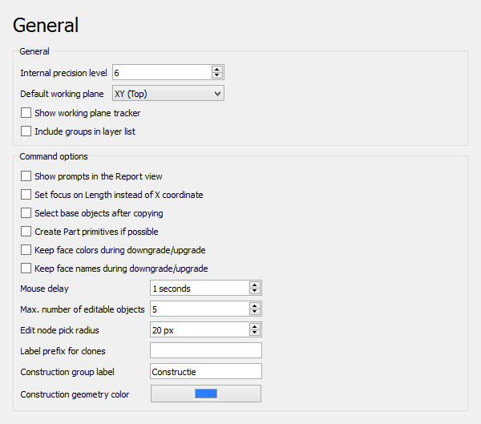
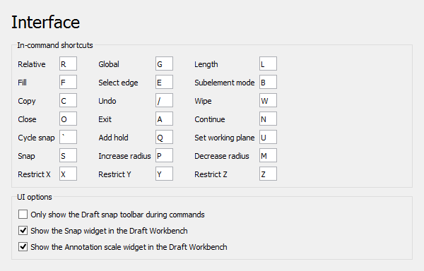
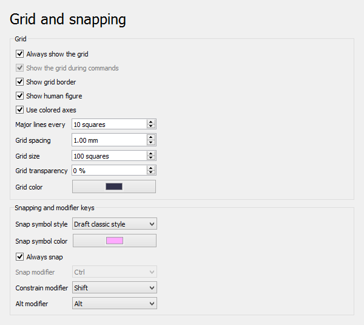

# Draft Preferences
The preferences for the [Draft Workbench](Draft_Workbench.md) can be found in the [Preferences Editor](Preferences_Editor.md). In the menu select **Edit → Preferences...** and then **Draft**.

There are five pages: [General](#General.md), [Interface](#Interface.md), [Grid and snapping](#Grid_and_snapping.md), [Visual](#Visual.md) and [Texts and dimensions](#Texts_and_dimensions.md).

Some advanced preferences can only be changed in the [Parameter editor](Std_DlgParameter.md). See [Fine-tuning](Fine-tuning#Draft_Workbench.md).

This page has been updated for version 0.22.

In {{VersionMinus|0.21}} some preferences may appear on a different page, and in some cases FreeCAD must be restarted after changing a preference.

## General

On the this page you can specify the following:

+++
| Name                                                        | Description                                                                                                                                                                                                                                                                |
+=============================================================+============================================================================================================================================================================================================================================================================+
|                                              | The number of decimals used in internal coordinate operations (for example 3 = 0.001). Values between 6 and 8 are usually considered the best trade-off.                                                                                                                   |
| **Internal precision level**                    |                                                                                                                                                                                                                                                                            |
|                                                          |                                                                                                                                                                                                                                                                            |
+++
|                                              | The default [working plane](Draft_SelectPlane.md) for new views. The options are:                                                                                                                                                                                  |
| **Default working plane**                       |                                                                                                                                                                                                                                                                            |
|                                                          | -                                                                                                                                                                                                                                                           |
|                                                             |     **Automatic**                                                                                                                                                                                                                                              |
|                                                             |                                                                                                                                                                                                                                                                         |
|                                                             |     : If set to **Automatic** the working plane will automatically align with the current view whenever a command is started. Additionally it will align to preselected planar faces, or when points on planar faces are picked during commands. |
|                                                             |                                                                                                                                                                                                                                                                            |
|                                                             | -                                                                                                                                                                                                                                                           |
|                                                             |     **XY (Top)**                                                                                                                                                                                                                                               |
|                                                             |                                                                                                                                                                                                                                                                         |
|                                                             |                                                                                                                                                                                                                                                                            |
|                                                             | -                                                                                                                                                                                                                                                           |
|                                                             |     **XZ (Front)**                                                                                                                                                                                                                                             |
|                                                             |                                                                                                                                                                                                                                                                         |
|                                                             |                                                                                                                                                                                                                                                                            |
|                                                             | -                                                                                                                                                                                                                                                           |
|                                                             |     **YZ (Side)**                                                                                                                                                                                                                                              |
|                                                             |                                                                                                                                                                                                                                                                         |
+++
|                                              | If checked, a widget indicating the current working plane orientation appears when picking points.                                                                                                                                                                         |
| **Show working plane tracker**                  |                                                                                                                                                                                                                                                                            |
|                                                          |                                                                                                                                                                                                                                                                            |
+++
|                                              | If checked, the layers drop-down list also includes groups. Objects can then automatically be added to groups as well. See [Draft AutoGroup](Draft_AutoGroup.md).                                                                                                  |
| **Include groups in layer list**                |                                                                                                                                                                                                                                                                            |
|                                                          |                                                                                                                                                                                                                                                                            |
+++
|                                              | If checked, instructions are displayed in the [Report view](Report_view.md) when using Draft commands. <small>(v0.22)</small>                                                                                                                               |
| **Show prompts in the Report view**             |                                                                                                                                                                                                                                                                            |
|                                                          |                                                                                                                                                                                                                                                                            |
+++
|                                              | If checked, Length input, instead of the X coordinate, will have the initial focus. This allows to indicate a direction and then type a distance.                                                                                                                          |
| **Set focus on Length instead of X coordinate** |                                                                                                                                                                                                                                                                            |
|                                                          |                                                                                                                                                                                                                                                                            |
+++
|                                              | If checked, base objects, instead of created copies, are selected after copying.                                                                                                                                                                                           |
| **Select base objects after copying**           |                                                                                                                                                                                                                                                                            |
|                                                          |                                                                                                                                                                                                                                                                            |
+++
|                                              | If checked, Draft commands will create [Part primitives](Part_Primitives.md) instead of Draft objects. Note that this is not fully supported, and many objects will not be editable with Draft modification commands.                                              |
| **Create Part primitives if possible**          |                                                                                                                                                                                                                                                                            |
|                                                          |                                                                                                                                                                                                                                                                            |
+++
|                                              | If checked, [Draft Downgrade](Draft_Downgrade.md) and [Draft Upgrade](Draft_Upgrade.md) will keep face colors. Only for the splitFaces and makeShell options.                                                                                              |
| **Keep face colors during downgrade/upgrade**   |                                                                                                                                                                                                                                                                            |
|                                                          |                                                                                                                                                                                                                                                                            |
+++
|                                              | If checked, [Draft Downgrade](Draft_Downgrade.md) and [Draft Upgrade](Draft_Upgrade.md) will keep face names. Only for the splitFaces and makeShell options.                                                                                               |
| **Keep face names during downgrade/upgrade**    |                                                                                                                                                                                                                                                                            |
|                                                          |                                                                                                                                                                                                                                                                            |
+++
|                                              | The maximum number of objects [Draft Edit](Draft_Edit.md) is allowed to process at the same time.                                                                                                                                                                  |
| **Max. number of editable objects**             |                                                                                                                                                                                                                                                                            |
|                                                          |                                                                                                                                                                                                                                                                            |
+++
|                                              | The pick radius of edit nodes.                                                                                                                                                                                                                                             |
| **Edit node pick radius**                       |                                                                                                                                                                                                                                                                            |
|                                                          |                                                                                                                                                                                                                                                                            |
+++
|                                              | The default prefix added to the label of new [clones](Draft_Clone.md).                                                                                                                                                                                             |
| **Label prefix for clones**                     |                                                                                                                                                                                                                                                                            |
|                                                          |                                                                                                                                                                                                                                                                            |
+++
|                                              | The default label for the [construction geometry group](Draft_ToggleConstructionMode.md).                                                                                                                                                                          |
| **Construction group label**                    |                                                                                                                                                                                                                                                                            |
|                                                          |                                                                                                                                                                                                                                                                            |
+++
|                                              | The default color for Draft objects in construction mode.                                                                                                                                                                                                                  |
| **Construction geometry color**                 |                                                                                                                                                                                                                                                                            |
|                                                          |                                                                                                                                                                                                                                                                            |
+++

  

## Interface

On the this page you can specify the following:

+++
| Name                                                                    | Description                                                                                                                                                                                                                                   |
+=========================================================================+===============================================================================================================================================================================================================================================+
|                                                          | These shortcuts only work when a [Draft](Draft_Workbench.md) or [Arch](Arch_Workbench.md) command is active. Note that not all commands support all shortcuts.                                                                |
| **In-command shortcuts**                                    |                                                                                                                                                                                                                                               |
|                                                                      |                                                                                                                                                                                                                                               |
+++
|                                                          | Shortcut to toggle relative mode. If relative mode is on, coordinates are relative to the last point, if available, else they are relative to the coordinate system origin.                                                                   |
| **Relative**                                                |                                                                                                                                                                                                                                               |
|                                                                      |                                                                                                                                                                                                                                               |
+++
|                                                          | Shortcut to toggle global mode. If global mode is on, coordinates are relative to the global coordinate system, else they are relative to the [working plane](Draft_SelectPlane.md) coordinate system. <small>(v0.20)</small>  |
| **Global**                                                  |                                                                                                                                                                                                                                               |
|                                                                      |                                                                                                                                                                                                                                               |
+++
|                                                          | Shortcut to change the focus from the X coordinate input box to the Length input box and vice versa.                                                                                                                                          |
| **Length**                                                  |                                                                                                                                                                                                                                               |
|                                                                      |                                                                                                                                                                                                                                               |
+++
|                                                          | Shortcut to toggle filled mode. If filled mode is on, the created object will have **Make Face** set to `True`.                                                                                    |
| **Fill**                                                    |                                                                                                                                                                                                                                               |
|                                                                      |                                                                                                                                                                                                                                               |
+++
|                                                          | Shortcut to press the **Select edge** button. See [Draft Dimension](Draft_Dimension.md).                                                                                                                         |
| **Select edge**                                             |                                                                                                                                                                                                                                               |
|                                                                      |                                                                                                                                                                                                                                               |
+++
|                                                          | Shortcut to toggle subelement mode. If subelement mode is on, the command will use the selected subelements instead of the whole objects.                                                                                                     |
| **Subelement mode**                                         |                                                                                                                                                                                                                                               |
|                                                                      |                                                                                                                                                                                                                                               |
+++
|                                                          | Shortcut to toggle copy mode. If copy mode is on, the command will create modified copies instead of modifying the original objects.                                                                                                          |
| **Copy**                                                    |                                                                                                                                                                                                                                               |
|                                                                      |                                                                                                                                                                                                                                               |
+++
|                                                          | Shortcut to press the **Undo** button.                                                                                                                                                                                   |
| **Undo**                                                    |                                                                                                                                                                                                                                               |
|                                                                      |                                                                                                                                                                                                                                               |
+++
|                                                          | Shortcut to press the **Wipe** button.                                                                                                                                                                                   |
| **Wipe**                                                    |                                                                                                                                                                                                                                               |
|                                                                      |                                                                                                                                                                                                                                               |
+++
|                                                          | Shortcut to press the **Close** button.                                                                                                                                                                                  |
| **Close**                                                   |                                                                                                                                                                                                                                               |
|                                                                      |                                                                                                                                                                                                                                               |
+++
|                                                          | Shortcut to press the **Finish** button.                                                                                                                                                                                 |
| **Exit**                                                    |                                                                                                                                                                                                                                               |
|                                                                      |                                                                                                                                                                                                                                               |
+++
|                                                          | Shortcut to toggle continue mode. If continue mode is on, commands will restart after finishing.                                                                                                                                              |
| **Continue**                                                |                                                                                                                                                                                                                                               |
|                                                                      |                                                                                                                                                                                                                                               |
+++
|                                                          | Shortcut to change snap priority to an object that is obscured by other geometry. See [Draft Snap](Draft_Snap.md).                                                                                                                    |
| **Cycle snap**                                              |                                                                                                                                                                                                                                               |
|                                                                      |                                                                                                                                                                                                                                               |
+++
|                                                          | Shortcut to insert a \"hold point\" at the current location of the cursor. See [Draft Snap](Draft_Snap.md).                                                                                                                           |
| **Add hold**                                                |                                                                                                                                                                                                                                               |
|                                                                      |                                                                                                                                                                                                                                               |
+++
|                                                          | Shortcut to press the **Set WP** button.                                                                                                                                                                                 |
| **Set working plane**                                       |                                                                                                                                                                                                                                               |
|                                                                      |                                                                                                                                                                                                                                               |
+++
|                                                          | Shortcut to toggle [Draft snapping](Draft_Snap.md).                                                                                                                                                                                   |
| **Snap**                                                    |                                                                                                                                                                                                                                               |
|                                                                      |                                                                                                                                                                                                                                               |
+++
|                                                          | Shortcut to increase the maximum distance at which [Draft Snap Grid](Draft_Snap_Grid.md) detects the intersections of grid lines. See [Draft SelectPlane](Draft_SelectPlane.md).                                              |
| **Increase radius**                                         |                                                                                                                                                                                                                                               |
|                                                                      |                                                                                                                                                                                                                                               |
+++
|                                                          | Shortcut to decrease the maximum distance at which [Draft Snap Grid](Draft_Snap_Grid.md) detects the intersections of grid lines.                                                                                                     |
| **Decrease radius**                                         |                                                                                                                                                                                                                                               |
|                                                                      |                                                                                                                                                                                                                                               |
+++
|                                                          | Shortcut to constrain the movement of the cursor to the X axis. See [Draft Constrain](Draft_Constrain.md).                                                                                                                            |
| **Restrict X**                                              |                                                                                                                                                                                                                                               |
|                                                                      |                                                                                                                                                                                                                                               |
+++
|                                                          | Shortcut to constrain the movement of the cursor to the Y axis.                                                                                                                                                                               |
| **Restrict Y**                                              |                                                                                                                                                                                                                                               |
|                                                                      |                                                                                                                                                                                                                                               |
+++
|                                                          | Shortcut to constrain the movement of the cursor to the Z axis.                                                                                                                                                                               |
| **Restrict Z**                                              |                                                                                                                                                                                                                                               |
|                                                                      |                                                                                                                                                                                                                                               |
+++
|                                                          | If checked, the Draft snap toolbar will only be visible during commands. <small>(v0.22)</small>                                                                                                                                        |
| **Only show the Draft snap toolbar during commands**        |                                                                                                                                                                                                                                               |
|                                                                      |                                                                                                                                                                                                                                               |
+++
|                                                          | If checked, the [Snap widget](Draft_snap_widget.md) is displayed in the Draft statusbar.                                                                                                                                              |
| **Show the Snap widget in the Draft Workbench**             |                                                                                                                                                                                                                                               |
|                                                                      |                                                                                                                                                                                                                                               |
+++
|                                                          | If checked, the [Annotation scale widget](Draft_annotation_scale_widget.md) is displayed in the Draft statusbar.                                                                                                                      |
| **Show the Annotation scale widget in the Draft Workbench** |                                                                                                                                                                                                                                               |
|                                                                      |                                                                                                                                                                                                                                               |
+++

  

## Grid and snapping 

Note that several grid preferences can also be changed with the [Draft SelectPlane](Draft_SelectPlane.md) command.

On the this page you can specify the following:

+++
| Name                                          | Description                                                                                                                                                                                                                                                              |
+===============================================+==========================================================================================================================================================================================================================================================================+
|                                | If checked, the grid will always be visible in new views. Use [Draft ToggleGrid](Draft_ToggleGrid.md) to change this for the active view.                                                                                                                        |
| **Always show the grid**          |                                                                                                                                                                                                                                                                          |
|                                            |                                                                                                                                                                                                                                                                          |
+++
|                                | If checked, the grid will be visible during commands in new views. Use [Draft ToggleGrid](Draft_ToggleGrid.md) to change this for the active view. <small>(v0.22)</small>                                                                                 |
| **Show the grid during commands** |                                                                                                                                                                                                                                                                          |
|                                            |                                                                                                                                                                                                                                                                          |
+++
|                                | If checked, an additional border is displayed around the grid, showing the main square size in the bottom left corner.                                                                                                                                                   |
| **Show grid border**              |                                                                                                                                                                                                                                                                          |
|                                            |                                                                                                                                                                                                                                                                          |
+++
|                                | If checked, the outline of a human figure is displayed at the bottom left corner of the grid. Only effective if the [BIM Workbench](BIM_Workbench.md) is installed and **Show grid border** is enabled. <small>(v0.20)</small>  |
| **Show human figure**             |                                                                                                                                                                                                                                                                          |
|                                            |                                                                                                                                                                                                                                                                          |
+++
|                                | If checked, the two main axes of the grid are colored red, green or blue if they match the X, Y or Z axis of the global coordinate system.                                                                                                                               |
| **Use colored axes**              |                                                                                                                                                                                                                                                                          |
|                                            |                                                                                                                                                                                                                                                                          |
+++
|                                | The number of squares between main grid lines. These lines are thicker than normal grid lines.                                                                                                                                                                           |
| **Main lines every**              |                                                                                                                                                                                                                                                                          |
|                                            |                                                                                                                                                                                                                                                                          |
+++
|                                | The distance between grid lines.                                                                                                                                                                                                                                         |
| **Grid spacing**                  |                                                                                                                                                                                                                                                                          |
|                                            |                                                                                                                                                                                                                                                                          |
+++
|                                | The number of horizontal and vertical lines in the grid.                                                                                                                                                                                                                 |
| **Grid size**                     |                                                                                                                                                                                                                                                                          |
|                                            |                                                                                                                                                                                                                                                                          |
+++
|                                | The overall transparency of the grid.                                                                                                                                                                                                                                    |
| **Grid transparency**             |                                                                                                                                                                                                                                                                          |
|                                            |                                                                                                                                                                                                                                                                          |
+++
|                                | The color of the grid.                                                                                                                                                                                                                                                   |
| **Grid color**                    |                                                                                                                                                                                                                                                                          |
|                                            |                                                                                                                                                                                                                                                                          |
+++
|                                | The style for [snap symbols](Draft_Snap.md). The options are:                                                                                                                                                                                                    |
| **Snap symbol style**             |                                                                                                                                                                                                                                                                          |
|                                            | -                                                                                                                                                                                                                                                         |
|                                               |     **Draft classic style**                                                                                                                                                                                                                                  |
|                                               |                                                                                                                                                                                                                                                                       |
|                                               |                                                                                                                                                                                                                                                                          |
|                                               | -                                                                                                                                                                                                                                                         |
|                                               |     **Bitsnpieces style**                                                                                                                                                                                                                                    |
|                                               |                                                                                                                                                                                                                                                                       |
|                                               |     .                                                                                                                                                                                                                                                                    |
+++
|                                | The color for [snap symbols](Draft_Snap.md), [snap dimensions](Draft_Snap_Dimensions.md) and [edit nodes](Draft_Edit.md).                                                                                                                        |
| **Snap symbol color**             |                                                                                                                                                                                                                                                                          |
|                                            |                                                                                                                                                                                                                                                                          |
+++
|                                | If checked, [snapping](Draft_Snap.md) is activated without the need to press the **Snap modifier** key.                                                                                                                                |
| **Always snap**                   |                                                                                                                                                                                                                                                                          |
|                                            |                                                                                                                                                                                                                                                                          |
+++
|                                | The [Snap](Draft_Snap.md) modifier key.                                                                                                                                                                                                                          |
| **Snap modifier**                 |                                                                                                                                                                                                                                                                          |
|                                            |                                                                                                                                                                                                                                                                          |
+++
|                                | The [Constrain](Draft_Constrain.md) modifier key.                                                                                                                                                                                                                |
| **Constrain modifier**            |                                                                                                                                                                                                                                                                          |
|                                            |                                                                                                                                                                                                                                                                          |
+++
|                                | The Alt modifier key. The function of this key depends on the command.                                                                                                                                                                                                   |
| **Alt modifier**                  |                                                                                                                                                                                                                                                                          |
|                                            |                                                                                                                                                                                                                                                                          |
+++

  

## Visual

On the this page you can specify the following:

+++
| Name                                            | Description                                                                                                      |
+=================================================+==================================================================================================================+
|                                  | The default size for SVG patterns. A higher value results in a denser pattern.                                   |
| **SVG pattern size**                |                                                                                                                  |
|                                              |                                                                                                                  |
+++
|                                  | An optional directory with custom SVG files containing pattern definitions to be added to the standard patterns. |
| **Additional SVG pattern location** |                                                                                                                  |
|                                              |                                                                                                                  |
+++
|                                  | An SVG linestyle definition used by the [TechDraw DraftView](TechDraw_DraftView.md) command.             |
| **Dashed line definition**          |                                                                                                                  |
|                                              |                                                                                                                  |
+++
|                                  | Idem.                                                                                                            |
| **Dashdot line definition**         |                                                                                                                  |
|                                              |                                                                                                                  |
+++
|                                  | Idem.                                                                                                            |
| **Dotted line definition**          |                                                                                                                  |
|                                              |                                                                                                                  |
+++

  

## Texts and dimensions 

These preferences are the defaults used when creating new objects. Changing them does not affect existing objects.

On the this page you can specify the following:

+++
| Name                                          | Description                                                                                                                                                                                                                                                                                                                                                       |
+===============================================+===================================================================================================================================================================================================================================================================================================================================================================+
|                                | The default font for texts, dimensions and labels. It can be a font name such as {{Value|Arial}}, a style such as {{Value|sans}}, {{Value|serif}} or {{Value|mono}}, or a family such as {{Value|Arial,Helvetica,sans}}, or a name with a style such as {{Value|Arial:Bold}}. |
| **Font name or family**           |                                                                                                                                                                                                                                                                                                                                                                   |
|                                            |                                                                                                                                                                                                                                                                                                                                                                   |
+++
|                                | The default height for texts, dimension texts and label texts.                                                                                                                                                                                                                                                                                                    |
| **Font size**                     |                                                                                                                                                                                                                                                                                                                                                                   |
|                                            |                                                                                                                                                                                                                                                                                                                                                                   |
+++
|                                | The default line spacing for multi-line texts and labels (relative to the font size).                                                                                                                                                                                                                                                                             |
| **Line spacing factor**           |                                                                                                                                                                                                                                                                                                                                                                   |
|                                            |                                                                                                                                                                                                                                                                                                                                                                   |
+++
|                                | The default annotation scale multiplier. This is the inverse of the scale set in the [Draft annotation scale widget](Draft_annotation_scale_widget.md). If the scale is {{Value|1:100}} the multiplier is {{Value|100}}. <small>(v0.22)</small>                                                                        |
| **Scale multiplier**              |                                                                                                                                                                                                                                                                                                                                                                   |
|                                            |                                                                                                                                                                                                                                                                                                                                                                   |
+++
|                                | The default color for texts, dimension texts and label texts.                                                                                                                                                                                                                                                                                                     |
| **Text color**                    |                                                                                                                                                                                                                                                                                                                                                                   |
|                                            |                                                                                                                                                                                                                                                                                                                                                                   |
+++
|                                | If checked, the dimension line is displayed by default.                                                                                                                                                                                                                                                                                                           |
| **Show dimension line**           |                                                                                                                                                                                                                                                                                                                                                                   |
|                                            |                                                                                                                                                                                                                                                                                                                                                                   |
+++
|                                | The default line width.                                                                                                                                                                                                                                                                                                                                           |
| **Line width**                    |                                                                                                                                                                                                                                                                                                                                                                   |
|                                            |                                                                                                                                                                                                                                                                                                                                                                   |
+++
|                                | The default symbol displayed at the ends of dimension lines. The options are:                                                                                                                                                                                                                                                                                     |
| **Arrows type**                   |                                                                                                                                                                                                                                                                                                                                                                   |
|                                            | -                                                                                                                                                                                                                                                                                                                                                  |
|                                               |     **Dot**                                                                                                                                                                                                                                                                                                                                           |
|                                               |                                                                                                                                                                                                                                                                                                                                                                |
|                                               |                                                                                                                                                                                                                                                                                                                                                                   |
|                                               | -                                                                                                                                                                                                                                                                                                                                                  |
|                                               |     **Circle**                                                                                                                                                                                                                                                                                                                                        |
|                                               |                                                                                                                                                                                                                                                                                                                                                                |
|                                               |                                                                                                                                                                                                                                                                                                                                                                   |
|                                               | -                                                                                                                                                                                                                                                                                                                                                  |
|                                               |     **Arrow**                                                                                                                                                                                                                                                                                                                                         |
|                                               |                                                                                                                                                                                                                                                                                                                                                                |
|                                               |                                                                                                                                                                                                                                                                                                                                                                   |
|                                               | -                                                                                                                                                                                                                                                                                                                                                  |
|                                               |     **Tick**                                                                                                                                                                                                                                                                                                                                          |
|                                               |                                                                                                                                                                                                                                                                                                                                                                |
|                                               |                                                                                                                                                                                                                                                                                                                                                                   |
|                                               | -                                                                                                                                                                                                                                                                                                                                                  |
|                                               |     **Tick-2**                                                                                                                                                                                                                                                                                                                                        |
|                                               |                                                                                                                                                                                                                                                                                                                                                                |
+++
|                                | The default arrow size.                                                                                                                                                                                                                                                                                                                                           |
| **Arrows size**                   |                                                                                                                                                                                                                                                                                                                                                                   |
|                                            |                                                                                                                                                                                                                                                                                                                                                                   |
+++
|                                | The default color for lines and arrows.                                                                                                                                                                                                                                                                                                                           |
| **Line and arrow color**          |                                                                                                                                                                                                                                                                                                                                                                   |
|                                            |                                                                                                                                                                                                                                                                                                                                                                   |
+++
|                                | If checked, a unit symbol is added to dimension texts by default.                                                                                                                                                                                                                                                                                                 |
| **Show unit**                     |                                                                                                                                                                                                                                                                                                                                                                   |
|                                            |                                                                                                                                                                                                                                                                                                                                                                   |
+++
|                                | The default unit override for dimensions. Enter a unit such as {{Value|m}} or {{Value|cm}}, leave blank to use the current unit defined in FreeCAD.                                                                                                                                                                                   |
| **Unit override**                 |                                                                                                                                                                                                                                                                                                                                                                   |
|                                            |                                                                                                                                                                                                                                                                                                                                                                   |
+++
|                                | The default number of decimal places for dimension texts.                                                                                                                                                                                                                                                                                                         |
| **Number of decimals**            |                                                                                                                                                                                                                                                                                                                                                                   |
|                                            |                                                                                                                                                                                                                                                                                                                                                                   |
+++
|                                | The optional string inserted between the feet and inches values in dimensions. <small>(v0.22)</small>                                                                                                                                                                                                                                                      |
| **Feet separator**                |                                                                                                                                                                                                                                                                                                                                                                   |
|                                            |                                                                                                                                                                                                                                                                                                                                                                   |
+++
|                                | The default distance the dimension line is extended past the extension lines.                                                                                                                                                                                                                                                                                     |
| **Dimension line overshoot**      |                                                                                                                                                                                                                                                                                                                                                                   |
|                                            |                                                                                                                                                                                                                                                                                                                                                                   |
+++
|                                | The default length of extension lines. Use {{Value|0}} for full extension lines. A negative value defines the gap between the ends of the extension lines and the measured points. A positive value defines the maximum length of the extension lines. Only used for [linear dimensions](Draft_Dimension#View.md).                          |
| **Extension line length**         |                                                                                                                                                                                                                                                                                                                                                                   |
|                                            |                                                                                                                                                                                                                                                                                                                                                                   |
+++
|                                | The default length of extension lines above the dimension line.                                                                                                                                                                                                                                                                                                   |
| **Extension line overshoot**      |                                                                                                                                                                                                                                                                                                                                                                   |
|                                            |                                                                                                                                                                                                                                                                                                                                                                   |
+++
|                                | The default space between the dimension line and the dimension text.                                                                                                                                                                                                                                                                                              |
| **Text spacing**                  |                                                                                                                                                                                                                                                                                                                                                                   |
|                                            |                                                                                                                                                                                                                                                                                                                                                                   |
+++
|                                | The default font file for the [Draft ShapeString](Draft_ShapeString.md) command. For Windows users: please read the [Font file selection on Windows](Draft_ShapeString#Font_file_selection_on_Windows.md) paragraph on that page.                                                                                                                 |
| **Default ShapeString font file** |                                                                                                                                                                                                                                                                                                                                                                   |
|                                            |                                                                                                                                                                                                                                                                                                                                                                   |
+++

 

---
⏵ [documentation index](../README.md) > [Preferences](Category_Preferences.md) > [Draft](Draft_Workbench.md) > Draft Preferences
