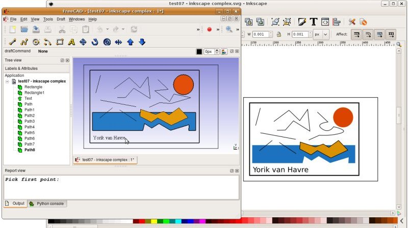

# Draft SVG
## Description

Draft SVG is a software module used by the  [Std Open](Std_Open.md),  [Std Import](Std_Import.md) and  [Std Export](Std_Export.md) commands to handle the [SVG](SVG.md) file format.

   
*Inkscape drawing exported to SVG, which is subsequently opened in FreeCAD*

## Importing

The following SVG objects can be imported:

-   PATH objects
-   LINE objects
-   RECT objects
-   CIRCLE objects
-   ELLIPSE objects
-   POLYGON objects
-   POLYLINE objects

### Limitations

FreeCAD will not import path objects that have only one point ([forum discussion](https://forum.freecadweb.org/viewtopic.php?f=3&t=43856)).

## Exporting

The following FreeCAD objects can be exported:

-   Lines and wires (polylines)
-   Arcs and circles
-   Faces
-   Texts
-   Dimensions

### Limitations 

SVG is a 2D format, so all Z information will be disregarded (all objects will be flattened).

## Unit Handling 

When exporting, a User Unit (px) equals one millimeter.

When importing, the width, height and viewBox attributes are respected. All elements are scaled to their size in millimeters, which is FreeCAD\'s internal unit. If the SVG does not contain information on its physical size, it is assumed to have a 90 DPI resolution. Using absolute units in attributes inside the SVG should be avoided. Relative units like em, ex and % are currently not supported.

The [Inkscape](https://inkscape.org/) SVG Editor currently works only with 90 DPI documents. No matter which unit is selected in Inkscape. All the output has to be considered converted to 90 DPI and rounded to 6 decimal places. As FreeCAD (and the SVG standard) is agnostic to the precision of rounding done in Inkscape these values will not be rounded on input. And odd values in millimeter will remain. If you need the SVG import not to be rounded, work on User Units (px) in Inkscape. Scaling can be done after the import in FreeCAD or by changing the width, height and viewbox attributes.

## Preferences

See [Import Export Preferences](Import_Export_Preferences.md).

## Scripting

See also: [Autogenerated API documentation](https://freecad.github.io/SourceDoc/) and [FreeCAD Scripting Basics](FreeCAD_Scripting_Basics.md).

To export objects to SVG use the `export` method of the importSVG module.

 
```python
importSVG.export(exportList, filename)
```

-   For the Windows OS: use a {{FileName|/}} (forward slash) as the path separator in {{Incode|filename}}.

Example:

 
```python
import FreeCAD as App
import Draft
import importSVG

doc = App.newDocument()

polygon1 = Draft.make_polygon(3, radius=500)
polygon2 = Draft.make_polygon(5, radius=1500)

doc.recompute()

objects = [polygon1, polygon2]
importSVG.export(objects, "/home/user/Pictures/myfile.svg")
```


---
 [documentation index](../README.md) > [File Formats](Category_File Formats.md) > [Draft](Draft_Workbench.md) > Draft SVG
