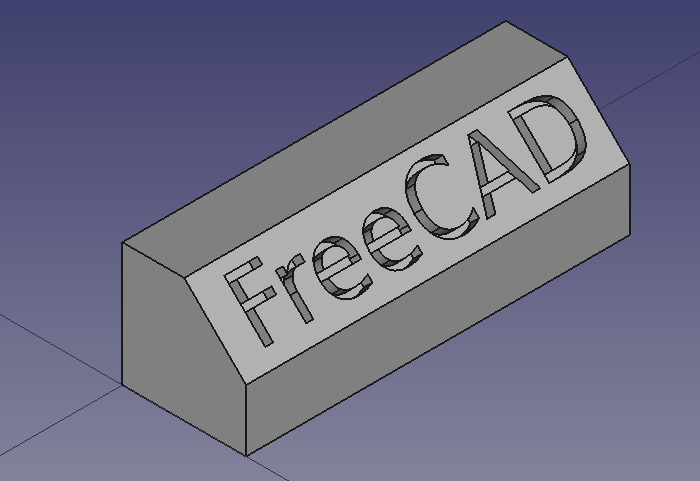
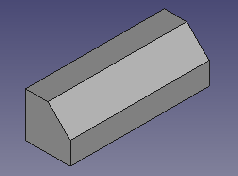
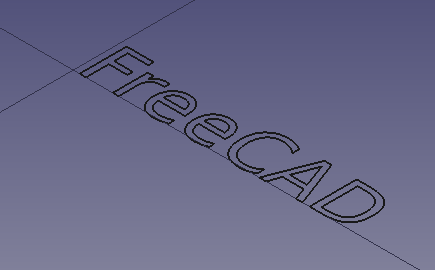
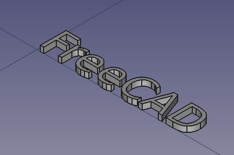
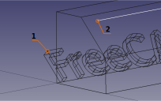
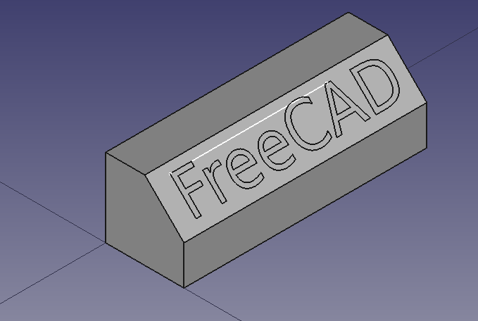

# Draft ShapeString tutorial
---
- TutorialInfo:   Topic:Product design
   Level:Beginner
   Time:30 minutes
   Author:r-frank and vocx
   FCVersion:0.17 and above
   Files:[https://github.com/FreeCAD/Examples/blob/master/Draft_Shapestring_Tutorial_Examples/Draft_Shapestring_Tutorial_Text.FCStd?raw=true Draft_Shapestring_Text]
}}

## Introduction

This tutorial was originally written by Roland Frank (†2017, r-frank), and it was rewritten and re-illustrated by vocx.

This tutorial describes a method to create 3D text and use it with solid objects in the  [Part Workbench](Part_Workbench.md). We will discuss how to

-   insert outlined text with the **** tool,
-   extrude it to be a 3D solid with **[Part Extrude](File:Part_Extrude.svg   16px]] [[Part Extrude.md)**,
-   position it in 3D space using [placement](placement.md), and **[Draft Move](File:Draft_Move.svg   16px]] [[Draft Move.md)** (it uses a sketch as auxiliary geometry), and
-   engrave the text by applying a boolean **[Part Cut](File:Part_Cut.svg   16px]] [[Part Cut.md)**.

To use ShapeStrings inside the  [PartDesign Workbench](PartDesign_Workbench.md), the process is essentially the same as with the Part Workbench, but the ShapeString is placed inside the [PartDesign Body](PartDesign_Body.md) to extrude it. Go to the end of this tutorial for more information.

   
*Final model of the engraved text.*

The [Sketcher Workbench](Sketcher_Workbench.md) is used briefly to draw an auxiliary line. More information about the tools of this workbench can be found in

-   [Basic Sketcher tutorial](Basic_Sketcher_Tutorial.md)
-   [Sketcher reference](Sketcher_reference.md)

## Setup

1\. Open FreeCAD, create a new empty document with **File → [New](File:Std_New.svg   16px]] [[Std_New.md)**, and switch to the [Part Workbench](Part_Workbench.md).

:   1.1. Press the **[View isometric](File:Std_ViewIsometric.svg   16px]] [[Std_ViewIsometric.md)** button, or press **0** in the numerical pad of your keyboard, to change the view to isometric to visualize the 3D solids better.
:   1.2. Press the **[View fit all](File:Std_ViewFitAll.svg   16px]] [[Std_ViewFitAll.md)** button whenever you add objects in order to pan and zoom the [3D view](3D_view.md) so that all elements are seen in the view.
:   1.3. Hold **Ctrl** while you click to select multiple items. If you selected something wrong or want to de-select everything, just click on empty space in the [3D view](3D_view.md).

## Create the basic shape 

2\. Insert a primitive cube by clicking on ****.

:   2.1. Select {{incode   Cube}} in the [tree view](tree_view.md).
:   2.2. Change the dimensions in the **Data** tab of the [property editor](property_editor.md).
:   2.3. Change **Width** to {{incode   31 mm}}.

3\. Create a chamfer.

:   3.1. Select the upper edge ({{incode   Edge6}}) on the front face of the {{incode   Cube}} in the [3D view](3D_view.md).
:   3.2. Press ****.
:   3.3. In the **Chamfer edges** [task panel](task_panel.md) go to **Selection**, choose **Select edges**. As **Fillet type** choose {{incode   Constant length}}, then set **Length** to {{incode   5 mm}}.
:   3.4. Press **OK**. This will create a {{incode   Chamfer}} object.
:   3.5. In the [tree view](tree_view.md), select {{incode   Chamfer}}, in the **View** tab change the value of **Line Width** to {{incode   2.0}}.

   
*Base object created from a cube and a chamfer operation.*

## Insert the ShapeString 

4\. Switch to the [Draft Workbench](Draft_Workbench.md).

:   4.1. Make sure nothing is selected in the [tree view](tree_view.md).
:   4.2. Establish the working plane to XY (Top) by clicking on **[SelectPlane](File:Draft_SelectPlane.svg   16px]] [[Draft_SelectPlane.md)** and pressing **[Top (XY)](File:View-top.svg   16px]] [[Std_ViewTop.md)**.

5\. Insert the text \"FreeCAD\".

:   5.1. Press on **[ShapeString](File:Draft_ShapeString.svg   16px]] [[Draft_ShapeString.md)**.
:   5.2. Change **X** to {{incode   0 mm}}.
:   5.3. Change **Y** to {{incode   0 mm}}.
:   5.4. Change **Z** to {{incode   0 mm}}.
:   5.5. Or press **Reset point**.
:   5.6. Change **String** to {{incode   FreeCAD}}; change **Height** to {{incode   5 mm}}; change **Tracking** to {{incode   0 mm}}.
:   5.7. Make sure **Font file** points to a valid font, for example, {{incode   /usr/share/fonts/truetype/dejavu/DejaVuSans.ttf}}. Press the ellipsis **...** to open the operating system\'s dialog to find a font.

    :   
        **Note:**
        
        for more details about working with fonts please refer to the [Draft ShapeString Notes](Draft_ShapeString#Notes.md) section.
:   5.8. Press **OK**. This will create a {{incode   ShapeString}} object.
:   5.9. Recompute the document by pressing **[Refresh](File:Std_Refresh.svg   16px]] [[Std_Refresh.md)**.
:   5.10. In the [tree view](tree_view.md), select {{incode   ShapeString}}, in the **View** tab change the value of **Line Width** to {{incode   2.0}}.
:   5.11. In the [tree view](tree_view.md), select {{incode   Chamfer}}, in the **View** tab change the value of **Visibility** to {{incode   false}}, or press **Space** in the keyboard. This will hide the object, so you can see the {{incode   ShapeString}} better.
:   5.12. To see the ShapeString from above change the view by pressing **[Top (XY)](File:View-top.svg   16px]] [[Std_ViewTop.md)**, or **2** in the keyboard.
:   5.13. To restore the view to isometric, press **[View isometric](File:Std_ViewIsometric.svg   16px]] [[Std_ViewIsometric.md)**, or **0** in the keyboard.

   
*Text created as a ShapeString, that is, as a collection of edges in a plane.*

## Create the solid 3D text 

6\. Switch back to the [Part Workbench](Part_Workbench.md).

:   6.1. In the [tree view](tree_view.md), select {{incode   ShapeString}}, then press **[Extrude](File:Part_Extrude.svg   16px]] [[Part_Extrude.md)**.
:   6.2. In the **Extrude** [task panel](task_panel.md) go to **Direction**, choose **Along normal**; in **Length**, set **Along** to {{incode   1 mm}}; also tick the **Create solid** option.
:   6.3. Press **OK**. This will create an {{incode   Extrude}} object.
:   6.4. In the [tree view](tree_view.md), select {{incode   Extrude}}, in the **View** tab change the value of **Line Width** to {{incode   2.0}}.

   
*Text created as a ShapeString, and turned into a solid by extrusion.*

## Insert auxiliary sketch for positioning 

Now we will draw a simple sketch that will be used as auxiliary geometry to position the ShapeString extrusion.

7\. In the [tree view](tree_view.md), select {{incode   Extrude}}, and press **Space** in the keyboard to make it invisible.

8\. Switch to the [Sketcher Workbench](Sketcher_Workbench.md).

9\. In the [tree view](tree_view.md), select {{incode   Chamfer}}, and press **Space** in the keyboard to make it visible.

:   9.1. Choose the sloped face created by the chamfer operation ({{incode   Face3}}).
:   9.2. Click on **[NewSketch](File:Sketcher_NewSketch.svg   16px]] [[Sketcher_NewSketch.md)**. In the **Sketch attachment** dialog, select {{incode   FlatFace}}, and press **OK**.
:   9.3. The view should adjust automatically so that the camera is parallel to the selected face.
:   9.4. Draw a horizontal line in a general position on top of the face. The length is not important; we are just interested in its position.
:   9.5. Constrain the left endpoint to be {{incode   2.5 mm}} away from the local X axis and from the local Y axis, using **[ConstrainDistanceX](File:Sketcher_ConstrainDistanceX.svg   16px]] [[Sketcher_ConstrainDistanceX.md)** and **[ConstrainDistanceY](File:Sketcher_ConstrainDistanceY.svg   16px]] [[Sketcher_ConstrainDistanceY.md)**.
:   9.6. Since the sketch is just an auxiliary object, we don\'t need to have it fully constrained. You can do this if you wish by assigning a fixed distance, say, {{incode   20 mm}}, again with **[ConstrainDistanceX](File:Sketcher_ConstrainDistanceX.svg   16px]] [[Sketcher_ConstrainDistanceX.md)**.
:   9.7. Close the sketch.

   
*Line being created with the sketcher, with constraints.*

   
*Sketch line created on top of the solid face, to be used as reference guide for positioning the extruded text.*

## Positioning the solid text in 3D space 

10\. In the [tree view](tree_view.md), select {{incode   Extrude}}, and press **Space** in the keyboard to make it visible.

11\. In the [tree view](tree_view.md), select {{incode   Extrude}}, in the **Data** tab of the [property editor](property_editor.md), click on the **Placement** value so the ellipsis button **...** appears on the right.

:   11.1. Tick the option **Apply incremental changes**.
:   11.2. Change the **Rotation** to {{incode   Rotation axis with angle}}; **Axis** to {{incode   Z}}, and **Angle** to {{incode   90 deg}}, then click on **Apply**. This will apply a rotation around the Z-axis, and will reset the **Angle** field to zero.
:   11.3. Change the **Rotation** to {{incode   Rotation axis with angle}}; **Axis** to {{incode   Y}}, and **Angle** to {{incode   45 deg}}, then click on **Apply**. This will apply a rotation around the Y-axis, and will reset the **Angle** field to zero.
:   11.4. Click on **OK** to close the dialog.

12\. Switch again to the [Draft Workbench](Draft_Workbench.md).

:   12.1. Switch to \"Wireframe\" draw style with **View → [16px](Std_DrawStyle___Draw_style]]_→_[[File:DrawStyleWireFrame.svg.md) Wireframe**, or press the **[Wireframe](File:DrawStyleWireFrame.svg   16px]] [[Std_DrawStyle.md)** button in the view toolbar. This will allow you to see the objects behind other objects.
:   12.2. Make sure the [Draft Snap](Draft_Snap.md) \"Snap to endpoint\" method is active. This can be done from the menu **Draft → Snapping → [Toggle On/Off](File:Draft_Snap_Lock.svg   16px]] [[Draft_Snap_Lock.md)**, and then ** → [Endpoint](File:Snap_Endpoint.svg   16px]] [[Draft_Snap_Endpoint.md)**, or by pressing the **[ToggleSnap](File:Draft_Snap_Lock.svg   16px]] [[Draft_Snap_Lock.md)** and **[Snap endpoint](File:Draft_Snap_Endpoint.svg   16px]] [[Draft_Snap_Endpoint.md)** buttons in the Snap toolbar.

13\. In the [tree view](tree_view.md), select {{incode   Extrude}}.

:   13.1. Click on **[Move](File:Draft_Move.svg   16px]] [[Draft Move.md)**.
:   13.2. In the [3D view](3D_view.md) click on the upper left corner point of the {{incode   Extrude}} object (1), and then click on the leftmost point in the line drawn with the sketcher (2).
:   13.3. If **[Snap endpoint](File:Draft_Snap_Endpoint.svg   16px]] [[Draft_Snap_Endpoint.md)** is active, as soon as you move the pointer close to a vertex, you should see that it attaches to it exactly.
:   
    **Note:**if you have problems snapping to vertices, make sure only the **[Snap endpoint](File:Snap_Endpoint.svg   16px]] [[Draft_Snap_Endpoint.md)** method is enabled. Having multiple snapping methods active at the same time may make it difficult to select the right feature.
:   13.4. The extruded text should now be inside the body of the {{incode   Fillet}} object.

   
*The extruded ShapeString should be moved to the position of the sketched line that lies on the face of the base body.*

   
*Extruded ShapeString positioned in the {{incode   Fillet*.}}

## Creating engraved text 

14\. Switch back to the [Part Workbench](Part_Workbench.md).

:   14.1. Switch to \"As is\" draw style with **View → [16px](Std_DrawStyle___Draw_style]]_→_[[File:DrawStyleAsIs.svg.md) As is**, or press the **[As is](File:DrawStyleAsIs.svg   16px]] [[Std_DrawStyle.md)** button in the view toolbar. This will show all objects with the normal shading and color.
:   14.2. In the [tree view](tree_view.md), select {{incode   Sketch}}, and press **Space** in the keyboard to make it invisible.

15\. In the [tree view](tree_view.md) select {{incode   Chamfer}} first, and then {{incode   Extrude}}.

:   15.1. Then press **[Cut](File:Part_Cut.svg   16px]] [[Part_Cut.md)**. This will create a {{incode   Cut}} object. This is the final object.
:   
    **Note:**the order in which you select the objects is important for the cut operation. The base object is selected first, and the subtracting object comes at the end.
:   15.2. In the [tree view](tree_view.md), select {{incode   Cut}}, in the **View** tab change the value of **Line Width** to {{incode   2.0}}.

   
*Final model of a filleted cube, with carved text created from a ShapeString, Extrude, and boolean Cut operations.*

## Engraving 3D text with the PartDesign Workbench 

A similar process as described above can be done with the [PartDesign Workbench](PartDesign_Workbench.md).

1.  Create the **[Draft ShapeString](File:Draft_ShapeString.svg   16px]] [[Draft_ShapeString.md)** first.
2.  Create a **[PartDesign Body](File:PartDesign_Body_Tree.svg   16px]] [[PartDesign_Body.md)**, make it active, and add a base solid by adding primitives, or using a Sketch and extruding it with **[PartDesign Pad](File:PartDesign_Pad.svg   16px]] [[PartDesign_Pad.md)**.
3.  Move the {{incode   ShapeString}} object into the active body.
4.  Attach the {{incode   ShapeString}} object to one of the faces of the solid, or to a **[PartDesign Plane](File:PartDesign_Plane.svg   16px]] [[PartDesign Plane.md)**, using **[Part EditAttachment](File:Part_EditAttachment.svg   16px]] [[Part_EditAttachment.md)**.
5.  Now create a **[PartDesign Pad](File:PartDesign_Pad.svg   16px]] [[PartDesign_Pad.md)** or a **[PartDesign Pocket](File:PartDesign_Pocket.svg   16px]] [[PartDesign_Pocket.md)** from the {{incode   ShapeString}}, in order to produce an additive or a subtractive [feature](PartDesign_Feature.md) of the base body, respectively.

See the forum thread, [How to use ShapeStrings in PartDesign](https://forum.freecadweb.org/viewtopic.php?f=3&t=36623).

## Notes

-   To create curved text you can use  [Macro FCCircularText](Macro_FCCircularText.md).
-   To import text from an SVG file look at the [Import text and geometry from Inkscape](Import_text_and_geometry_from_Inkscape.md) tutorial.

   {{PartDesign Tools navi}} {{Sketcher Tools navi}} {{Userdocnavi
---

---
 [documentation index](../README.md) > [Tutorials](Category_Tutorials.md) > [Part](Category_Part.md) > [PartDesign](Category_PartDesign.md) > [Sketcher](Category_Sketcher.md) > [Draft](Draft_Workbench.md) > Draft ShapeString tutorial
