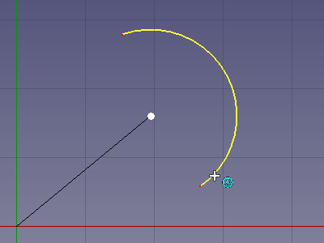
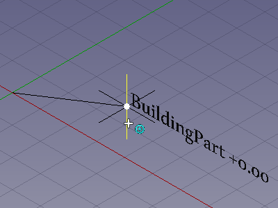

---
- GuiCommand:
   Name:Draft Snap Center
   Workbenches:[Draft](Draft_Workbench.md), [Arch](Arch_Workbench.md)
   SeeAlso:[Draft Snap](Draft_Snap.md), [Draft Snap Lock](Draft_Snap_Lock.md)
---

# Draft Snap Center

## Description

The  **Draft Snap Center** option snaps to the center point of faces and circular edges, and to the **Placement** point of [Draft WorkingPlaneProxies](Draft_WorkingPlaneProxy.md) and [Arch BuildingParts](Arch_BuildingPart.md). The faces and edges can belong to [Draft](Draft_Workbench.md) or [Arch](Arch_Workbench.md) objects but also to objects created with other [workbenches](Workbenches.md).

   
*Snapping the second point of a line to the center of a circular edge*

   
*Snapping the second point of a line to the Placement point of an Arch BuildingPart*

## Usage

For general information about snapping see [Draft Snap](Draft_Snap.md).

1.  Make sure snapping is enabled. See  [Draft Snap Lock](Draft_Snap_Lock.md).
2.  If **Draft Snap Center** is not active do one of the following:
    -   Press the **** button in the Draft snap toolbar.
    -   Hold down the **** button in the [Draft snap widget](Draft_snap_widget.md) and in the menu that opens select the ** Snap Center** option.
3.  Choose a [Draft](Draft_Workbench.md) or [Arch](Arch_Workbench.md) command to create your geometry.
4.  Note that you can also change snap options while a command is active.
5.  Do one of the following:
    -   To select the center point of a face or circular edge:
        -   Move the cursor over the face or edge.
        -   The face or edge is highlighted.
    -   To select the **Placement** point of a [Draft WorkingPlaneProxy](Draft_WorkingPlaneProxy.md):
        -   Move the cursor over any element of the working plane proxy.
        -   The working plane proxy is not highlighted.
    -   To select the **Placement** point of an [Arch BuildingPart](Arch_BuildingPart.md):
        -   Move the cursor over one of the edges of the small axis symbol of the BuildingPart, or over the text next to it that displays the **Label** of the BuildingPart and its level.
        -   Only the edges of the axis symbol are highlighted. The text is not highlighted.
6.  If a point is found the point is marked and the  icon is displayed near the cursor.
7.  Click to confirm the point.

## Preferences

See [Draft Snap](Draft_Snap#Preferences.md).

---
 [documentation index](../README.md) > [Draft](Draft_Workbench.md) > Draft Snap Center
