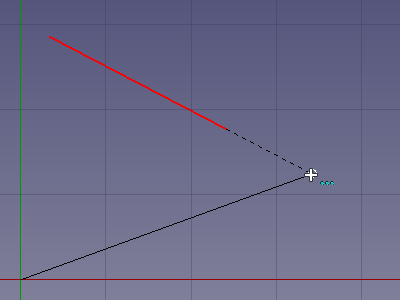

---
- GuiCommand:
   Name:Draft Snap Extension
   Workbenches:[Draft](Draft_Workbench.md), [Arch](Arch_Workbench.md)
   SeeAlso:[Draft Snap](Draft_Snap.md), [Draft Snap Lock](Draft_Snap_Lock.md)
---

# Draft Snap Extension

## Description

The  **Draft Snap Extension** option snaps to an imaginary line that extends beyond the endpoints of straight edges. The edges can belong to [Draft](Draft_Workbench.md) or [Arch](Arch_Workbench.md) objects but also to objects created with other [workbenches](Workbenches.md).

Up to two edged can be referenced by this snap option and [Draft Snap Parallel](Draft_Snap_Parallel.md), making it possible to snap to virtual intersections. Both snap options can also be combined with other snap options.

   
*Snapping the second point of a line to the extension of an edge*

## Usage

For general information about snapping see [Draft Snap](Draft_Snap.md).

1.  Make sure snapping is enabled. See  [Draft Snap Lock](Draft_Snap_Lock.md).
2.  If **Draft Snap Extension** is not active do one of the following:
    -   Press the **** button in the Draft Snap toolbar.
    -   Press the **** button in the [Draft snap widget](Draft_snap_widget.md) and in the menu select the ** Snap Extension** option.
3.  Choose a [Draft](Draft_Workbench.md) or [Arch](Arch_Workbench.md) command to create your geometry.
4.  Note that you can also change snap options while a command is active.
5.  Move the cursor over a straight edge.
6.  The edge is highlighted.
7.  If you now move the cursor beyond the endpoints of the edge, you will see a dashed line appear when the cursor is on the extended edge.
8.  The point is marked and the  icon is displayed near the cursor.
9.  Click to confirm the point.

## Preferences

See [Draft Snap](Draft_Snap#Preferences.md).

---
[documentation index](../README.md) > [Draft](Draft_Workbench.md) > Draft Snap Extension
