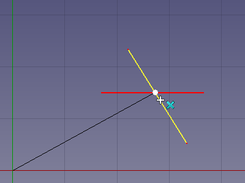

---
- GuiCommand:
   Name:Draft Snap Intersection
   Workbenches:[Draft](Draft_Workbench.md), [Arch](Arch_Workbench.md)
   SeeAlso:[Draft Snap](Draft_Snap.md), [Draft Snap Lock](Draft_Snap_Lock.md)
---

# Draft Snap Intersection

## Description

The  **Draft Snap Intersection** option snaps to the intersection of two edges. The edges can belong to [Draft](Draft_Workbench.md) or [Arch](Arch_Workbench.md) objects but also to objects created with other [workbenches](Workbenches.md).

This snap option will also find apparent intersections of (extended) straight edges if  [Draft Snap WorkingPlane](Draft_Snap_WorkingPlane.md) is active as well.

   
*Snapping the second point of a line to the intersection of two edges*

## Usage

For general information about snapping see [Draft Snap](Draft_Snap.md).

1.  Make sure snapping is enabled. See  [Draft Snap Lock](Draft_Snap_Lock.md).
2.  If **Draft Snap Intersection** is not active do one of the following:
    -   Press the **** button in the Draft snap toolbar.
    -   Hold down the **** button in the [Draft snap widget](Draft_snap_widget.md) and in the menu that opens select the ** Snap Intersection** option.
3.  Choose a [Draft](Draft_Workbench.md) or [Arch](Arch_Workbench.md) command to create your geometry.
4.  Note that you can also change snap options while a command is active.
5.  Move the cursor over one of the edges that intersect.
6.  The edge is highlighted.
7.  Move the cursor over the other edge.
8.  The edge is highlighted.
9.  If an intersection is found the point is marked and the  icon is displayed near the cursor.
10. If the edges have multiple intersections: optionally move the cursor closer to another intersection.
11. Click to confirm the point.

## Preferences

See [Draft Snap](Draft_Snap#Preferences.md).

---
 [documentation index](../README.md) > [Draft](Draft_Workbench.md) > Draft Snap Intersection
