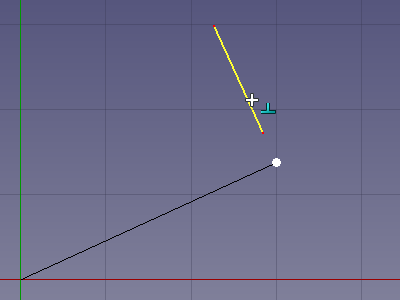

---
- GuiCommand:
   Name: Draft Snap Perpendicular
   Workbenches: Draft_Workbench, Arch_Workbench
   SeeAlso: Draft_Snap, Draft_Snap_Lock
---

# Draft Snap Perpendicular

## Description

The  **Draft Snap Perpendicular** option snaps to the perpendicular projections of a previous point on faces (<small>(v0.21)</small> ) and edges. The faces and edges can belong to [Draft](Draft_Workbench.md) or [Arch](Arch_Workbench.md) objects but also to objects created with other [workbenches](Workbenches.md).

This snap option will also find points on extended faces and edges.

   
*Snapping the second point of a line to the perpendicular point on an extended edge*

## Usage

For general information about snapping see [Draft Snap](Draft_Snap.md).

1.  Make sure snapping is enabled. See  [Draft Snap Lock](Draft_Snap_Lock.md).
2.  If **Draft Snap Perpendicular** is not active do one of the following:
    -   Press the **** button in the Draft snap toolbar.
    -   Hold down the **** button in the [Draft snap widget](Draft_snap_widget.md) and in the menu that opens select the ** Snap Perpendicular** option.
3.  Choose a [Draft](Draft_Workbench.md) or [Arch](Arch_Workbench.md) command to create your geometry.
4.  Note that you can also change snap options while a command is active.
5.  Pick a first point. This snap option requires a previous point. The perpendicular point will be determined in relation to this point.
6.  Move the cursor over a face or edge.
7.  The face or edge is highlighted.
8.  If a perpendicular point is found the point is marked and the  icon is displayed near the cursor.
9.  If there are multiple perpendicular points: optionally move the cursor closer to another perpendicular point. <small>(v0.21)</small> 
10. Click to confirm the point.

## Preferences

See [Draft Snap](Draft_Snap#Preferences.md).

---
⏵ [documentation index](../README.md) > [Draft](Draft_Workbench.md) > Draft Snap Perpendicular
