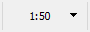
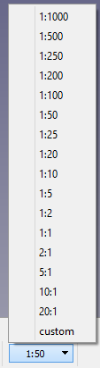

# Draft annotation scale widget
## Description

The **Draft annotation scale widget** (<small>(v0.19)</small> ) can be used to specify the Draft annotation scale. This scale determines the **Scale Multiplier** of new _ and the  [Arch Workbench](Arch_Workbench.md). It is an [optional](#Preferences.md) GUI element that is located in the [Status bar](Status_bar.md).

   *The Draft annotation scale widget*

## Usage

1.  Press the **x:x** button in the [Status bar](Status_bar.md). The button displays the current annotation scale.
2.  The scale menu opens.
3.  Do one of the following:
    -   Select one of the standard scales.
    -   Select the **custom** option:
        -   In the dialog box that opens enter a custom scale using the {{Value|x:x}} or the {{Value|x<nowiki>=</nowiki>x}} format.
        -   Press **Enter** or the **OK** button.

   *The menu of the widget*

## Preferences

See also: [Preferences Editor](Preferences_Editor.md) and [Draft Preferences](Draft_Preferences.md).

-   The Draft annotation scale widget is optional: **Edit → Preferences... → Draft → User interface settings → Draft Statusbar → Annotation scale widget**.
-   To change the annotation scale without the widget: **Tools → Edit parameters... → BaseApp → Preferences → Mod → Draft → DraftAnnotationScale**. The scale is defined by a single number. For a scale of {{Value|1:50}} enter {{Value|0.02}}.

## Notes

-   See also: [Draft SetStyle](Draft_SetStyle.md) and [Draft ApplyStyle](Draft_ApplyStyle.md).

---
[documentation index](../README.md) > [Draft](Draft_Workbench.md) > Draft annotation scale widget
