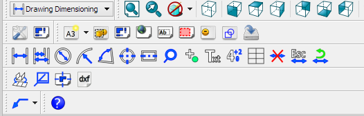
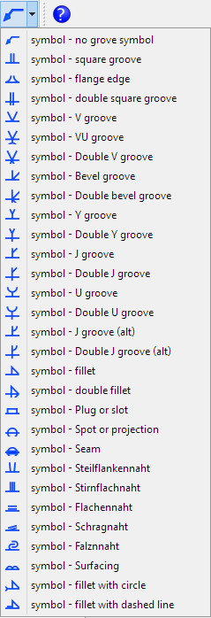

# Drawing Dimensioning Addon
**The [[Drawing Workbench]] was superseded by the [[TechDraw Workbench]] in FreeCAD 0.17. While both workbenches are included in v0.17, the Drawing Workbench is no longer maintained, and may be removed in future versions of FreeCAD. Users are advised to make the switch to the [[TechDraw Workbench]] which also includes dimensioning and annotation tools.**

## Introduction

The [Drawing dimensioning workbench](https://github.com/hamish2014/FreeCAD_drawing_dimensioning) adds powerful dimensioning and annotation tools to the [Drawing Workbench](Drawing_Workbench.md) (see [forum thread](http://forum.freecadweb.org/viewtopic.php?f=10&t=8395)).

Drawing dimensioning workbench for FreeCAD v0.15 or later. Take note that this workbench is experimental and still contains bugs.

### Intended work-flow: 

-   create a drawing page and a drawing of the part using the drawing workbench
-   switch to the drawing dimensioning workbench to add dimensions to that drawing

### Features:

-   linear dimensioning
-   circular and radial dimensioning
-   angular dimension
-   center lines
-   adding, editing and moving dimension text
-   deleting dimensions
-   Draw a dimension or a symbol anywhere on the drawing with \"Add grab point\"

### Limitations:

-   No parametric updating, if the drawing is updated the dimensions need to be redone
-   only works with FreeCAD version 0.15+

## References

-   Author: hamish
-   Home page: [Drawing Dimensioning](https://github.com/hamish2014/FreeCAD_drawing_dimensioning)
-   Source code on github: [Drawing Dimensioning](https://github.com/hamish2014/FreeCAD_drawing_dimensioning)

## Installation

### Automatic installation 

This workbench can be installed from the [Addon Manager](Std_AddonMgr.md). For manual installation see [Installing more workbenches](Installing_more_workbenches.md).

#### Linux Installation Instructions (From GitHub) 

To use this workbench clone this git repository under your FreeCAD MyScripts directory, and install the pyside and numpy python libraries. On a Linux Debian based system such as Ubuntu, installation can be done through BASH as follows  \$ sudo apt-get install git python-numpy python-pyside \$ mkdir \~/.FreeCAD/Mod \$ cd \~/.FreeCAD/Mod \$ git clone <https://github.com/hamish2014/FreeCAD_drawing_dimensioning.git> 

Once installed, use git to easily update to the latest version:  \$ cd \~/.FreeCAD/Mod/FreeCAD_drawing_dimensioning \$ git pull \$ rm \*.pyc 

#### Windows Installation Instructions (From GitHub) 

Tested with 015.4415 Development Snapshot on a Windows 7 64bit-System (thanks BPLRFE )

-   download the git repository as ZIP
-   assuming FreeCAD is installed in \"C:\\PortableApps\\FreeCAD 0_15\", go to \"C:\\PortableApps\\FreeCAD 0_15\\Mod\" within Windows Explorer
-   create new directory named \"DrawingDimensioning\"
-   unzip downloaded repository in \"C:\\PortableApps\\FreeCAD 0_15\\Mod\\DrawingDimensioning\"

FreeCAD will now have a new workbench-entry called \"DrawingDimensioning\".

Pyside and Numpy are integrated in the FreeCAD dev-Snapshots 0.15, so these Python packages do not need to be installed individually.

To update to the latest version, delete the DrawingDimensioning folder and redownload the git repository.

#### Mac Installation Instructions (From GitHub) 

Copy or unzip the drawing dimensioning folder to the directory FreeCAD.app/Contents/Mod

where FreeCAD.app is the folder where FreeCAD is installed. (thanks PLChris)

## Setting your dimensioning preferences 

Unit preferences are taken from the General unit preferences (excluding number of decimal places!). To set unit preferences goto edit → preferences → general → units

To set up your desired dimensioning style

1.  open FreeCAD
2.  switch to the Drawing dimensioning workbench
3.  edit → preferences → drawing dimensioning

## Tools

Toolbar

-    **Linear Dimension**: adds linear dimension
-    **Linear Dimension Stack**: adds linear dimension stack
-    **Circular Dimension**: adds circular dimension
-    **Radius Dimension**: adds radius dimension
-    **Angular Dimension**: adds radius dimension
-    **Center Lines**: shows center lines (axes)
-    **Center Line**: shows center line (axis)
-    **Note Circle**: creates a notation indicator
-    **Grab Point**: adds grab point to draw a free dimension
-    **Text Add**: adds text to drawing
-    **Tolerance Add**: adds tolerance super and subscript to dimension
-    **Table Add**: adds table to drawing
-    **Delete Dimension**: deletes a dimension
-    **Escape Dimensioning**: escapes dimensioning
-    **Recompute Dimensions**: recomputes dimensions
-    **Unfold Faces**:
-    **Bending Note**:
-    **Center View**: centers a view on its page
-    **Export To Dxf**: alternative dxf export command
-    **Line With Arrow**: welding/grove symbols command
-    **Help**:

Other

-    
**Draw Line**
-    
**Text Edit**
-    
**Text Move**
-    
**Landscape New**
-    
**Ortho Views**
-    
**Shortcut Settings**
-    
**Half Linerar Dimension**
-    
**New Drawing Page 1**
-    
**New Drawing Page 2**
-    
**New Drawing Page 3**
-    
**New Drawing Page 4**
-    
**Preferences**
-    
**Drawing Dimensioning Icon**

Symbols

## Linear dimensions 

Linear dimensions / Linear dimension stack

Upon clicking on linear dimensions or linear dimension stack you will get a menu with different choices. repeat: If checked the menu won\'t close after defining one dimension Grid Options: allow you to snap the dimensions to a grid

grid on will toggle the visibility of the grid

spacing: will define the spacing of the main grid (default: 1 mm)

display period: will define how often the lines are displayed (default: 20)

color: line color of the grid lines

line width: line width of the grid lines (default: 0,15) Unit Options: will define the units of the dimensions

Edit → Preferences → Unit: use same units as defined in FreeCAD preferences

mm: force units to be in mm

inch: force units to be in inch

m: force units to be in m

custom: use custum scaling of units (default: 1/mm) Preferences: define preferences of the dimension appearence

compact:

format mask: changes the format of the dimension (default \"%(value)3.3f\"). Overwrite with manual text possible

arrows: changes arrow style (auto/in/out/off)

auto place text: place dimension text manually

comma: use comma instead of point

gap: (default: 2)

overshoot: (default: 1)

arrowL1: first Length of arrow (default: 3)

arrowL2: second length of arrow (default: 1)

arrowW: width of arrow (default: 2)

strokeWidth: change line with of dimension lines (default: 0,3)

lineColor: change color of dimension lines

text properties: choose font name, font size and color (default: Verdana, 3.6, red)

auto place offset:

Set as default: Accept settings as default

Tipps:

-   changing the placement of the dimensions afterwards can be done by selecting the dimension in the tree view, and changing the values in the section \"Placement Clicks\" in the data tab

-   changing the dimension to a half linear dimension ca be done by selecting the dimension in the tree view and setting the value for \"half Dimension_linear\" to true. The dimension will be using the half towrds the second click point

## Links to Drawing Dimensioning WB 

-   Workbench Wiki: <https://github.com/hamish2014/FreeCAD_drawing_dimensioning/wiki>
-   FreeCAD Wiki:
-   FreeCAD Forum: <http://forum.freecadweb.org/viewtopic.php?f=10&t=8395&start=40>
-   Tutorials:
-   Videos:
-   Files:
-   Report bugs: Please report bugs at <https://github.com/hamish2014/FreeCAD_drawing_dimensioning/issues>

## Other useful links 

-   [External workbenches](External_workbenches.md)
-   [Macros recipes](Macros_recipes.md)

---
 [documentation index](../README.md) > [User Documentation](Category_User Documentation.md) > [Addons](Category_Addons.md) > [Drawing](Category_Drawing.md) > Drawing Dimensioning Addon
