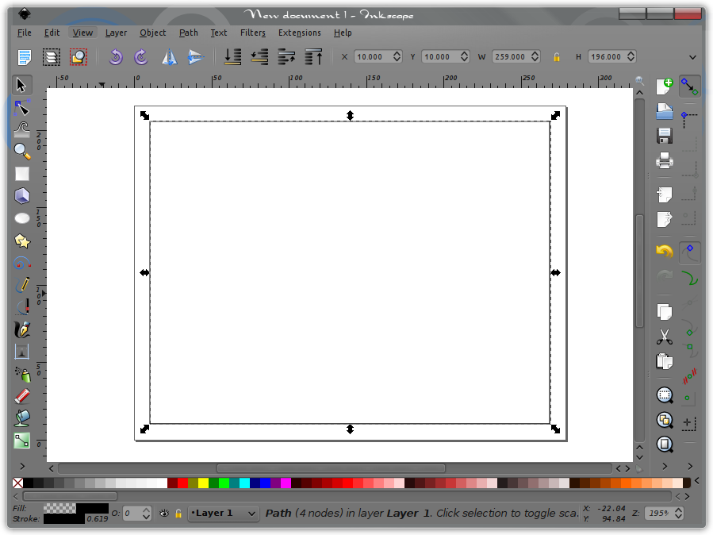
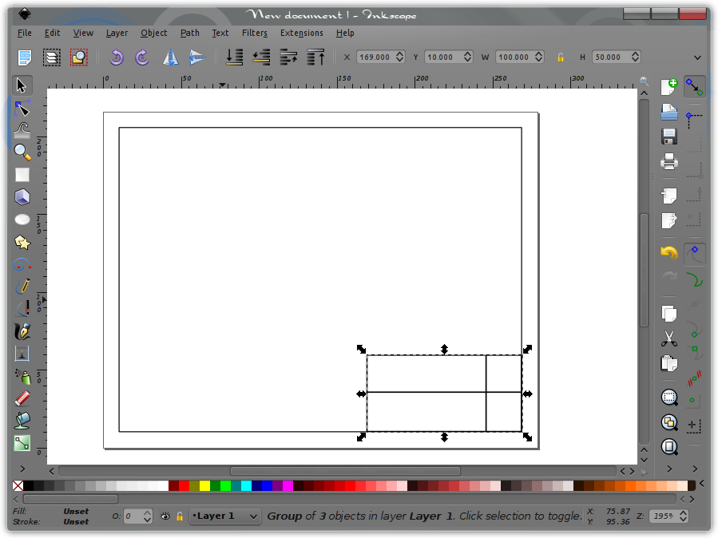
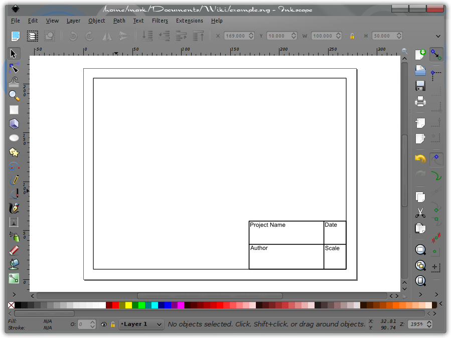
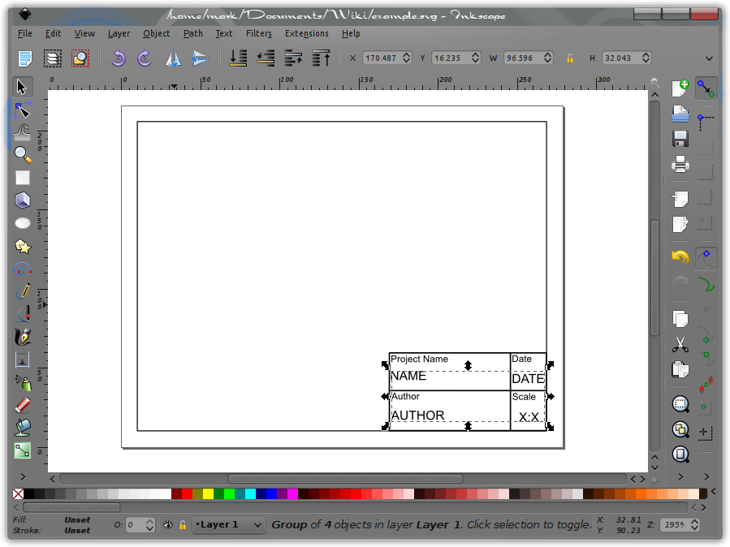
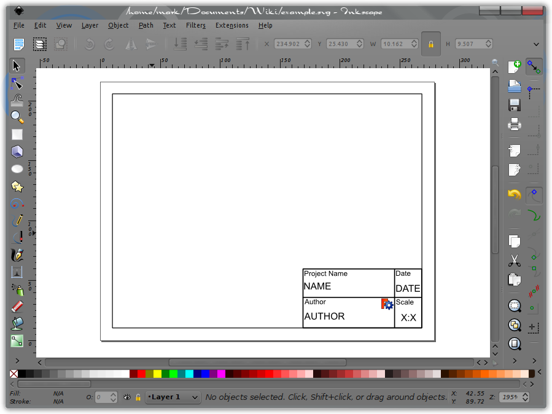
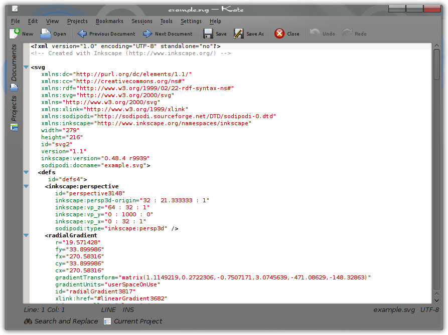
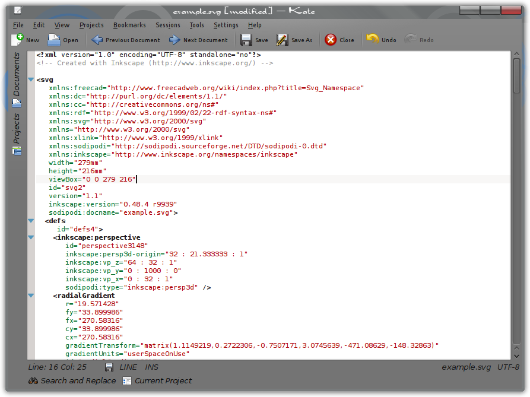
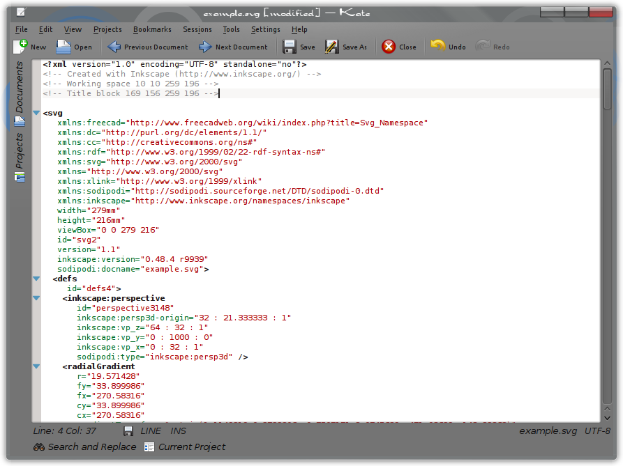
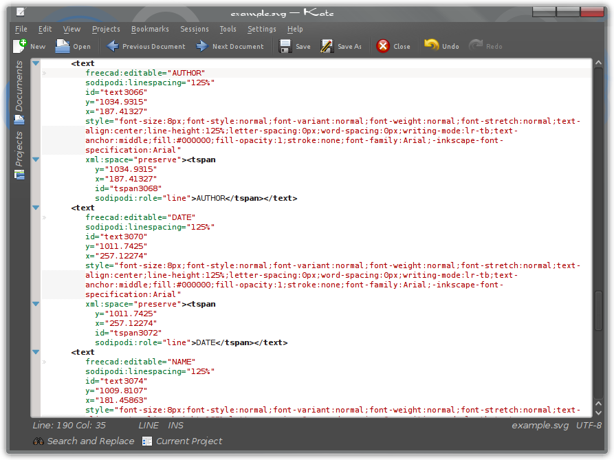
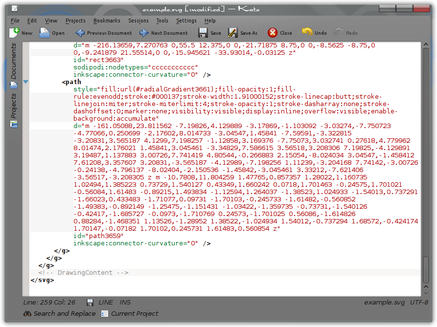

---
 TutorialInfo:
   Topic:2D Drafting
   Level:Intermediate
   Author:Mark Stephen ([Quick61](User_Quick61.md))
   Time:An hour or less
   FCVersion:0.14.3700 or greater
---

# Drawing Template HowTo

 

**The [Drawing Workbench](Drawing_Workbench.md) became obsolete in v0.17. Consider using the [TechDraw Workbench](TechDraw_Workbench.md) instead. 
For a tutorial on how to create a template for that workbench see [TechDraw TemplateHowTo](TechDraw_TemplateHowTo.md)**

.

## Introduction

This tutorial will take you through the basic creation and modification of a SVG graphics file for use as a drawing template within FreeCAD\'s [Drawing Workbench](Drawing_Workbench.md). As of FreeCAD version 0.14, revision 2995, the Drawing Workbench will project the selected part onto the drawing template following rules set within the SVG document. Those rules define the Working space, in X / Y coordinates, where FreeCAD may project the part and automatically avoid intrusions into the space occupied by the Title block.

Anyone designing templates to be shared, all the basic guidelines laid out in this tutorial should be followed. Having the tags for "Working space" and "Title block" included in the template does not excluded it from being used in older versions of FreeCAD. While including these tags will make your template fully functional for current revisions.

This tutorial will begin with setting up a page in Inkscape and making a basic template drawing. Followed by adding some artwork to give that personal or professional touch to your work. Next, you will see how to edit your new template and what information it needs to contain for use with FreeCAD.

This tutorial assumes the reader to have basic knowledge of Inkscape, and a text editor.

## The Basics 

### Page Setup 

Begin with a new document within Inkscape. Referring to the FreeCAD Wiki page on Drawing templates, one pixel = one millimeter. That means if you wish to create a Drawing template for an ANSI A sized page, (letter size), which is 216mm X 279mm, our template should be sized 216px X 279px. If you wish for the page to be landscape orientated, those numbers would be reversed. For the purposes of this tutorial, landscape orientation will be used. The page is defined as being 279px wide and 216px high.

In Inkscape, pull down the File menu and select Document Properties You should now see the Document Properties window. Edit the Width and Height as mentioned and insure that the Units is set to px.

  

You should now have an Inkscape document that is 279px wide and 216px high. Now proceed to add a border.

### The Border 

Next, make the border. While not necessary, for purposes of this tutorial, it will be referenced later on.

Using the "Draw Bezier curves and straight lines" tool, and selecting the Mode "Create a sequence of paraxial line segments", make a rectangle within the borders of the document. Once this rectangle is closed, click on the Select and transform objects tool. The rectangle should now show it is selected. If not, use the tool and select it.

Using the Horizontal and Vertical coordinates of selection settings, along with the settings for Width and Height of selection, we will place the border 10 units, (px) in from the document edges. Enter the following. For X enter 10, for Y enter 10, for W enter 259, and for H enter 196. You will see that this set the lower left corner of the rectangle drawn for the border 10 up and 10 over from the lower left corner of the page. Entering the Width and Height sized the rectangle so it is now evenly spaced within the document boundaries.

  

### The Title Block 

Next you will make a Title Block. This is where the editable text about the Drawing will be entered when used with FreeCAD. This tutorial will use a simple example. The Title Block can be as simple, or complex as one wishes.

This example Title Block will contain the following, Project Name, Date, Scale, and Author. It will then be placed in the lower right hand corner of the border.

First you start with making a rectangle somewhere within the borders of the document. Make it in the same manner as you did the border. Then divide it into 4 sections as you see fit. Once done, Select the box and the dividing lines, make them a group, and locate it at X =169, Y 10 and size it W=100, H=50, in the same manner done for the border.

  

### Fixed Text 

Next, you will add the text blocks that will be fixed within the Title Block. These will be Project Name, Date, Scale, and Author. To do this, select the text tool and click it somewhere in the document. Then simply type in the text, one block to each name. Click the text tool in the document and after selecting the appropriate font size, (size 6 works for this example), type in Project Name. Then move the pointer to a new location and click again, starting a new text block and type in Date. Do the same for Scale, and Author. Now using the select tool the individual text blocks can be moved by dragging and / or the arrow keys to place them into the desired locations.

After the text blocks are placed they should all be selected, along with the title block and made a group. At this point the Title Block and the fixed text are joined together as one.

  

### Editable Text 

Now you will add the text blocks that we will want to be editable from within FreeCAD. In the same manner that the fixed text was done, the editable text will be made and placed in their respective locations, You will use the text as follows. NAME, DATE, SCALE, AUTHOR, and make them font size 8. Once the text is placed, select the 4 text fields you wish to be editable and make them a separate group. Do not include them into the same group as the Title Block or Border. For now you are done with the editable text. After the graphical part of the template is done, you will complete the process of making this text editable from within FreeCAD. For now, we will complete this part with adding a little artwork to your template.

  

## Advanced

### Adding Artwork 

Now that the basic template is done, you can add a bit of artwork to it. This can be whatever you wish. A company or personal graphical logo, a picture or rendering of the project, etc.. For this tutorial the FreeCAD logo, found in the [Artwork](Artwork.md) section of the FreeCAD Wiki will be used. You can simply right click on it and select save image. Once saved, import it into Inkscape. With the image imported into your template, it can be sized and placed where ever you may wish it to be. Adding artwork to your template is as easy as that.

At this point, you can select File, then Save. In this tutorial, the file was simply named TemplateExample.svg but you may name it whatever you wish.

  

## Once Your Template Is Made 

### Opening The File With A Text Editor 

Once your template is saved, open it with your favorite text editor. This can be something as basic as Windows Notepad or a more complete editor like Kate. In this tutorial, Kate will be used and all screenshots will be of that editor.

Opening the SVG file with your text editor you will see the following.

  

### The "xmlns:freecad" Tag 

The first thing is to insert the following line into the document. This line is the SVG namespace declaration and must be provided so that all SVG elements are identified as belonging to the SVG namespace.

 XML
xmlns:freecad="http://www.freecadweb.org/wiki/index.php?title=Svg_Namespace"

This line is added immediately following the first

<svg>

tag, and in the same margin spacing as the other xmlns entries are placed.

  

### Page Size 

In order to allow a final drawing to be printed in the right scale, the template must contain it\'s dimensions in real world units. Otherwise the whole drawing page would be printed scaled down by a factor of 3.54 (90(px/in)/25.4(in/mm)). Inside the the \<SVG\>-Tag the unit \"mm\" is added to the width and height fields. And a viewBox Attribute has to be added. The viewBox ranges from 0 0 to the width and height of the template. This way the SVG user unit (px) is redefined to be 1mm long. In consequence programs like Inkscape will be able to print a resulting drawing up to scale. Current versions of Inkscape handle this information very badly. Inkscape effectively rescales the whole document to 90dpi. This is not much of a problem for a final drawing, but imposes difficulties for editing drawing templates. After editing a template in Inkscape, it would have the same real word size on its own but elements of the drawing would be scaled down by a factor of 3.54. (Because the template would be in 90dpi but FreeCAD assumes 1px/mm.) Therefore it\'s recommended to remove the \"mm\" from the width and height attributes before opening an existing template in inkscape and recreate the units and viewBox attribute afterwards.

 html
width="279mm"
height="216mm"
viewBox="0 0 279 216"

 

### Working space and Title block Tags 

The next lines to add will be the Working space and Title block tags. These tags and their usage are defined on the Drawing Templates page. While these tags are not required, newer versions of the FreeCAD Drawing Workbench benefit from them and they will not affect older versions.

The Working space tag is used to define the space that FreeCAD may make projections into. This allows FreeCAD to make automatic projections on the drawing template and stay within the border that has been drawn, or within any defined space on the page.

The Title block tag is used to define where within the Working space it resides. This information is used by FreeCAD to avoid using that space within the Working space. This can be referred to as Title block avoidance.

If both tags are used, the Working space tag must appear first and be immediately followed by the title block tag. Both tags must also appear before the first \<metadata tag. These tags can be placed either at the top, following the \<? xml tag or immediately before the \<metadata tag. For this tutorial we will place them at the top.

#### The Working space Tag 

The first tag is the Working space tag and is formatted as follows.

 html

Where X1, Y1, X2, Y2 are defined as:

-   X1 is the X axis distance from the left edge of the page to the left side of the Border.
-   Y1 is the Y axis distance from the top edge of the page the the top of the Border.
-   X2 is the X axis distance from the left edge of the page to the right side of the Border.
-   Y2 is the Y axis distance from the top edge of the page the the bottom of the Border.

So for this tutorial template, the Working space tag will be.

 html

#### The Title block Tag 

The next tag will be the Title block tag and is formatted as follows:

 html

Where X1a, Y1a, X2a, Y2a are defined as:

-   X1a is the X axis distance from the left edge of the page to the left side of the Title block
-   Y1a is the Y axis distance from the top edge of the page the the top of the Title block
-   X2a is the X Axis distance from the left edge of the page to the right side of the Title block
-   Y2a is the Y axis distance from the top edge of the page the the bottom of the Title block
-   X1a \<= X1 or X2a \>= X2
-   Y1a \<= Y1 or Y2a \>= Y2

Again, referencing the template created with this tutorial, the title block tag will be as follows:

 html

Placing these two tags, in proper order at the top of the document looks like this:

  

### The freecad:editable Tag 

Adding the freecad:editable tags into the SVG document allows FreeCAD to access the defined text blocks for editing. For those blocks of text that you wish to be editable from within FreeCAD, do the following.

Search down through the SVG document until you find the section that contains the text you wish to have editable. When making the template, you placed these in a group, and as a result, they should appear within the document as a group as well. Once this group of text elements is located, you will add the line freecad:editable=" " to each text block where the text that you wish to make editable is contained within the quote marks. Place them as shown for all four lines of text to be editable.

  

### The DrawingContent Tag 

The last tag that is needed in the Template is the DrawingContent tag. Without it, FreeCAD can not access the drawing template. This tag informs FreeCAD where within the document it may write it\'s projections and other attributes. It is the one tag that must be within the SVG document for the drawing template to work with FreeCAD.

This tag is formated as follows and is inserted just before the last

</svg>

tag.

 html

  

That\'s it. The SVG document can now be saved and used with FreeCAD.

## Complete Example Template 

Below is the finished SVG template. Since it is in SVG format, you can save and open it in your text editor for review as reference to this tutorial and the creation of your own templates.

  

## Tools

The two tools used in this tutorial were Inkscape and Kate. They can be found by following the links provided below.

-   [Inkscape](http://www.inkscape.org/)
-   [Kate](http://kate-editor.org/)

 {{Drawing Tools navi}}

---
⏵ [documentation index](../README.md) > [Drawing](Category_Drawing.md) > Drawing Template HowTo
