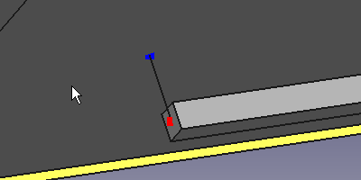

---
- GuiCommand:
   Name: EM FHEquiv
   MenuLocation: EM -> FHEquiv
   Workbenches: EM_Workbench
   Shortcut: **E** **E**
   Version: 0.17
   SeeAlso: EM_FHNode, EM_FHSegment, EM_FHPath, EM_FHPlane, EM_FHPort
---

# EM FHEquiv

## Description

The FHEquiv tool short-circuits two FHNode objects.

  


*FastHenry FHEquiv*

## Usage

The FHEquiv object is based on the two existing FHNodes that it will short-circuit.

1.  Select two  [FHNode](EM_FHNode.md) objects
2.  Press the ** [EM FHEquiv](EM_FHEquiv.md)** button, or press **E** then **E** keys.

### Remarks

-   If you need to short-circuit multiple nodes, just create multiple FHEquiv nodes. You don\'t need a full mesh of FHEquiv nodes, as of course if node1 is shorted with node2, and node2 is shorted with node3, also node1 will result shorted with node3.

## Properties

-    **Node1**: the first [FHNode](EM_FHNode.md) to short-circuit

-    **Node2**: the second [FHNode](EM_FHNode.md) to short-circuit

## Scripting


**See also:**

[FreeCAD Scripting Basics](FreeCAD_Scripting_Basics.md).

The FHEquiv object can be used in [macros](Macros.md) and from the [Python](Python.md) console by using the following function:

 
```python
equiv = makeFHEquiv(node1=None,node2=None,name='FHEquiv')
```

-   Creates a `FHEquiv` object.

-    `node1`is the first node [FHNode](EM_FHNode.md) object to short-circuit.

-    `node2`is the second node [FHNode](EM_FHNode.md) object to short-circuit.

-    `name`is the name of the object

Example:

 
```python
import FreeCAD, EM

fhnode1 = EM.makeFHNode(X=1.0,Y=0,Z=0)
fhnode2 = EM.makeFHNode(X=0,Y=1.0,Z=0)

fhequiv = EM.makeFHEquiv(fhnode1, fhnode2)
```

 


{{EM Tools navi

}}


---
⏵ [documentation index](../README.md) > [EM](Category_EM.md) > EM FHEquiv
