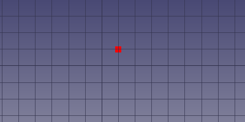

---
 GuiCommand:
   Name: EM FHNode
   MenuLocation: EM , FHNode
   Workbenches: EM_Workbench
   Shortcut: **E** **N**
   Version: 0.17
   SeeAlso: EM_FHSegment, EM_FHPath, EM_FHPlane, EM_FHPlaneAddRemoveNodeHole, EM_FHEquiv, EM_FHPort
---

# EM FHNode

## Description

The FHNode tool inserts a FastHenry node object.

   
*FastHenry FHNode*

## Usage

The FHNode object can be based on the position of a [Draft Point](Draft_Point.md) object, or you can select the 3D location of the FHNode.

1.  Press the ** [EM FHNode](EM_FHNode.md)** button, or press **E** then **N** keys.
2.  Click a point on the 3D view, or type coordinates and press the ** add point** button.

Alternatively, you can also:

1.  Select one or multiple [Draft Point](Draft_Point.md) object(s)
2.  Press the ** [EM FHNode](EM_FHNode.md)** button, or press **E** then **N** keys. As many FHNodes will be created as the Draft Point objects, at the same coordinates of the Draft Points.

## Options

-   To enter coordinates manually, simply enter the numbers, then press **Enter** between each X, Y and Z component. You can press the ** add point** button when you have the desired values to insert the point.
-   Click the checkbox to toggle *continue* mode. If continue mode is on, the FHNode tool will restart after you place a node, allowing you to place another one without pressing the tool button again.
-   Press **Esc** or the **Close** button to abort the current command.

## Properties

-    **X**: the X coordinate of the node

-    **Y**: the Y coordinate of the node

-    **Z**: the Z coordinate of the node

## Scripting


**See also:**

[FreeCAD Scripting Basics](FreeCAD_Scripting_Basics.md).

The FHNode object can be used in [macros](Macros.md) and from the [Python](Python.md) console by using the following function:

 
```python
node = makeFHNode(baseobj=None, X=0.0, Y=0.0, Z=0.0, color=None, size=None, name='FHNode')
```

-   Creates a `FHNode` object.

-    `baseobj`is the Draft Point object whose position can be used as base for the FHNode. It has priority over `X`, `Y`, `Z`. If no `baseobj` is given, `X`,`Y`,`Z` are used as coordinates.

-    `X`x coordinate of the node, in absolute coordinate system.

-    `Y`y coordinate of the node, in absolute coordinate system.

-    `Z`z coordinate of the node, in absolute coordinate system.

-    `color`is the node color, e.g. a tuple (1.0,0.0,0.0). Defaults to `EMFHNODE_DEF_NODECOLOR`.

-    `size`is the node size. Defaults to `EMFHNODE_DEF_NODESIZE`.

-    `name`is the name of the object

The placement of the FHNode can be changed by modifying its `Placement` property, or changing the `X`,`Y`,`Z` properties individually. Changing `X`,`Y`,`Z` modifies the node position in the relative coordinate system of the `Placement`.

Additionally, the \_FHNode class exposes these methods. The \_FHNode class can be accessed through the FHNode object Proxy (e.g. fhnode.Proxy).

 
```python
pos = getAbsCoord()
```

-   Get a `FreeCAD.Vector` containing the node coordinates in the absolute reference system

 
```python
pos = getRelCoord()
```

-   Get a `FreeCAD.Vector` containing the node coordinates relative to the FHNode Placement

 
```python
pos = setRelCoord(rel_coord, placement=None)
```

-   Sets the node position relative to the placement

-    `rel_coord`is a FreeCAD.Vector containing the node coordinates relative to the FHNode Placement

-    `placement`is a new FHNode placement. If `None`, the placement is not changed

 
```python
pos = setAbsCoord(abs_coord, placement=None)
```

-   Sets the absolute node position, considering the object placement, and in case forcing a new placement

-    `abs_coord`is a FreeCAD.Vector containing the node coordinates in the absolute reference system

-    `placement`is a new FHNode placement. If `None`, the placement is not changed

Example:

 
```python
import FreeCAD, EM

fhnode = EM.makeFHNode(X=1.0,Y=2.0,Z=0.0)
```


 {{EM Tools navi}}


---
⏵ [documentation index](../README.md) > [EM](Category_EM.md) > EM FHNode
