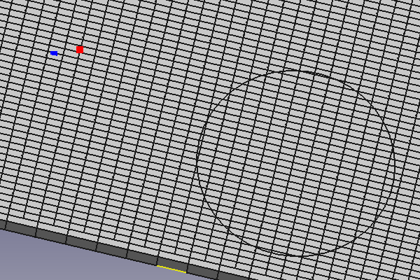

---
- GuiCommand:
   Name:EM FHPlaneAddRemoveNodeHole
   MenuLocation:EM → FHPlaneAddRemoveNodeHole
   Workbenches:[EM](EM_Workbench.md)
   Shortcut:**E** **A**
   Version:0.17
   SeeAlso:[EM FHPlane](EM_FHPlane.md), [EM FHNode](EM_FHNode.md), [EM FHPlaneHole](EM_FHPlaneHole.md)
---

# EM FHPlaneAddRemoveNodeHole

## Description

The FHPlaneAddRemoveNodeHole tool inserts or removes FHNodes or FHPlaneHoles from a FHPlane object.

  

*Nodes added (blue) and removed (red) from a FHPlane, and a FHPlaneHole removed from the FHPlane (not cutting a hole in the plane)*

## Usage

To remove one or multiple FHNode objects or FHPlaneHole objects from a FHPlane:

1.  Select all the [EM FHNode](EM_FHNode.md) objects or [EM FHPlaneHole](EM_FHPlaneHole.md) objects that you want to remove from the FHPlane (note that you need to expand the list of children of the FHPlane if you want to select these object from the [tree view](Tree_view.md) instead of from the current [3D view](3D_view.md)).
2.  Press the ** [EM FHPlaneAddRemoveNodeHole](EM_FHPlaneAddRemoveNodeHole.md)** button, or press **E** then **A** keys.

To insert one or multiple FHNode objects or FHPlaneHole objects into a FHPlane:

1.  Select the [EM FHPlane](EM_FHPlane.md) and all the [EM FHNode](EM_FHNode.md) objects or [EM FHPlaneHole](EM_FHPlaneHole.md) objects that you want to insert in the FHPlane.
2.  Press the ** [EM FHPlaneAddRemoveNodeHole](EM_FHPlaneAddRemoveNodeHole.md)** button, or press **E** then **A** keys.

### Remarks

You can also remove FHNode objects or FHPlaneHole objects from a FHPlane, and insert one or multiple FHNode objects or FHPlaneHole objects into a FHPlane at the same time. All FHNode objects or FHPlaneHole objects that already belong to a FHPlane will be removed from that FHPlane, while the others will be added to the selected FHPlane.

## Scripting

**See also:**

[FreeCAD Scripting Basics](FreeCAD_Scripting_Basics.md).

To add or remove FHNode or FHPlaneHole objects from a FHPlane via Python scripting, just add or remove the objects from the relevant properties of the FHPlane object. The PropertyList is monitored for changes, so the FHNode or FHPlaneHole will be handled as expected (change of color, etc.)

 {{EM Tools navi}}

---
 [documentation index](../README.md) > [EM](Category_EM.md) > EM FHPlaneAddRemoveNodeHole
