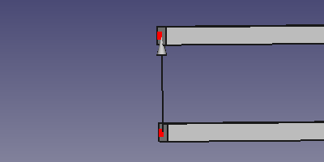

---
- GuiCommand:
   Name:EM FHPort
   MenuLocation:EM → FHPort
   Workbenches:[EM](EM_Workbench.md)
   Shortcut:**E** **P**
   Version:0.17
   SeeAlso:[EM FHNode](EM_FHNode.md), [EM FHSegment](EM_FHSegment.md), [EM FHPath](EM_FHPath.md), [EM FHPlane](EM_FHPlane.md), [EM FHEquiv](EM_FHEquiv.md)
---

# EM FHPort

## Description

The FHPort tool creates a FastHenry port between two FHNode objects.

  


*FastHenry FHPort*

## Usage

The FHPort object is based on the two existing FHNodes between which it will create a FastHenry port.

1.  Select two  [FHNode](EM_FHNode.md) objects
2.  Press the ** [EM FHPort](EM_FHPort.md)** button, or press **E** then **P** keys.

### Remarks

-   The first node you select is the positive node of the port, and the arrow that is the shape of the FHPort object will point in this direction.

## Properties

-    **NodePos**: the positive [FHNode](EM_FHNode.md) of the FastHenry port

-    **NodeNeg**: the negative [FHNode](EM_FHNode.md) of the FastHenry port

## Scripting


**See also:**

[FreeCAD Scripting Basics](FreeCAD_Scripting_Basics.md).

The FHPort object can be used in [macros](Macros.md) and from the [Python](Python.md) console by using the following function:

 
```python
port = makeFHPort(nodePos=None,nodeNeg=None,name='FHPort')
```

-   Creates a `FHPort` object.

-    `nodePos`is the positive node [FHNode](EM_FHNode.md) object of the FastHenry port.

-    `nodeNeg`is the negative node [FHNode](EM_FHNode.md) object of the FastHenry port.

-    `name`is the name of the object

Example:

 
```python
import FreeCAD, EM

fhnode_p = EM.makeFHNode(X=1.0,Y=0,Z=0)
fhnode_n = EM.makeFHNode(X=0,Y=1.0,Z=0)

fhport = EM.makeFHPort(fhnode_p, fhnode_n)
```


 {{EM Tools navi}}

---
[documentation index](../README.md) > EM FHPort
