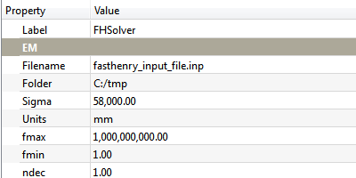

---
- GuiCommand:
   Name:EM FHSolver
   MenuLocation:EM → FHSolver
   Workbenches:[EM](EM_Workbench.md) (add-on)
   Shortcut:**E** **X**
   SeeAlso:[EM FHInputFile](EM_FHInputFile.md), [EM FHNode](EM_FHNode.md), [EM FHSegment](EM_FHSegment.md), [EM FHPath](EM_FHPath.md), [EM FHPlane](EM_FHPlane.md), [EM FHEquiv](EM_FHEquiv.md), [EM FHPort](EM_FHPort.md)
   Version:0.17
---

## Description

The FHSolver tool inserts a FHSolver object. 

  *FHSolver object*

## Usage

To insert a FHSolver object in the Document:

1.  Press the ** [EM FHSolver](EM_FHSolver.md)** button, or press **E** then **X** keys.

### Remarks

-   The FHSolver object represents the FastHenry directives that are needed in the common sections of the FastHenry input file for defining the simulation parameters, as for instance the list of frequency points at which the simulation should be run, the default units of measurement, etc. plus the output file name and folder for creating the FastHenry input file.

-   You should have only one FHSolver object per Document. If more than one FHSolver object is present, only the first one will be considered.

## Properties

-    **Units**: the FastHenry \'.units\'. Each unit in FreeCad will be one unit of the corresponding unit of measurement in FastHenry. Remark: this means that you can have for example a 3D drawing in FreeCAD with units set as meters, and specify a different unit of measurement for FastHenry, e.g. millimeters. So the value \'1.0m\' in FreeCAD will actually be \'1.0mm\' for the FastHenry simulation.

-    **Sigma**: the default Segment conductivity (\'sigma\' segment parameter in FastHenry \'.default\' statement)

-    **nhinc**: the default number of filaments in the height direction (\'nhinc\' segment parameter in FastHenry \'.default\' statement)

-    **nwinc**: the default number of filaments in the width direction (\'nwinc\' segment parameter in FastHenry \'.default\' statement)

-    **rh**: the default ratio of adjacent filaments in the height direction (\'rh\' segment parameter in FastHenry \'.default\' statement)

-    **rw**: the default ratio of adjacent filaments in the height direction (\'rw\' segment parameter in FastHenry \'.default\' statement)

-    **fmin**: the lowest simulation frequency (\'fmin\' segment parameter in FastHenry \'.freq\' statement)

-    **fmax**: the highest simulation frequency (\'fmax\' segment parameter in FastHenry \'.freq\' statement)

-    **ndec**: the number of desired frequency points per decade (\'ndec\' segment parameter in FastHenry \'.freq\' statement)

-    **Folder**: the folder path for exporting the file in FastHenry input file format

-    **Filename**: the simulation filename when exporting to FastHenry input file format

## Scripting


**See also:**

[FreeCAD Scripting Basics](FreeCAD_Scripting_Basics.md).

The FHSolver object can be used in [macros](macros.md) and from the [Python](Python.md) console by using the following function:  
```python
node = makeFHSolver(units=None, sigma=None, nhinc=None, nwinc=None, rh=None, rw=None, fmin=None, fmax=None, ndec=None, folder=None, filename=None, name='FHSolver')
```

-   Creates a `FHSolver` object.

-    `units`is the FastHenry unit of measurement. Each unit in FreeCad will be one unit of the corresponding unit of measurement in FastHenry. Allowed values are: \"km\", \"m\", \"cm\", \"mm\", \"um\", \"in\", \"mils\". Defaults to `EMFHSOLVER_DEFUNITS`

-    `sigma`is the float default conductivity. Defaults to `EMFHSOLVER_DEF_SEGSIGMA`.

-    `nhinc`is the integer default nhinc parameter in FastHenry, for defining the segment height discretization into filaments. Defaults to `EMFHSOLVER_DEFNHINC`.

-    `nwinc`is the integer default nwinc parameter in FastHenry, for defining the segment width discretization into filaments. Defaults to `EMFHSOLVER_DEFNWINC`.

-    `rh`is the integer default rh parameter in FastHenry, for defining the segment height discretization ratio. Defaults to `EMFHSOLVER_DEFRH`.

-    `rw`is the integer default rw parameter in FastHenry, for defining the segment height discretization ratio. Defaults to `EMFHSOLVER_DEFRW`.

-    `fmin`is the float minimum simulation frequency

-    `fmax`is the float maximum simulation frequency

-    `ndec`is the float value defining how many frequency points per decade will be simulated.

-    `folder`is the folder into which the FastHenry file will be saved. Defaults to the user\'s home path (e.g. in Windows \"C:\\Documents and Settings\\username\\My Documents\", in Linux \"/home/username\").

-    `filename`is the name of the file that will be exported. Defaults to `EMFHSOLVER_DEF_FILENAME`.

-    `name`is the name of the object

Example:  
```python
import FreeCAD, EM

fhsolver = EM.makeFHSolver()
```


{{EM Tools navi

}}  
