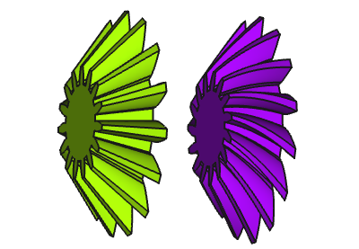

---
- GuiCommand:
   Name:FCGear BevelGear
   MenuLocation:FCGear → Create a Bevel gear
   Workbenches:[FCGear](FCGear_Workbench.md)
   Version:v0.16
---

# FCGear BevelGear

## Description

Partly because of the noise they generate, bevel gears are not used as often as other types of gear. But they are still used in certain sectors, such as food packaging and canned food, lawn and garden equipment, machines such as drills and mills, compression systems for the gas and oil market and flow control valves.

Spiral bevel gears have curved teeth to provide softer engagement and greater tooth to tooth contact compared to a straight bevel gear. This reduces the vibration and noise. They can be used at high speeds and are typically used in motorcycle and bicycle transmissions.

   
*From left to right: Spur gearing, spiral gearing*

## Usage

1.  Switch to the  [FCGear Workbench](FCGear_Workbench.md).
2.  Invoke the command several way:
    -   Press the  [Create a Bevel gear](FCGear_BevelGear.md) button in the tool bar.
    -   Using the **Menu → Bevel gear**.
3.  Change the gear parameter to the required conditions (see **Properties → Data** below).

## Properties

### Data

{{Properties_Title|Base}}

-    **Placement**: [Placement](Placement.md) is the location and orientation of an object in space.

-    **Label**: User name of the object in the [Tree view](Tree_view.md).

{{Properties_Title|gear_parameter}}

-    **beta**: With the angle β a helical bevel gear is created (positive value → rotation direction right, negative value → rotation direction left).

{{Properties_Title|gear_parameter}}

-    **backslash**: Default is 0,00. Backlash, also called lash or play, is the distance between the teeths at a gear pair.

-    **clearance**: Default is 0,10 (see also the information in **Note**).

-    **height**: Value for the bevel gear width.

-    **m**: Module is the ratio of the reference diameter of the gear divided by the number of teeth (see also the information in **Note**).

-    **numpoints**: Default is 6, change of the involute profile. Changing the value can lead to unexpected results.

-    **reset_origin**: If the value is **True**, the center of the axis is at the center of the bottom of the gear (see also the information in **Note**).

-    **teeth**: Number of teeth.

{{Properties_Title|involute_parameter}}

-    **pitch_angle**: Angle of taper.

-    **pressure_parameter**: Default is 20 (see also the information in **Note**).

### View

The parameter descriptions of the **View** tab will be found in [Property editor](Property_editor.md), further below at **Example of the properties of a PartDesign object**.

## Notes

-    **clearance**: At a gear pair, clearance is the distance between the tooth tip of the first gear and the tooth root of the second gear.

-    **module**: Using ISO (International Organization for Standardization) guidelines, Module size is designated as the unit representing gear tooth-sizes. Module (m): m = 1 (p = 3.1416), m = 2 (p = 6.2832), m = 4 (p = 12.566). If you multiply Module by Pi, you can obtain Pitch (p). Pitch is the distance between corresponding points on adjacent teeth.

-    **reset_origin**: It can be advantageous for mounting purposes if the parameter is set to **false**. The origin of the body is then at the tip of the pitch cone.

-    **pressure_parameter**: Only change the parameter, if sufficient knowledge of the gear geometry is available.

## Useful formulas 

-    **pitch diameter**= **module** \* **teeth**

-    **addendum diameter**= **pitch diameter** + 2 \* **module** \* **cos reference cone angle**

-    **tip angle 1**= **(teeth 1 + 2)** \* **(cos reference cone angle 1)** : **(teeth 2 - 2)** \* **(sin reference cone angle 1)**

-    **tip angle 2**= **(teeth 2 + 2)** \* **(cos reference cone angle 2)** : **(teeth 1 - 2)** \* **(sin reference cone angle 2)**

-    **reference cone angle 1**= **(teeth 1)** : **(teeth 2)**

-    **reference cone angle 2**= **(teeth 2)** : **(teeth 1)**

-    **axis angle total**= **reference cone angle 1** + **reference cone angle 2**

Substantive reference cone angle \[TECH.\]

_ _ _

---
[documentation index](../README.md) > [Addons](Category_Addons.md) > FCGear BevelGear
