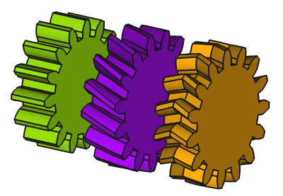

---
- GuiCommand:
   Name:FCGear InvoluteGear
   MenuLocation:Gear → Involute Gear
   Workbenches:[FCGear](FCGear_Workbench.md)
   Shortcut:None
   Version:v0.16
   SeeAlso:[FCGear CycloideGear](FCGear_CycloideGear.md)
---

# FCGear InvoluteGear

## Description

Due to the favourable meshing ratio and the relatively simple production, involute gearing is the most common tooth form in mechanical engineering. Gear wheels can be found wherever movement and force are to be transferred from one part to another. For example, they can be found in machines, cars, watches or household appliances. The movement is often transferred directly from one gear wheel to the other, but sometimes also via a chain. In addition, the direction of rotation can be changed. It is also possible to change a radial movement into a linear one via an [involute rack](FCGear_InvoluteRack.md).

   
*From left to right: Spur gearing, helical gearing, double helical gearing*

## Usage

1.  Switch to the  [FCGear Workbench](FCGear_Workbench.md).
2.  There are several ways to invoke the command:
    -   Press the **[ [Involute Gear](FCGear_InvoluteGear.md)** button in the toolbar.
    -   Select the **Gear → [ Involute Gear** option from the menu.
3.  Change the gear parameter to the required conditions (see [Properties](#Properties.md)).

## Properties

An FCGear InvoluteGear object is derived from a [Part Feature](Part_Feature.md) object and inherits all its properties. It also has the following additional properties:

### Data


{{Properties_Title|accuracy}}

-    **numpoints|Integer**: Default is {{Value|6}}. Change of the involute profile. Changing the value can lead to unexpected results.

-    **simple|Bool**: Default is {{False}}, {{True}} generates a simplified display (without teeth and only a cylinder in pitch diameter).


{{Properties_Title|base}}

-    **height|Length**: Default is {{Value|5 mm}}. Value of the gear width.

-    **module|Length**: Default is {{Value|1 mm}}. Module is the ratio of the reference diameter of the gear divided by the number of teeth (see [Notes](#Notes.md)).

-    **teeth|Integer**: Default is {{Value|15}}. Number of teeth (see [Notes](#Notes.md)).


{{Properties_Title|computed}}

-    **angular_backlash|Angle**: (read-only)

-    **da|Length**: (read-only) Outside diameter, measured at the addendum (the tip of the teeth).

-    **df|Length**: (read-only) Root diameter, measured at the foot of the teeth.

-    **dw|Length**: (read-only) Working pitch diameter.

-    **transverse_pitch|Length**: (read-only) Pitch in the plane of rotation.


{{Properties_Title|fillets}}

-    **head_fillet|Float**: Default is {{Value|0 mm}}.

-    **root_fillet|Float**: Default is {{Value|0 mm}}.

-    **undercut|Bool**: Default is {{False}}, {{True}} changes the profile of the tooth root (see [Notes](#Notes.md)).


{{Properties_Title|helical}}

-    **beta|Angle**: Default is {{Value|0 °}}. With the helix angle β a helical gear is created -- positive value → rotation direction right, negative value → rotation direction left (see [Notes](#Notes.md)).

-    **double_helix|Bool**: Default is {{False}}, {{True}} creates a double helix gear (see [Notes](#Notes.md)).

-    **properties_from_tool|Bool**: Default is {{False}}. If {{True}} and **beta** is not zero, gear parameters are recomputed internally for the rotated gear.


{{Properties_Title|involute}}

-    **pressure_angle|Angle**: Default is {{Value|20 °}} (see [Notes](#Notes.md)).

-    **shift|Float**: Default is {{Value|0}}. Generates a positive and negative profile shift (see [Notes](#Notes.md)).


{{Properties_Title|tolerance}}

-    **backlash|Length**: Default is {{Value|0}}. Backlash, also called lash or play, is the distance between the teeth at a gear pair.

-    **clearance|Float**: Default is {{Value|0.25}} (see [Notes](#Notes.md)).

-    **head|Float**: Default is {{Value|0}}. This value is used to change the tooth height.

-    **reversed_backlash|Bool**: {{True}} backlash decrease or {{False}} (default) backlash increase see [Notes](#Notes.md)).


{{Properties_Title|version}}

-    **version|String**:

## Notes

-    **beta**: When **beta** is changed, **pitch diameter** also changes. The following formula illustrates how the parameters interact: d = m \* Z / cos beta (Z = number of teeth, d = pitch diameter, m = module). This means for the spur gear: cos beta = 0 and for the helical gear: cos beta \> 0. However, a helix angle of less than 10° has hardly any advantages over straight teeth.

-    **clearance**: At a gear pair, clearance is the distance between the tooth tip of the first gear and the tooth root of the second gear.

-    **double_gear**: To use the double helical gearing the helix angle β (**beta**) for the helical gearing must first be entered.

-    **module**: Using ISO (International Organization for Standardization) guidelines, Module size is designated as the unit representing gear tooth-sizes. Module (m): m = 1 (p = 3.1416), m = 2 (p = 6.2832), m = 4 (p = 12.566). If you multiply Module by Pi, you can obtain Pitch (p). Pitch is the distance between corresponding points on adjacent teeth.

-    **shift**: Profile shift is not merely used to prevent undercut. It can be used to adjust center distance between two gears. If a positive correction is applied, such as to prevent undercut in a pinion, the tooth thickness at top is thinner.

-    **teeth**: If the number of teeth is changed, the pitch diameter also changes (**dw**).

-    **undercut**: Undercut is used when the number of teeth of a gear is too small. Otherwise the mating gear will cut into the tooth root. The undercut not only weakens the tooth with a wasp-like waist, but also removes some of the useful involute adjacent to the base circle.

-    **pressure_angle**: 20° is a standard value here. The pressure angle is defined as the angle between the line-of-action (common tangent to the base circles) and a perpendicular to the line-of-centers. Thus, for standard gears, 14.5° pressure angle gears have base circles much nearer to the roots of teeth than 20° gears. It is for this reason that 14.5° gears encounter greater undercutting problems than 20° gears. Important. the pressure angle changes with a profile shift. Only change the parameter, if sufficient knowledge of the gear geometry is available.

-    **reversed_backlash**: If there are several gears, pay attention to which gear the parameter is set for.

## Limitations

A 2D tooth profile, obtained by setting the **height** to zero, cannot be used with features requiring a 2D shape. For example [PartDesign Pad](PartDesign_Pad.md) and [PartDesign AdditiveHelix](PartDesign_AdditiveHelix.md) features do not accept such a profile as base. For technical details, please refer to the related [issue on GitHub](https://github.com/looooo/freecad.gears/issues/97).

## Useful formulas 

### Standard Spur Gears 

Here "standard" refers to those spur gears with no profile shift coefficient ($x$).

+++++
| Symbol   | Term                                     | Formula                        | FCGear Parameter                            |
+==========+==========================================+================================+=============================================+
| $m$      | *Module*                                 | \-                             | $\texttt{module}$                           |
+++++
| $z$      | *Number of Teeth*                        | \-                             | $\texttt{teeth}$                            |
+++++
| $\alpha$ | *Pressure Angle*                         | \-                             | $\texttt{pressure} {\_} \texttt{parameter}$ |
|          |                                          | Typically, $\alpha = 20^\circ$ |                                             |
+++++
| d        | *Reference Diameter* or *Pitch Diameter* | $z \cdot m$                    | \-                                          |
+++++
| $h^*_a$  | *Addendum Coefficient*                   | \-                             | $h^*_a = 1 + \texttt{ head}$                |
|          |                                          | Typically, $h^*_a = 1$         |                                             |
+++++
| $h^*_f$  | *Dedendum Coefficient*                   | \-                             | $h^*_f = 1 + \texttt{ clearance}$           |
|          |                                          | Typically, $h^*_f = 1.25$      |                                             |
+++++
| $h_a$    | *Addendum*                               | $h_a = h^*_a \cdot m$          | \-                                          |
+++++
| $h_f$    | *Dedendum*                               | $h_f = h^*_f \cdot m$          | \-                                          |
+++++
| $h$      | *Tooth Height* or *Tooth Depth*          | $h = h_a + h_f$                | \-                                          |
|          |                                          | Typically, $h = 2.25 \cdot m$  |                                             |
+++++
| $x$      | *Profile Shift Coefficient*              | \-                             | $\texttt{shift}$                            |
|          |                                          | For standard gears, $x = 0$    |                                             |
+++++

: style=\"text-align: left;\" \| Basic formulas common to internal and external standard spur gears

++++
| Symbol | Term            | Formula                              |
+========+=================+======================================+
| $d_a$  | *Tip Diameter*  | $d_a = d + 2 \cdot h_a$              |
|        |                 | Typically, $d_a = (z + 2) \cdot m$   |
++++
| $d_f$  | *Root Diameter* | $d_f = d - 2 \cdot h_f$              |
|        |                 | Typically, $d_f = (z - 2.5) \cdot m$ |
++++

: style=\"text-align: left;\" \| Basic formulas specific to external standard spur gears

++++
| Symbol | Term            | Formula                              |
+========+=================+======================================+
| $d_a$  | *Tip Diameter*  | $d_a = d - 2 \cdot h_a$              |
|        |                 | Typically, $d_a = (z - 2) \cdot m$   |
++++
| $d_f$  | *Root Diameter* | $d_f = d + 2 \cdot h_f$              |
|        |                 | Typically, $d_f = (z + 2.5) \cdot m$ |
++++

: style=\"text-align: left;\" \| Basic formulas specific to internal standard spur gears

++++
| Symbol | Term                     | Formula                       |
+========+==========================+===============================+
| $a$    | *Center Distance*        | $d = \frac{d_1 + d_2}{2}$     |
++++
| $c$    | *Tip and Root Clearance* | $c_1 = h_{f2} - h_{a1}$       |
|        |                          | $c_2 = h_{f1} - h_{a2}$       |
|        |                          | Typically, $c = 0.25 \cdot m$ |
++++

: style=\"text-align: left;\" \| Basic formulas specific for a pair of external standard spur gears

-   **Helical and double helical gearing**
    -   
        **pitch diameter (dw)**
        
        = **module** \* **teeth** : **cos beta**

    -   
        **axle base**
        
        = **(pitch diameter (dw) 1 + 2)** : 2

    -   
        **addendum diameter**
        
        = **pitch diameter (dw)** + 2 \* **module**

    -   
        **module**
        
        = **pitch diameter (dw)** \* **cos beta** : **teeth**

## Scripting

Use the power of python to automate your gear modeling:  
```python
import FreeCAD as App
import freecad.gears.commands
gear = freecad.gears.commands.CreateInvoluteGear.create()
gear.teeth = 20
gear.beta = 20
gear.height = 10
gear.double_helix = True
App.ActiveDocument.recompute()
Gui.SendMsgToActiveView("ViewFit")
```


---
 [documentation index](../README.md) > [Addons](Category_Addons.md) > [FCGear](Category_FCGear.md) > [External Command Reference](Category_External Command Reference.md) > FCGear InvoluteGear
