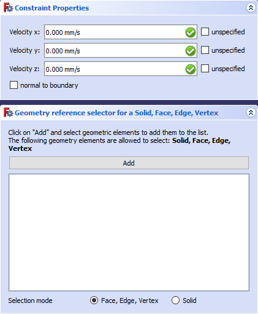

---
- GuiCommand:
   Name:FEM ConstraintFlowVelocity
   MenuLocation: Model → Fluid Constraints → Constraint flow velocity
   Workbenches:[FEM](FEM_Workbench.md)
   SeeAlso:[FEM Constraint initial flow velocity](FEM_ConstraintInitialFlowVelocity.md)
---

# FEM ConstraintFlowVelocity

## Description

Applies a flow velocity as boundary condition to an edge in 2D or to a face in 3D.

   *Constraint flow velocity menus within the [task panel](Task_panel.md)*

## Usage

1.  There are several ways to invoke the command:
    -   Press the ** [FEM ConstraintFlowVelocity](FEM_ConstraintFlowVelocity.md)** button.
    -   Select the **Model → Fluid Constraints →  Constraint flow velocity** option from the menu.
2.  The [task panel](Task_panel.md) will display menus for constraint flow velocity
3.  Select the target Edges or Faces.
4.  Press the **Add** button.
5.  Deselect \"unspecified\" to activate the necessary fields for edition.
6.  Fill in the values in mm/s for the main Cartesian components.

## Notes

-   Vector components that are ticked as \"unspecified\" will be interpolated by the selected solver.

    :   Any vector that should be the result of the solver must be ticked as \"unspecified\".
-   If the target face or edge is not aligned with the main cartesian coordinate system, it is possible to tick \"normal to boundary\".

    :   If \"normal to boundary\" is ticked, the normal vector to the selected edge or face is X and it will be oriented away from the mesh domain.
    :   For example, if a flow of 20 mm/s of air must enter the domain, then after ticking \"normal to boundary\" the user will have to input -20 mm/s in the \"velocity X\" field.

-   For a Wall with non-slip condition, the flow will be (0,0,0)
-   For a Symmetry condition, the flow will be (0, Unspecified, Unspecified) if \"normal to boundary\" is ticked.

 {{FEM Tools navi}}

---
[documentation index](../README.md) > FEM ConstraintFlowVelocity
