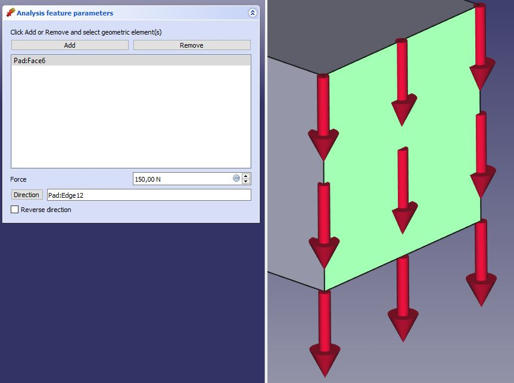

---
 GuiCommand:
   Name: FEM ConstraintForce
   MenuLocation: Model , Mechanical boundary conditions and loads , Force load
   Workbenches: FEM_Workbench
   SeeAlso: FEM_ConstraintPressure
---

# FEM ConstraintForce

## Description

Applies a force of a given value \[N\] to the selected geometry.

## Usage

1.  There are several ways to invoke the command:
    -   Press the ** [Force load](FEM_ConstraintForce.md)** button
    -   Select the **Model → Mechanical boundary conditions and loads →  Force load** option from the menu.
2.  The Mesh object will be hidden automatically and reveal the original model. If the Mesh object is still visible, do one of the following to hide it:
    -   Select the Mesh object in the [Tree view](Tree_view.md) and press **spacebar**.
    -   Right-click on the Mesh object in the [Tree view](Tree_view.md) and select **Hide selection** from its context menu.
3.  The **Analysis feature parameters** dialog in the [Task panel](Task_panel.md) has also been opened.
4.  Press the **Add** button and select one or more of either *faces*, *edges* or *vertices* in the [3D view](3D_view.md) to apply the force to. The selected items will appear in the list of geometrical objects.
5.  Optionally press the **Remove** button and deselect one or more of the selected items in the [3D view](3D_view.md). The deselected items will be removed from the list of geometrical objects.
6.  Optionally edit the **Load [N]** value.
7.  Optionally select a face or an edge and press the **Direction** button to change the force direction. In a typical case, you\'ll leave this field empty to apply the force in the normal direction.
8.  Optionally check the **Reverse direction** checkbox to reverse the force direction.
9.  Click **OK** to finish.

  

## Notes

-   The defined force is applied uniformly to the selected objects. For example, if you define one force load with 200 N applied to two faces having the same area, each face will be uniformly loaded with 100 N.

 {{FEM Tools navi}}

---
⏵ [documentation index](../README.md) > [FEM](Category_FEM.md) > FEM ConstraintForce
