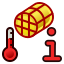

---
- GuiCommand:
   Name: FEM ConstraintInitialTemperature
   MenuLocation: Model -> Thermal Constraints -> Constraint initial temperature
   Workbenches: FEM_Workbench
   SeeAlso: FEM_tutorial
---

# FEM ConstraintInitialTemperature

## Description

Creates an initial temperature constraint for a thermo-mechanical analysis.

## Usage

1.  There are several ways to invoke the command:
    -   Press the ** [FEM ConstraintInitialTemperature](FEM_ConstraintInitialTemperature.md)** button.
    -   Select the **Model → Thermal Constraints →  Constraint initial temperature** option from the menu.
2.  Enter an initial temperature value for the analysis.

## Limitations

This constraint applies the initial temperature to all nodes in the FEA model - it\'s not possible to select individual regions.

## Notes

-   This constraint uses the \*INITIAL CONDITIONS card in CalculiX. The initial temperature constraint is explained at <http://web.mit.edu/calculix_v2.7/CalculiX/ccx_2.7/doc/ccx/node215.html>

 {{FEM Tools navi}}

---
⏵ [documentation index](../README.md) > [FEM](Category_FEM.md) > FEM ConstraintInitialTemperature
