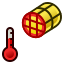

---
- GuiCommand   *
   Name   *FEM ConstraintTemperature
   MenuLocation   *Model → Thermal Constraints → Constraint temperature
   Workbenches   *[FEM](FEM_Workbench.md)
   SeeAlso   *[FEM tutorial](FEM_tutorial.md)
---

# FEM ConstraintTemperature

## Description

Creates a FEM constraint for a temperature boundary condition.

## Usage

1.  There are several ways to invoke the command   *
    -   Press the ** [FEM ConstraintTemperature](FEM_ConstraintTemperature.md)** button.
    -   Select the **Model → Thermal Constraints →  Constraint temperature** option from the menu.
2.  In the [3D view](3D_view.md) select the objects the constraint should be applied to, which can be a vertices (corners), edges, or faces.
3.  Enter a temperature to apply to the objects.

### Option

By default the constraint defines a temperature. By using the option **Concentrated heat Flux** a heat flux trough the area of the face (Watt per face area) can be specified.

## Notes

-   The temperature constraint uses the \*BOUNDARY card in CalculiX. the temperature constraint is explained at <http   *//web.mit.edu/calculix_v2.7/CalculiX/ccx_2.7/doc/ccx/node163.html>

 {{FEM Tools navi}}

---
 [documentation index](../README.md) > [FEM](Category_FEM.md) > FEM ConstraintTemperature
