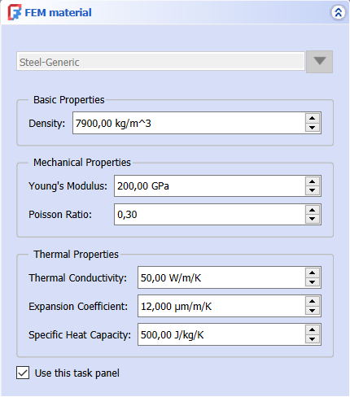

---
 GuiCommand:Container|
{{GuiCommand
   Name: FEM MaterialSolid
   MenuLocation: Model , Materials , Material for solid
   Workbenches: FEM_Workbench
   Shortcut: **M** **S**
   SeeAlso: FEM_tutorial
}}
{{GuiCommandFemInfo
   Solvers: All
}}
---

# FEM MaterialSolid

## Description

Creates a material for solid.

   
*The FEM material task panel*

## Usage

1.  To create a new MaterialSolid object do one of the following:
    -   Press the ** [Material for solid](FEM_MaterialSolid.md)** button.
    -   Select the **Model → Materials →  Material for solid‏‎** option from the menu.
2.  To edit an existing MaterialSolid object:
    -   Double-click it in the [Tree view](Tree_view.md).
3.  The FEM material task panel opens.
4.  Select a material from the drop-down list. For example, for engineering mechanical analysis, *CalculiX-Steel* is a common option.
5.  Optionally, press the **Use this task panel** button to modify material properties such as density, Young\'s modulus, Poisson\'s ratio, etc.
6.  Provided you are applying material to the whole object, don\'t select any geometrical entities (leave the reference list empty). The material will be applied to the whole model. Otherwise, assign the material to selected regions manually by selecting some of them for each inserted material, but don\'t leave any part of the model with no material assigned.
7.  Press the **Close** button to close the task panel.

## Notes

-   The mechanical material uses the [\*MATERIAL card in CalculiX](https://web.mit.edu/calculix_v2.7/CalculiX/ccx_2.7/doc/ccx/node216.html).

 {{FEM Tools navi}}

---
⏵ [documentation index](../README.md) > [FEM](Category_FEM.md) > FEM MaterialSolid
