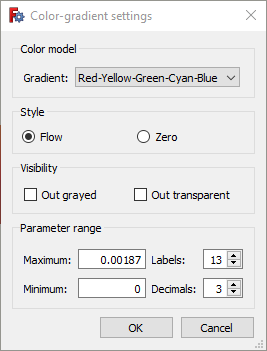

---
- GuiCommand:
   Name:FEM PostPipelineFromResult
   MenuLocation: Results → Post pipeline from result
   Workbenches:[FEM](FEM_Workbench.md)
   Version:0.17
   SeeAlso:[FEM tutorial](FEM_tutorial.md)
---

# FEM PostPipelineFromResult

**\* You need a valid result object in the ** [Analysis container](FEM_Analysis.md)
**, such as **CalculiX static results**.**

## Description

Pipeline is a result object, which creates a new graphical representation of FEM analysis results on the analysed part. It adds color scale and more display options.

## Usage

-   Select the result object
-   Click  button, or click on menu **Results** and item **Post Pipeline from results**. A new object called \"Pipeline\" will be added to your document; note if will appear outside of the Analysis container.
-   Double click the new Pipeline object in the Model tree and select type of properties to display. Typical settings are: Mode: **Surface**, Field: **Von Mises stress**

:\* Mode: How to draw the results

:\* Field: Which result property to draw

:\* Vector: If a property is a vector, you might restrict the data to an axis (X, Y, Z) or select Magnitude to use the vector value.

-   If you see no model in the graphical area, go to and enable **Edit → Preferences → Display → Rendering → Backlight color**
-   If you double-click the scale, you can modify display properties.

:\* Gradient: You can select reversed order of the default color gradient or either Black-White or White-Black.

:\* Parameter range: Minimum and maximum values are filled-in automatically, when you select a property to evaluate on the **Pipeline** object; you can modify them, however make sure you know what you are doing. You can also amend number of displayed labels and number of decimal places to be displayed.

## Limitations

Once again, note, that the Pipeline representation of the results (called VTK) on the displayed part is different from the color gradient results which are visible when you finish solution. Values in the gradient scale cannot be applied to the solution result object.

 {{FEM Tools navi}}

---
[documentation index](../README.md) > FEM PostPipelineFromResult
