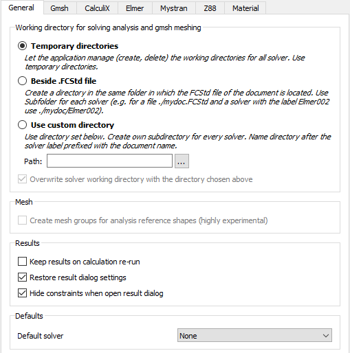
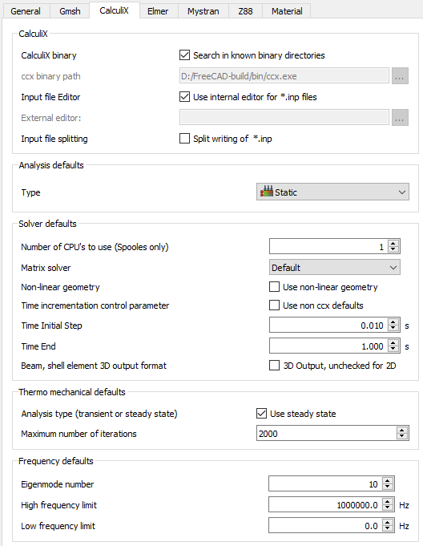
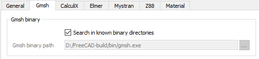
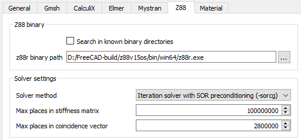

# FEM Preferences
The preferences screen of the [FEM Workbench](FEM_Workbench.md) are found in the [Preferences Editor](Preferences_Editor.md), **Edit → Preferences → FEM**.

There are several tabs in the FEM workbench preferences, starting with the **General** configuration of the workbench. The rest of the tabs control how FEM interacts with supported external solvers.

The current supported external solvers are:

-   CalculiX
-   Gmsh
-   Z88
-   Elmer

## General

## CalculiX

## Gmsh

## Z88

## Elmer

 {{FEM Tools navi}}  

[ Preferences](Category_Preferences.md)

---
[documentation index](../README.md) > [Preferences](Category_Preferences.md) > FEM Preferences
