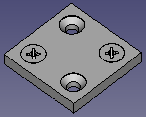

---
- GuiCommand:
   Name: Fasteners ChamferHole
   MenuLocation: Fasteners -> Make countersunk
   Workbenches: Fasteners_Workbench
---

# Fasteners ChamferHole

## Description

The  **Fasteners ChamferHole** command chamfers holes for countersunk screws.

   
*Chamfered holes for countersunk screws*

## Usage

1.  The command can detect screw diameters automatically. Holes must have the correct diameter for this to work. For example an M5 screw requires a 5mm pass hole or a 4.2mm tap hole. The  [Fasteners ScrewCalculator](Fasteners_ScrewCalculator.md) command can be used to determine tap hole diameters.
2.  Select a part with circular holes.
3.  There are several ways to invoke the command:
    -   Press the ** [Make countersunk](Fasteners_ChamferHole.md)** button.
    -   Select the **Fasteners →  Make countersunk** option from the menu.
4.  The **Chamfer holes for countersunk screws** task panel opens.
5.  The **Edges to chamfer** list shows all circular edges of the selected part.
6.  Select the edges you want to chamfer by doing one of the following:
    -   Click individual circular edges or faces with circular edges in the [3D view](3D_view.md):
        -   There is no need to hold down the **Ctrl** key.
        -   Each selected edge is checked in the **Edges to chamfer** list.
        -   The screw diameter for each edge is detected automatically.
        -   Edges cannot be deselected in the [3D view](3D_view.md).
    -   Select or deselect edges by checking or unchecking them in the **Edges to chamfer** list:
        -   In this case the screw diameter is not detected automatically.
7.  Optionally change the screw diameter of individual edges in the **Edges to chamfer** list by double-clicking their **Diameter** field, and selecting a new value from the dropdown list that appears.
8.  Optionally change the screw diameter of all selected edges by selecting a new value from the **Diameter** dropdown list below the **Edges to chamfer** list.
9.  Optionally specify a **Screw type**.
10. Press the **OK** button.
11. A Countersunk object with a chamfered recess for each selected edge is created.
12. Optionally attach screws. See [Fasteners Workbench](Fasteners_Workbench#Usage.md).

## Notes

-   Countersunk objects are parametric. An existing Countersunk object can be edited by double-clicking it in the [Tree view](Tree_view.md). The **Chamfer holes for countersunk screws** task panel will open. Circular edges can be added or removed, and the parameters of edges can be changed.

 {{Fasteners Tools navi}}

---
⏵ [documentation index](../README.md) > [External Command Reference](Category_External Command Reference.md) > [Fasteners](Category_Fasteners.md) > Fasteners ChamferHole
