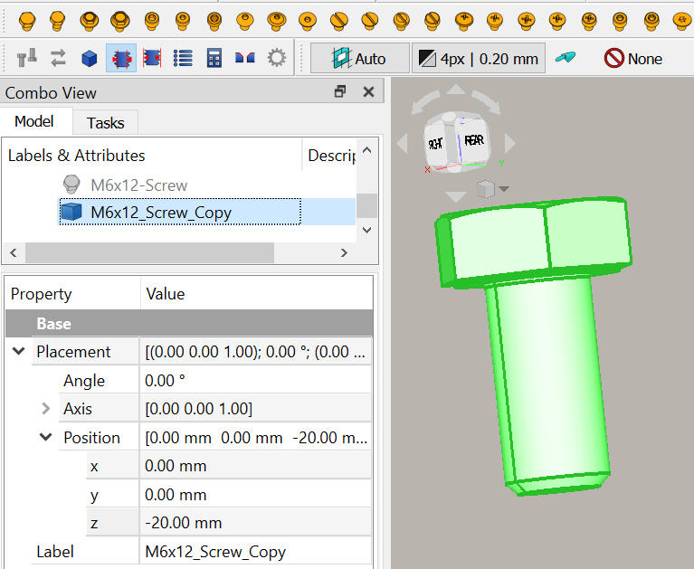

---
- GuiCommand:
   Name:Fasteners Shape
   MenuLocation:Fasteners → Shape
   Workbenches:[Fasteners](Fasteners_Workbench.md)
   Shortcut:None
   SeeAlso:
---

## Description

The  [Fasteners Shape](Fasteners_Shape.md) is used to convert a parameteric fastener object into a simple shape.

It is important to note that if you wish to share FCStd files that contains fasteners (or parts from other custom parametric workbenches) with other people, they must install these workbenches as well, or else they will get errors when trying to use them.

However, if you just want to share the resulting parts, with no need to change object's parameters, you can use the Simplify (SimplifyObj) function, to convert the fasteners to simple shapes. They will appear as new Shape parts in the model tree. You can then delete the original fasteners and save as a simple FCStd that can be read and used on any FreeCAD installation.

This tool is part of the [external workbench](external_workbenches.md) called [Fasteners](Fasteners_Workbench.md).

## Usage

1.  Switch to the  [Fasteners](Fasteners_Workbench.md) workbench (install from  [Addon Manager](Addon_Manager.md) is necessary, if not previously installed)
2.  Invoke the Fasteners Shape tool several ways:
    -   Press the  button
    -   Use the {{MenuCommand|Fasteners → Shape}} entry in the Fasteners menu

Result: A copy of the select fastener will be created with a **\_Copy** suffix. The original item will remain but will be have its visibility toggled to hidden.

## Notes

\- Multiple fasteners can be selected and simplified in a single step. It will create an individual simplified object for each item selected.

## Limitations

## Properties

{{Properties_Title|Base}}

-    **View**: Invert, boolean, default: false

## Scripting

 {{Fasteners Tools navi}} 

[Category:External Command Reference{{\#translation:}}](Category:External_Command_Reference.md)
