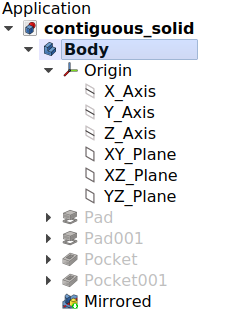

# Feature editing sandbox
## Introduction

This page explains the way the  [PartDesign Workbench](PartDesign_Workbench.md) is intended to be used.

## Body

Working in PartDesign requires first creating a  **[Body](PartDesign_Body.md)**. The PartDesign Body is a container intended to hold a single contiguous solid. When a Body is created, an Origin object, a local coordinate system, is automatically added. The solid is then built by adding features. Each [feature](PartDesign_Feature.md) is cumulative and adds to or subtracts from the result of the previous feature.

A document can contain multiple bodies, but only one body can be active. New features are added to the active body. A body can be activated or deactivated by double clicking it in the [Tree view](Tree_view.md). The activate body is highlighted in the Tree view.

### What is a contiguous solid? 

A contiguous solid is an object like a casting or something machined from a single block of metal. If the object involves nails, screws or glue, it is not a contiguous solid. As a practical example, a wooden chair would be made of multiple bodies, with one for each of its sub-components (legs, slats, seat, etc).

In version 1.0 an experimental property was introduced that allows the Body to have non-contiguous solids. This can also be set in Preferences as default for a newly created Body. This is not intended to be used to build, as in the example, a chair in one Body. It is meant to allow features that may produce disconnected solids that will be made contiguous by later features.

When a model requires multiple bodies, like the wooden chair, the general purpose  [Part container](Std_Part.md) can be used to group them and move the whole as a unit.

### Body Origin 

The body has an Origin which consists of reference planes (XY, XZ, YZ) and axes (X, Y, Z) that can be used by sketches and features. Sketches can be attached to Origin planes or attached to faces for features based on the sketch to be added or subtracted from the model.

### Body visibility management 

By default a body will present its most recent feature to the outside. This feature is the tip of the body. A good analogy is the expression *the tip of the iceberg*: only the tip is visible above the water, most of the iceberg\'s mass (the other features) is hidden. As a new feature is added to the body, visibility of the previous feature is turned off, and the new feature becomes the tip.

There can only be one feature visible at a time. It is possible to [toggle the visibility](Std_ToggleVisibility.md) of any feature in the body, by selecting it in the Tree view and pressing the **Spacebar**, in effect going back in the history of the body.

### Moving and Reordering Objects 

It is possible to temporarily redefine the tip to a feature in the middle of the Body tree to insert new objects (features, sketches or datum geometry). It is also possible to reorder features under a Body, or to move them to a different Body. Select the object and right-click to get a context menu that will offer both options. The operation may be prevented if the object has dependencies in the source Body, such as being attached to a face. To move a sketch to another Body, it should not contain links to external geometry.

---
⏵ [documentation index](../README.md) > Feature editing sandbox
